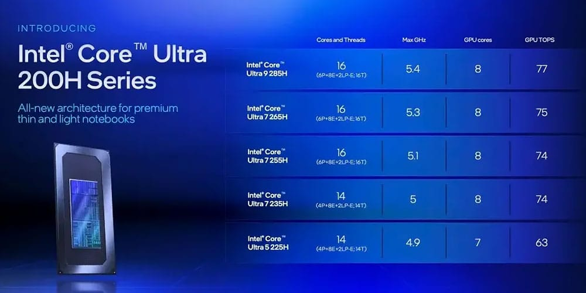

Los ordenadores a medida ya son caros por definición: se paga por el trabajo manual y
por el derecho a tener algo que nadie más tiene. El encargo que ha publicado
FanlessTech se salta cualquier registro razonable. El fabricante ha entregado una
edición especial del mini PC Kubb Fanless cuyo chasis está hecho de oro de 24
quilates, con un valor en torno a los **1,7 millones de dólares**. El mismo
ordenador, en su versión normal de aluminio, se cotiza en 1.595 euros.

## Un cubo de 120 milímetros que pesa 13 kilos

El Kubb Fanless es un ordenador pasivo de formato muy compacto: sus dimensiones
estándar son 120 × 120 × 120 milímetros, del tamaño de un cubo de sobremesa. La
versión de aluminio pesa 2,1 kilogramos. La misma máquina revestida en oro macizo
sube hasta los **13 kilogramos**, casi 29 libras: multiplica su peso por más de seis.

El precio, en torno a 1,7 millones de dólares, sitúa a este mini PC en una liga que
no tiene nada que ver con sus componentes. Para poner la cifra en contexto, un mod
chino que montaba un Threadripper PRO 9995WX de 96 núcleos, una RTX 6000 Blackwell y
256 GB de RAM DDR5 costaba unos 60.000 dólares: ni siquiera eso se acerca al
presupuesto de este encargo. La diferencia entera está en el material del chasis y en
el hecho de que fue un pedido especial de un cliente particular, no un producto de
serie.

## El oro como disipador de un PC sin ventiladores

Lo que convierte la historia en algo más que un capricho estético es la física. Un PC
fanless no tiene ventiladores: el calor tiene que salir por conducción a través del
propio chasis, así que el material del recubrimiento deja de ser decorativo y pasa a
ser el sistema de refrigeración.

FanlessTech sostiene que el oro conduce el calor bastante mejor que el aluminio. Sus
cifras: el oro se sitúa en 314 W/m·K frente a los 205 W/m·K del aluminio, una mejora
de alrededor de un 50 %. En términos absolutos, sin embargo, hay materiales mejores y
mucho más baratos: el cobre alcanza los 385 W/m·K y la plata, los 406 W/m·K, con el
diamante muy por encima de todos ellos, en 1.000 W/m·K. Es decir, el oro no es la
opción técnica más eficiente del mercado, sino la más llamativa.

Quien busque silencio sin renunciar al bolsillo tiene opciones mucho más racionales:
cajas y equipos pasivos como la [Akasa Newton N16](/noticias/akasa-newton-n16-nuc-case/)
para los NUC de ASUS resuelven el mismo problema sin añadir ni un gramo de metal
precioso.

## Las especificaciones siguen siendo las de un mini PC corriente

El interior del Kubb Fanless no guarda relación con el precio del chasis. Las
configuraciones disponibles son las habituales de la gama:

- Procesador: Intel Core Ultra 5 225H, Intel Core Ultra X7 358H o AMD Ryzen AI 5 340.
- Memoria: de 16 GB a 128 GB de RAM DDR5.
- Almacenamiento: un SSD M.2 NVMe de 1 TB, con hueco para un segundo disco.
- Conectividad Intel: USB 3.2 Tipo A, USB 3.2 Tipo C con DisplayPort 1.4a, un
  USB4/Thunderbolt 4, Wi-Fi 7 y Bluetooth 5.4.
- Conectividad AMD: USB 3.2 Gen 2 Tipo A, dos puertos USB4, Wi-Fi 6 y Bluetooth 5.3.
- Puertos laterales: dos RJ45, dos HDMI 2.1 TMDS y dos USB 3.2 Gen 2 Tipo A.
- Alimentación: fuente de 19 V y 6,32 A (120 W) y sistema operativo Windows 11 Pro.

La gama se vende en versiones de aluminio terminadas en grafito, azul o bronce, y la
configuración con Core Ultra 5 225H se lista a **1.595 euros** en la web del fabricante,
aunque sin disponibilidad en el momento de publicar la noticia.

## Qué cambia para el lector

Nada de esto llega a las tiendas: el modelo de oro es un encargo único y no está en
venta. Lo que sí interesa es la lección térmica. En un equipo sin ventiladores, el
chasis es el disipador, y la elección del material se traduce directamente en cuánto
calor puede disipar la máquina y a qué temperatura de trabajo. El oro cumple esa
función mejor que el aluminio, pero a un coste que convierte la pieza en una obra
para coleccionistas más que en una herramienta de trabajo.
