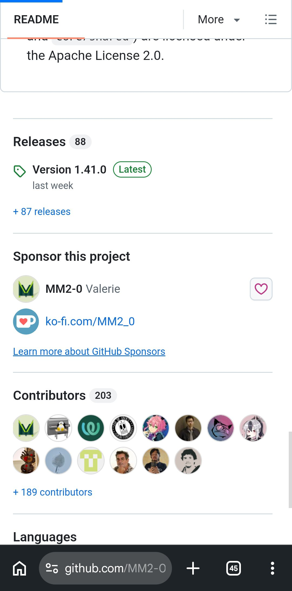
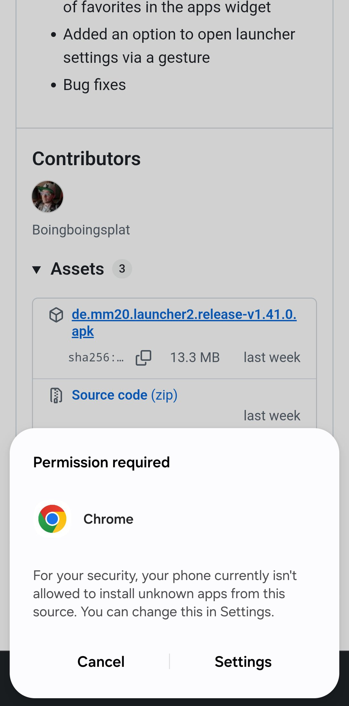
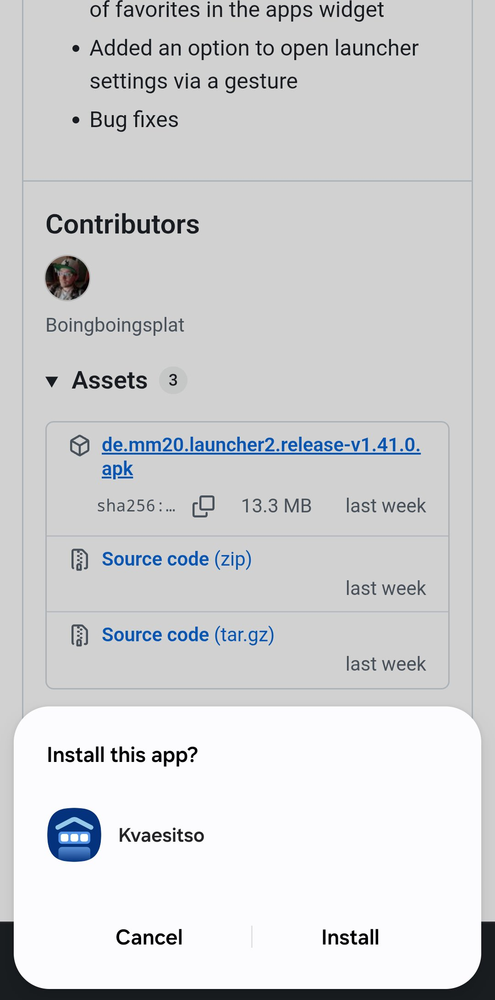
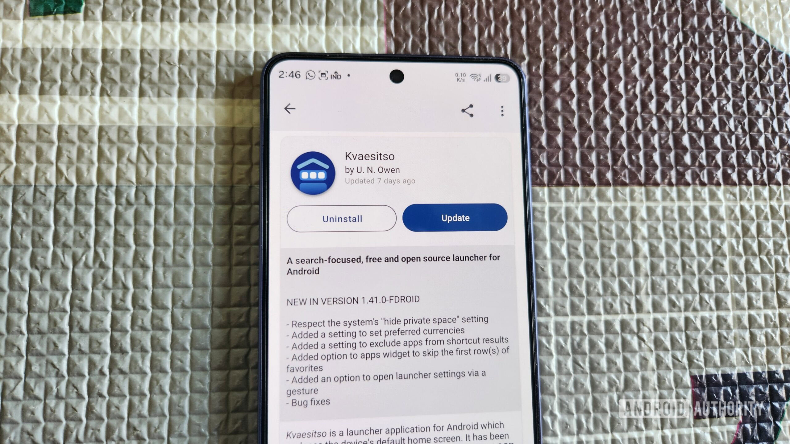
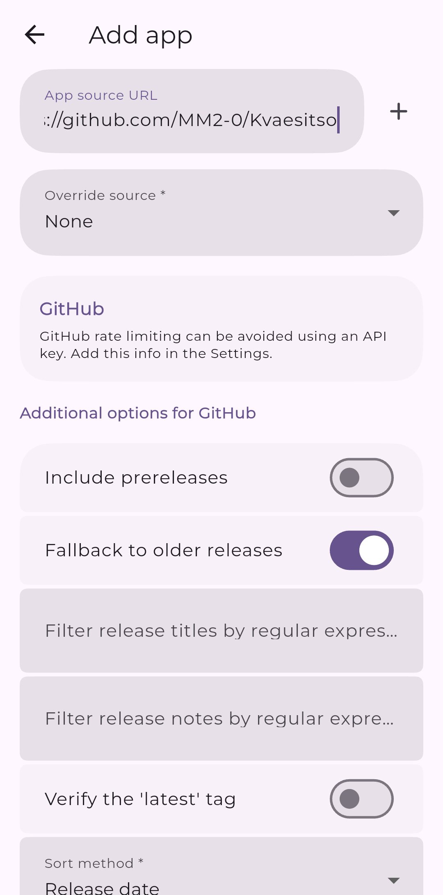

Kvaesitso es un lanzador de Android de código abierto, orientado a la búsqueda, que no tiene ficha en la Play Store. Eso no lo convierte en una app difícil de usar, solo en una que hay que instalar a mano: hay que descargar el paquete, autorizar la instalación desde fuera de la tienda y, si se quiere, darle un mecanismo para recibir actualizaciones. Esta guía recorre ese proceso completo, paso a paso, con las rutas de menú tal y como aparecen en la guía original de Android Authority.

## Por qué Kvaesitso no está en la Play Store

El desarrollador no ha dado una razón concreta. En términos generales, los proyectos de software libre tienden a saltarse la Play Store para evitar las tasas de publicación, las revisiones y el papeleo de las políticas: publicar la aplicación en GitHub o en F-Droid es mucho más directo. El resultado es que la instalación tiene unos pasos extra, pero son un trámite único.

## Requisitos previos

- Un teléfono Android con conexión a internet y un navegador instalado (en los ejemplos se usa Chrome).
- Permiso para instalar aplicaciones de fuentes desconocidas. En la primera instalación lo concede el propio sistema, pero hay que aceptarlo.
- En teléfonos Samsung Galaxy, además: desactivar la función **Auto Blocker**, que bloquea la instalación de paquetes APK.

## Cómo descargar e instalar Kvaesitso en Android

1. Abre cualquier navegador en el teléfono y entra en la página de GitHub de Kvaesitso: [github.com/MM2-0/Kvaesitso](https://github.com/MM2-0/Kvaesitso).
2. Desplázate hasta la sección **Releases** y toca la **versión más reciente**.
3. Dentro de **Assets**, toca el archivo **APK del lanzador** para descargarlo.
4. Abre el archivo APK para instalarlo. Si es la primera vez que realizas una instalación de este tipo, tendrás que conceder al navegador permiso para instalar aplicaciones desconocidas.
5. Toca **Install** para instalar el lanzador.

El proceso completo lleva poco más de un minuto. En un teléfono Galaxy, si la instalación se bloquea, entra en **Settings -> Security and privacy** y desactiva **Auto Blocker**: entre otras funciones, impide instalar aplicaciones de fuentes externas.

### Alternativa: instalar desde F-Droid

Si ya tienes F-Droid en el teléfono, puedes obtener Kvaesitso directamente desde ahí. F-Droid es un repositorio exclusivo de aplicaciones libres y de código abierto, con un funcionamiento similar al de la Play Store. Si aún no lo tienes, primero hay que descargar F-Droid desde su [repositorio de GitHub](https://github.com/f-droid/fdroidclient) e instalarlo a mano, y solo después buscar Kvaesitso dentro de la aplicación.

## Cómo convertir Kvaesitso en el lanzador predeterminado

Una vez instalado, falta el paso final: elegirlo como aplicación de inicio. Entra en **Settings -> Apps -> Default apps -> Home app** y selecciona **Kvaesitso** de la lista. Vuelve a la pantalla de inicio: el nuevo lanzador ya estará ahí.

## Cómo verificar que la instalación funcionó

- Al pulsar el botón de inicio o deslizar hacia arriba desde el borde inferior, debe mostrarse la interfaz de Kvaesitso y no la del lanzador anterior.
- La barra de búsqueda debe estar operativa: además de aplicaciones y contactos, permite buscar en Wikipedia, YouTube, Maps y en la propia Play Store, e incluso crear alarmas, recordatorios o hacer cálculos sencillos sin salir del lanzador.
- En **Settings -> Apps -> Default apps -> Home app**, **Kvaesitso** debe aparecer como opción seleccionada.

## Cómo mantener Kvaesitso actualizado

Las aplicaciones instaladas fuera de la Play Store no reciben actualizaciones automáticamente, y Kvaesitso no incluye una opción interna para comprobarlas. No hace falta, sin embargo, revisar la página de GitHub cada pocas semanas: hay dos vías.

### Opción 1: F-Droid

Si instalaste el lanzador desde F-Droid, las actualizaciones se gestionan desde la propia aplicación, igual que en la Play Store: busca el proyecto y toca **Update** para instalar la última versión. También puedes activar las actualizaciones automáticas en **Settings** de F-Droid, encendiendo **Automatically install updates**. Ten en cuenta que esa opción se aplica a todas las aplicaciones instaladas con F-Droid, no solo a Kvaesitso.

### Opción 2: Obtainium

Si no quieres instalar F-Droid solo para esto, la alternativa es [Obtainium](https://github.com/ImranR98/Obtainium), una aplicación libre y de código abierta diseñada para actualizar aplicaciones instaladas manualmente: comprueba en origen si hay versiones nuevas y las instala desde ahí mismo.

Tiene dos ventajas respecto a F-Droid. La primera, que las actualizaciones llegan sin demora, a veces incluso antes de que aparezcan en F-Droid, porque Obtainium las toma directamente de la fuente. La segunda, que si con el tiempo has ido instalando APK de distintos sitios, Obtainium los rastrea a todos y te permite actualizarlos desde un único lugar.

La única contrapartida es la configuración inicial. Primero hay que instalar Obtainium desde GitHub o desde [F-Droid](https://f-droid.org/en/packages/dev.imranr.obtainium.fdroid/). Después, abrirlo, tocar el botón **Add** y pegar la URL de GitHub o de F-Droid de Kvaesitso **según la fuente de la que la instalaste originalmente**: la firma digital de una aplicación puede variar según el origen, y con el enlace equivocado las actualizaciones pueden no funcionar.

En ese mismo menú, Obtainium ofrece algunos interruptores —instalar versiones previas, silenciar las notificaciones de actualización— que son opcionales: puedes ignorarlos y tocar el **icono más** para añadir la aplicación. A partir de ese momento, Obtainium comprueba actualizaciones automáticamente cada seis horas.

## Por qué merece la pena el esfuerzo

Instalar y mantener Kvaesitso cuesta más que descargar cualquier cosa desde la Play Store, pero compensa. Su punto fuerte es la barra de búsqueda: junto a aplicaciones y contactos, busca en Wikipedia, YouTube, Maps y en la propia tienda, y resuelve tareas como poner una alarma o hacer un cálculo, algo que evita cambiar de aplicación para cosas pequeñas.

También ofrece mucha personalización. De fábrica mantiene la pantalla de inicio limpia y aparta los widgets en un panel aparte, pero desde los ajustes se puede recuperar el aspecto tradicional, con los widgets en primer plano —por ejemplo, para combinarlo con widgets generativos como los de [Create My Widget](/noticias/android-create-my-widget-app/). La retícula de aplicaciones, los packs de iconos, los temas y las tipografías también son configurables, e incluso se pueden asignar gestos de pantalla de inicio: un deslizamiento o una doble pulsación para abrir una aplicación, bloquear el teléfono, abrir los ajustes rápidos o el panel de notificaciones.

Y sobre todo: cuesta encontrar un lanzador con tantas funciones que además sea totalmente gratuito.

## Advertencias y limitaciones

- Las aplicaciones instaladas fuera de la Play Store no se actualizan solas: sin F-Droid o Obtainium, hay que revisar GitHub manualmente.
- Las actualizaciones solo funcionan si la fuente configurada coincide con la de la instalación original, por la firma digital del paquete.
- En los Galaxy, **Auto Blocker** debe permanecer desactivado mientras se quieran instalar APK externos; volver a activarlo bloqueará las siguientes instalaciones.
- La instalación de aplicaciones de fuentes desconocidas es una puerta que conviene abrir solo para paquetes que provienen de repositorios oficiales.
