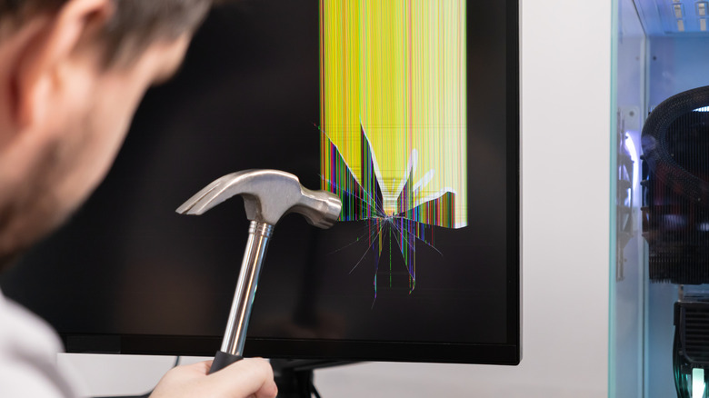

Un punto fijo en la pantalla del portátil puede ser muchas cosas, y no todas tienen arreglo. La buena noticia es que, si ese punto emite luz propia —se ve azul, verde, rojo o una mezcla de esos colores— en lugar de quedarse siempre negro, lo más probable es que sea un **píxel atascado**, y todavía hay margen para intentar recuperarlo.

Esta guía está pensada para cualquier persona con un portátil con un píxel atascado que quiera probar soluciones en casa antes de plantearse una reparación o una garantía. Antes de tocar nada conviene entender qué diferencia a un píxel atascado de uno muerto y qué suele provocar el problema.

## Píxel atascado frente a píxel muerto

La clave está en si sigue pasando corriente por el píxel. Un píxel **muerto** no recibe energía y se queda apagado de forma permanente, normalmente como un punto negro. Un píxel **atascado**, en cambio, todavía tiene corriente, y el problema es justo el contrario: recibe demasiada, de modo que el transistor que lo controla queda fijado en la posición de encendido y el píxel no logra cambiar de color. Como sigue alimentado, un píxel atascado sí tiene posibilidades de desatascarse.

## Qué provoca un píxel atascado

No hay una única causa, y ningún portátil está libre de sufrirla:

- **Daños físicos**: una caída puede dañar transistores, y presionar con demasiada fuerza sobre el panel puede alterar el cristal líquido de una pantalla LCD.
- **Subidas de tensión**: los picos de corriente pueden dañar componentes internos y provocar fallos.
- **Temperaturas extremas**: la exposición al frío o al calor extremos también puede afectar al panel.
- **Desgaste por antigüedad**: cuanto más tiempo lleva en uso un equipo, más probable es que algo falle en su interior.

Conviene saber que los píxeles atascados **no se contagian**: que uno tenga un problema no significa que el resto de la pantalla vaya a seguir el mismo camino. La excepción es un defecto de fabricación más amplio —transistores defectuosos o un sellado incorrecto de componentes—, en cuyo caso sí podrían aparecer más píxeles afectados. Esto también influye en la garantía: un solo píxel atascado puede no cumplir el umbral para el reemplazo, mientras que un grupo de ellos puede sí alcanzarlo.

## Antes de empezar: apaga el equipo

Antes de probar cualquiera de los métodos, apaga el dispositivo y déjalo en reposo alrededor de un día. En algunos casos, ese simple reinicio de la alimentación es suficiente para que el píxel vuelva a la normalidad.

## Los tres métodos de reparación

Existen tres vías principales para intentar desatascar un píxel antes de revisar la garantía: por software, por presión y por calor. Los dos últimos tienen capacidad de causar más daños al equipo, así que hay que usarlos con mucha precaución.

### 1. Método por software

Es la opción más sencilla y segura. Consiste en usar programas diseñados para desatascar píxeles que hacen ciclar colores a gran velocidad sobre la zona afectada para forzar el transistor del píxel y liberarlo.

1. Elige una herramienta. **JScreenFix** es una opción popular y funciona directamente en el navegador, sin necesidad de descargar un programa.
2. Como alternativa, puedes usar **PixelHealer**, aunque solo está disponible para Windows.
3. Ejecuta la herramienta y deja que el ciclo de colores actúe sobre el píxel atascado.

**Advertencia**: el parpadeo rápido de estas herramientas puede ser problemático para personas con epilepsia fotosensible o afecciones similares. Si tú o alguien presente en la sala tiene esa condición, hay que extremar las precauciones al usar software de reparación de píxeles.

### 2. Método por presión

Este método ya requiere contacto físico con la pantalla y tiene riesgo de dañarla, así que hay que hacerlo con cuidado.

1. Reúne un instrumento **con punta pero que no sea afilado**, como el capuchón de un bolígrafo, un lápiz óptico o tu propio dedo.
2. Consigue una barrera suave de protección, idealmente un paño de microfibra.
3. Cubre el instrumento con el paño.
4. Con la pantalla **apagada**, localiza la zona del píxel afectado y aplica una **presión ligera**.
5. Sin dejar de presionar, enciende el equipo y comprueba si el píxel se ha desatascado.

Si no funciona, puedes repetir el ciclo unas cuantas veces más.

### 3. Método por calor

1. Apaga primero el dispositivo.
2. Calienta un paño: no debe estar caliente, solo templado.
3. Colócalo sobre la zona del píxel atascado durante unos minutos.
4. Vuelve a encender el equipo.

Como en el método por presión, se puede repetir varias veces si no funciona en el primer intento. En este caso conviene dejar pausas más largas entre sesiones para no calentar en exceso otros componentes internos.

## Cómo verificar que funcionó

En el método por software, la comprobación es inmediata: la propia herramienta actúa sobre el píxel mientras se ejecuta, así que basta con observar si el punto recupera un color normal. En los métodos por presión y por calor, la verificación se hace encendiendo el equipo —en el caso de la presión, todavía aplicándola— y revisando si el píxel ha dejado de quedarse fijo. Si sigue igual, se puede repetir el ciclo varias veces respetando las pausas.

## Advertencias y limitaciones

- Los métodos por **presión** y por **calor** pueden causar más daños al equipo si se aplican mal. La presión debe ser ligera y el paño debe estar solo templado.
- No todas las averías tienen solución: si el problema es de origen o el píxel está muerto en vez de atascado, estos métodos no servirán.
- Antes de seguir insistiendo, merece la pena valorar la garantía. Un único píxel atascado puede no alcanzar el umbral que exige el fabricante para sustituir el equipo, pero un grupo de píxeles afectados sí podría cumplirlo.
