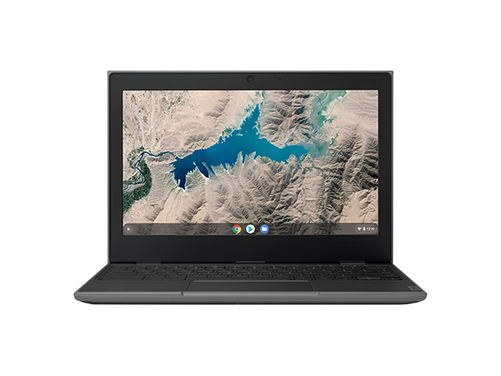

Chrome OS es un sistema deliberadamente ligero, y precisamente por eso un equipo de gama baja con algunos años a sus espaldas puede seguir cumpliendo para navegar, redactar documentos y reproducir vídeo. Sobre esa idea se apoya la oferta que recoge PCWorld: un Lenovo Chromebook reacondicionado con pantalla táctil de 11,6 pulgadas que el medio sitúa en 79,99 dólares, frente a los 284,99 dólares que figuran como precio de referencia. La rebaja anunciada equivale a un 71 % y la venta corre a cargo de StackSocial.

Conviene aclarar desde el principio que no es un portátil nuevo ni una alternativa para cargas exigentes: es un reacondicionado pensado para tareas cotidianas, y su precio refleja exactamente eso.

## Un equipo básico con pantalla táctil IPS

La configuración descrita por PCWorld combina un procesador Intel Celeron N3450 de cuatro núcleos con 4 GB de memoria RAM y 32 GB de almacenamiento. Son cifras modestas que bastan para ofimática, correo, navegación con varias pestañas y vídeo en streaming, pero no para edición de vídeo, procesamiento pesado o juegos exigentes.

La pantalla es el punto que más lo distingue de otros equipos de su franja: 11,6 pulgadas a 1366×768 con tecnología IPS y función táctil. El panel IPS suele ofrecer mejores ángulos de visión y color que las pantallas básicas habituales en este rango de precio. En conectividad incluye WiFi y Bluetooth 4.0, y el equipo pesa alrededor de 3,2 libras (cerca de 1,45 kilogramos), con una webcam integrada para videollamadas.

## Qué implica que sea un reacondicionado de Grado B

El precio no es casual. El equipo tiene clasificación Grado B dentro del mercado de reacondicionados, lo que significa que la carcasa puede presentar roces leves, arañazos superficiales o pequeñas marcas, aunque el fabricante o el vendedor confirman que el funcionamiento interno es correcto. En la práctica, quien compra asume imperfecciones estéticas a cambio de un desembolso mucho menor.

Es la clave para entender el 71 % de descuento anunciado: no se trata de un chollo sobre producto nuevo, sino de un equipo con uso previo y con garantía limitada según las condiciones del vendedor. Para un dispositivo destinado a estudio, consulta o como segundo equipo, el intercambio puede tener sentido; para quien busque un portátil impecable, no.

## Chrome OS y el almacenamiento ajustado

Los 32 GB de almacenamiento pueden parecer escasos frente a los estándares de Windows, y en cierto modo lo son. Sin embargo, Chrome OS está diseñado para trabajar con la mayor parte de los archivos en la nube, de modo que el espacio local se llena más despacio que en un portátil convencional. A cambio, el sistema ofrece actualizaciones automáticas en segundo plano, seguridad integrada y acceso tanto a las aplicaciones de Google como a la Google Play Store.

Todo ello encaja con el perfil al que apunta la oferta: un equipo barato y ligero para tareas básicas, no un sustituto de un portátil de trabajo o de gaming.

## Antes de comprar: precios volátiles y disponibilidad

Las ofertas de este tipo son especialmente sensibles al paso del tiempo. StackSocial advierte que sus precios están sujetos a cambios, así que las cifras de 79,99 y 284,99 dólares pueden variar o dejar de estar disponibles sin previo aviso, y el stock de reacondicionados suele agotarse con rapidez. Además, son precios en dólares y de un minorista estadounidense, por lo que sirven como referencia de mercado pero implican envío internacional y posibles aranceles para el comprador hispanohablante.

Hay un detalle que conviene verificar antes de pagar: PCWorld describe el dispositivo como un Lenovo 300e, mientras que el título del listado del vendedor lo identifica como «Lenovo 11.6" Chromebook 100E Gen 2 (2019) AMD A4-9120C 4GB RAM 32GB SSD Black (Refurbished)». La denominación del modelo y el procesador no coinciden con la descripción del artículo, de modo que lo prudente es confirmar en la propia página de la oferta qué modelo y qué especificaciones se envían realmente antes de completar la compra.
