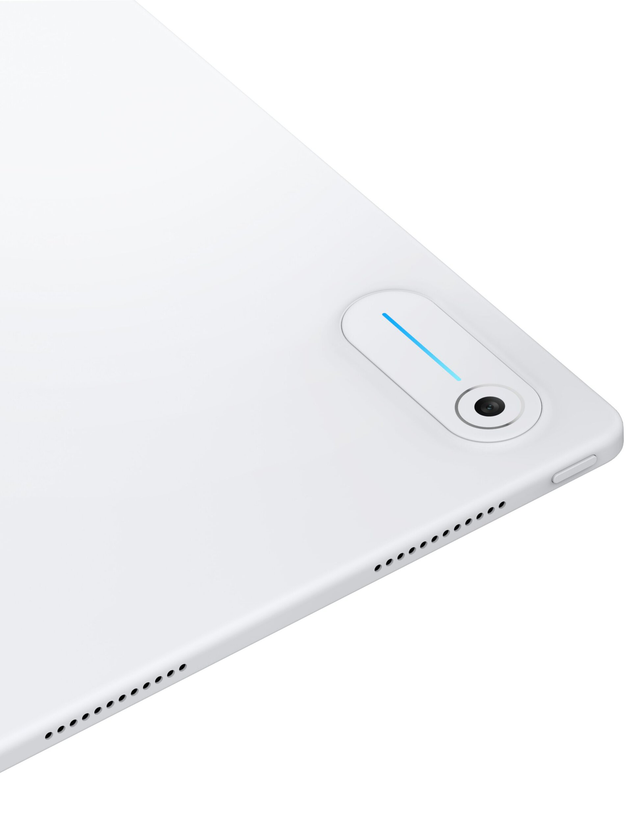

El Lenovo Googlebook 2 en 1, el modelo convertible que se quedó fuera de la presentación oficial de los portátiles Android de Google, ha vuelto a aparecer en una filtración. El conocido filtrador Evan Blass ha publicado en X nuevas imágenes de alta calidad del equipo, una versión mejorada de la que ya circuló el mes pasado y que muestra con más detalle su diseño de tableta con teclado acoplable.

Google presentó a principios de esta semana cinco portátiles Googlebook, una categoría con software basado en Android e inspirado en las lecciones de ChromeOS, cuyo hardware firman fabricantes externos. Lenovo aportó el Googlebook 15, el más asequible de la gama, pero la compañía tenía previstos varios dispositivos y solo uno llegó al evento principal. El 2 en 1 podría ser el siguiente en salir, según cuenta Android Authority.

## Un diseño heredado del Chromebook Duet

Las imágenes filtradas por Blass muestran un equipo con formato de tableta, soporte trasero integrado y un teclado más fino que el del resto de la gama Googlebook. La marca Googlebook se aprecia con claridad en el reposamanos izquierdo, mientras que a la derecha aparece un botón que serviría para desactivar el teclado y evitar pulsaciones accidentales.

Junto a ese interruptor se distingue un pequeño logotipo de Bluetooth, lo que sugiere que el teclado podría seguir funcionando separado de la tableta, de forma parecida a lo que ya hacen algunas tabletas de OnePlus. Una segunda imagen de alta resolución revela además la cámara trasera y la barra luminosa que recorre todo el equipo, un elemento común a la gama que por ahora solo indica el nivel de batería.

## Qué se sabe del hardware del Lenovo Googlebook 2 en 1

Blass no ha desvelado especificaciones, pero filtraciones anteriores apuntaban a una pantalla de 13 pulgadas y un procesador MediaTek Kompanio Ultra 910. Esa misma filtración indicaba que el equipo se llamaría Lenovo Googlebook Duet, en línea con el Chromebook Duet que Lenovo ya comercializó con este mismo formato.

Conviene tomar estos datos con cautela: proceden de filtraciones previas y ni Lenovo ni Google han confirmado la existencia del dispositivo, su ficha técnica o su fecha de salida.

## Por qué se quedó fuera del lanzamiento

De los cinco Googlebook presentados, cuatro apuestan por el formato clásico de concha y solo el Acer Googlebook 14 ofrece un diseño convertible de 360 grados. Según Android Authority, Google habría preferido reservar el protagonismo para los modelos con silueta de portátil tradicional, y el 2 en 1 habría quedado apartado para no diluir esa imagen de «portátil» que la compañía quiere asociar a la marca.

El filtrador no aclara si el proyecto se ha cancelado o simplemente está pendiente de lanzamiento. Con renders tan acabados ya en circulación, lo razonable es esperar que Lenovo lo ponga a la venta antes o después, aunque sea sin el escaparate que acompañó a su hermano convencional. Para poner en contexto la gama ya oficial, con sus cinco modelos y precios desde 899 dólares, puede consultarse [el catálogo de lanzamiento de los Googlebook](/noticias/googlebook-launch/).
