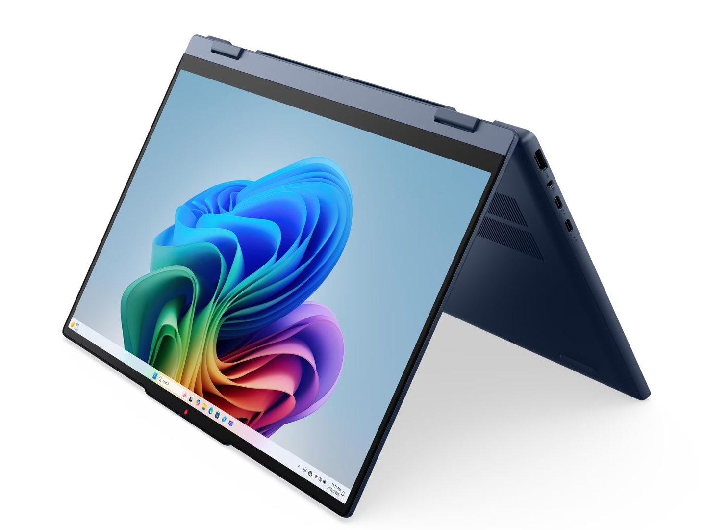
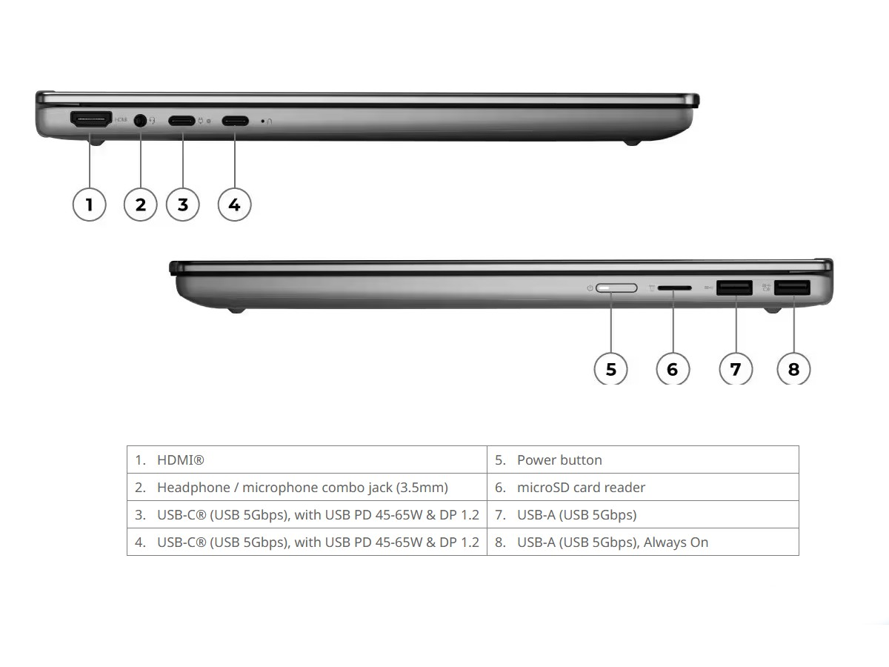

Lenovo ha lanzado en los mercados internacionales el IdeaPad 5 15 (15IWC11), un convertible 2 en 1 con bisagra de 360 grados que puede usarse como portátil o como tableta. Lo hace con procesadores Intel de la plataforma Wildcat Lake y con hasta 16 GB de memoria, según recoge ITHome, una configuración que apunta a un uso cotidiano más que a cargas de trabajo exigentes.

## Qué procesador y qué pantalla ofrece el IdeaPad 5 15 convertible

El equipo se puede configurar con un **Core 3 304** o un **Core 5 315**, siempre sobre la plataforma **Wildcat Lake** de Intel. La memoria máxima es de **16 GB DDR5-5600 en un solo canal**, un detalle que conviene tener en cuenta porque el ancho de banda queda por debajo del de una configuración de doble canal.

La bisagra de 360 grados permite alternar entre el modo portátil y el modo tableta. La pantalla es un panel **IPS de 15,3 pulgadas** con resolución **1920 × 1200**, un formato 16:10 más alto que el clásico 1080p, brillo máximo de **400 nits** y una frecuencia de refresco de **60 Hz**.

## Cámara, batería y conectividad

Para las videollamadas, el portátil incorpora una **cámara de 1080p con obturador de privacidad físico**, una solución más fiable que un simple interruptor por software. El teclado incluye **teclado numérico** y retroiluminación opcional.

La batería es de **60 Wh** y, según la ficha que cita ITHome, ofrece una autonomía de **hasta 18,99 horas**. Es una cifra del fabricante, así que conviene tomarla como referencia hasta que lleguen pruebas independientes.

En cuanto a los puertos, el esquema oficial que acompaña al anuncio detalla dos **USB-C de 5 Gbps** compatibles con carga USB PD de 45 a 65 W y DisplayPort 1.2, dos **USB-A de 5 Gbps** (uno de ellos con función Always On), **HDMI**, lector de **microSD** y un conector combinado de audio de 3,5 mm. El conjunto mide aproximadamente **34,01 × 24,21 × 1,75 cm** y pesa unos **1,77 kg**, un peso contenido para un convertible de 15 pulgadas.

## Qué cambia para el lector

ITHome no detalla **precio ni fecha de llegada a España**, así que por ahora no hay una referencia concreta para el mercado español. La filiación del equipo ayuda a situarlo: la familia IdeaPad ocupa el tramo de entrada y gama media de Lenovo, por debajo de los Yoga, que apuntan a un público premium y a un precio superior.

Quien busque un convertible de 15 pulgadas para ofimática, navegación y consumo de vídeo encontrará aquí una opción a seguir cuando se anuncie su precio. Quien necesite más potencia para edición o gaming debería mirar hacia otros modelos: los Yoga con Snapdragon, como el [Yoga Slim 7x que protagonizó una fuerte rebaja](/noticias/lenovo-yoga-slim-7x-deal/), juegan en otra liga de rendimiento y de coste. Para hacerse una idea de por dónde se mueven los precios del segmento, la [selección de ofertas en portátiles](/noticias/best-laptop-deals/) es un buen punto de partida.
