XDA Developers ha publicado su análisis del **Lenovo Yoga 9i 2-in-1 Aura Edition de 2026**, la nueva iteración de un convertible que el medio ya situó entre sus portátiles favoritos del año pasado. En esta ocasión, el equipo repite la fórmula que funcionó —chasis de aluminio cuidado, pantalla OLED y un teclado sólido— con el foco puesto en el nuevo silicio de Intel y en un par de ajustes de diseño. La unidad analizada fue cedida temporalmente por Lenovo, que no tuvo intervención alguna en el contenido del artículo.

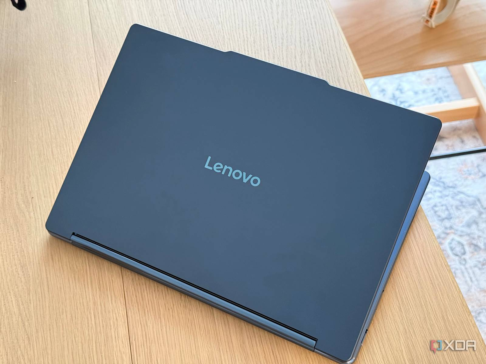

## Un diseño continuista con dos cambios de calado

El medio destaca que Lenovo no ha movido apenas las líneas del Yoga 9i, y lo considera un acierto. El equipo mantiene el acabado en **azul cósmico** con tapa y base de aluminio, y conserva el formato convertible que permite usarlo como portátil, atril, presentación o tableta.

Los cambios se concentran en dos detalles. El primero es el teclado: es prácticamente idéntico al del año pasado, pero Lenovo ha eliminado la columna de teclas más a la derecha, la que quedaba bajo la tecla Suprimir. El movimiento libera espacio a ambos lados, aunque se cobra una víctima: **desaparece el lector de huellas**. El acceso mediante Windows Hello queda en manos de la cámara infrarroja, una solución que el autor considera suficiente pero que echa de menos en un equipo de este precio.

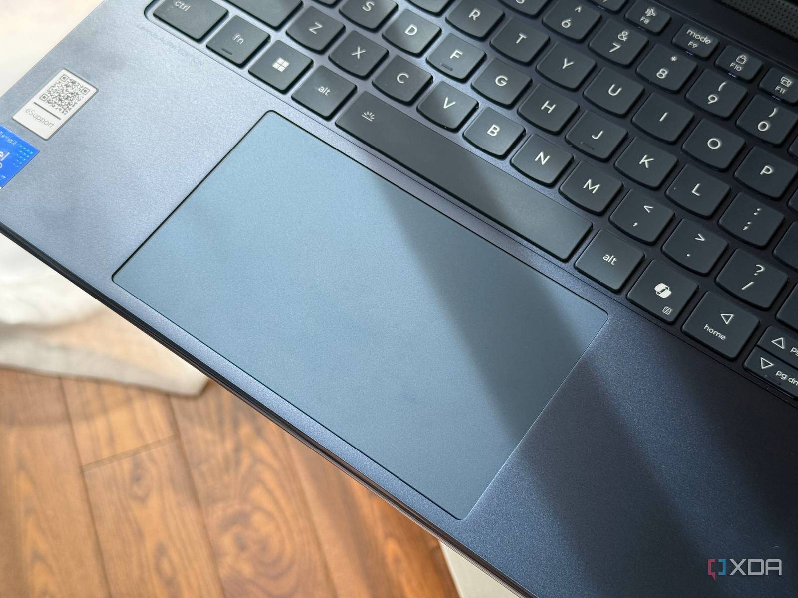

El segundo cambio está en la conectividad: uno de los puertos USB-C de 20 Gbps se sustituye por un **HDMI 2.1 de tamaño completo**, capaz de mover señal hasta 8K a 60 Hz. La ficha se completa con dos Thunderbolt 4, un USB-A de 10 Gbps con carga Always On y un conector combinado de auriculares y micrófono.

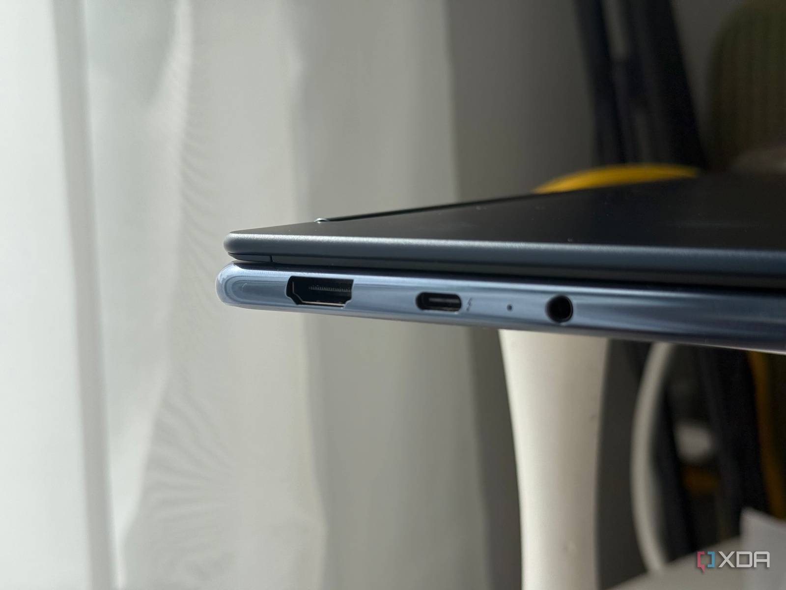

El Yoga Pen Gen 2 sigue incluido y ahora se adhiere a la parte trasera de la pantalla mediante una funda. Cuando el equipo se cierra por completo en modo tableta, esa funda deja la pantalla ligeramente inclinada, un detalle que el autor describe como más cómodo que una superficie totalmente plana.

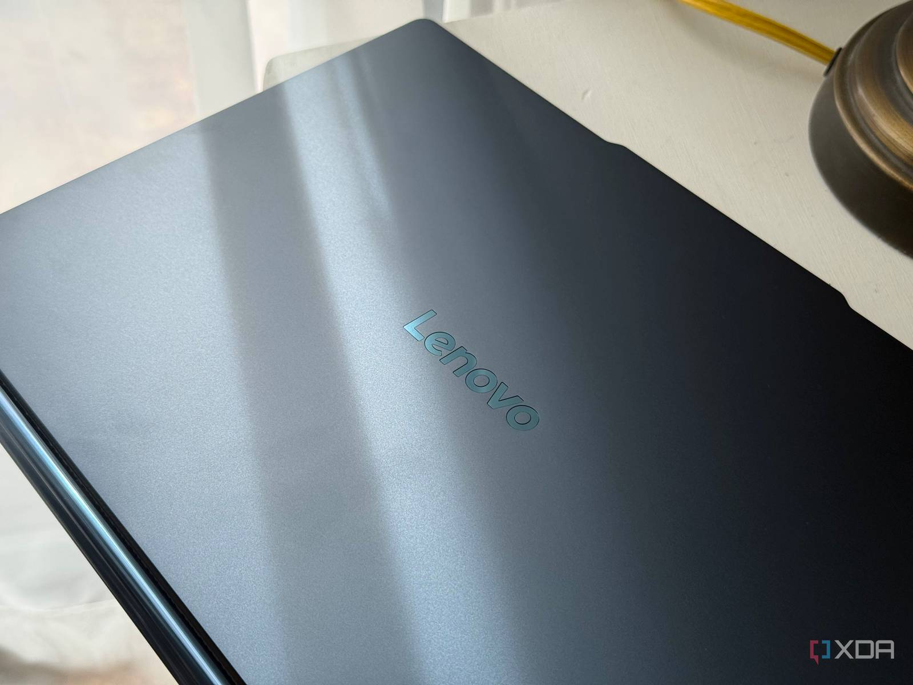

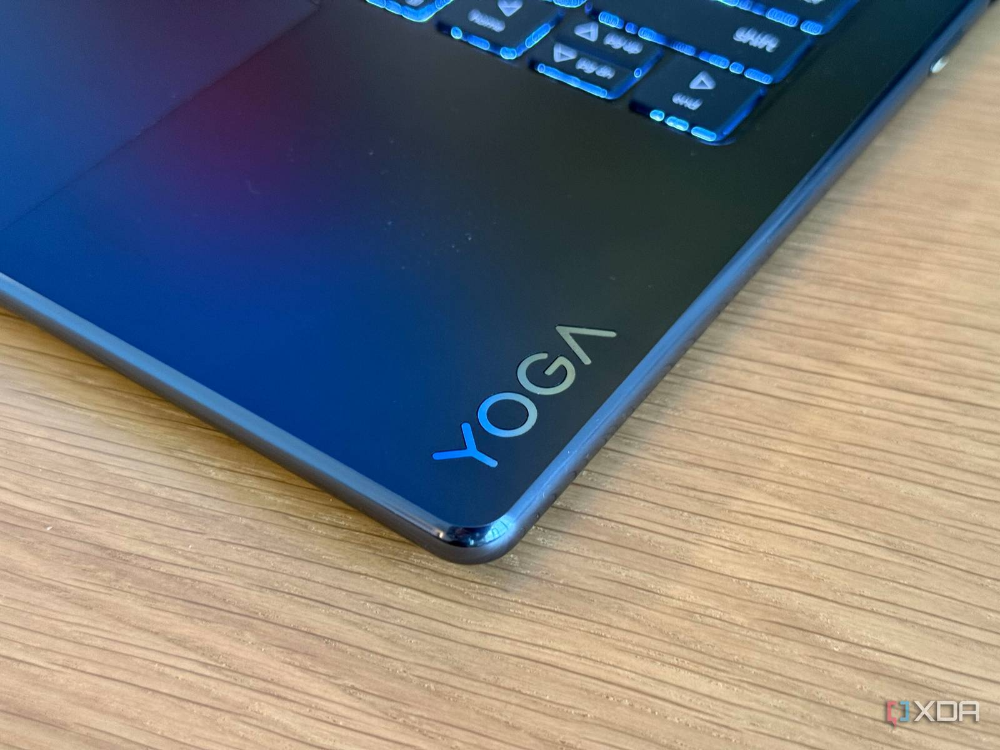

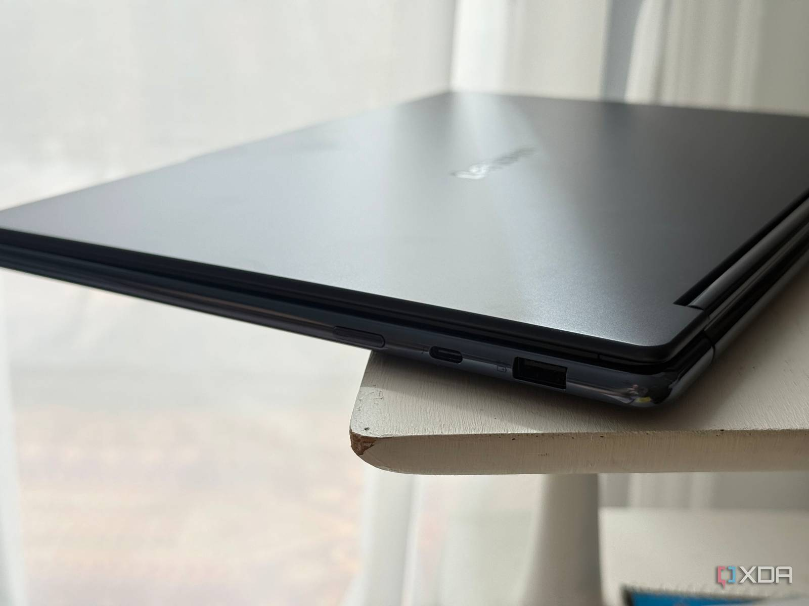

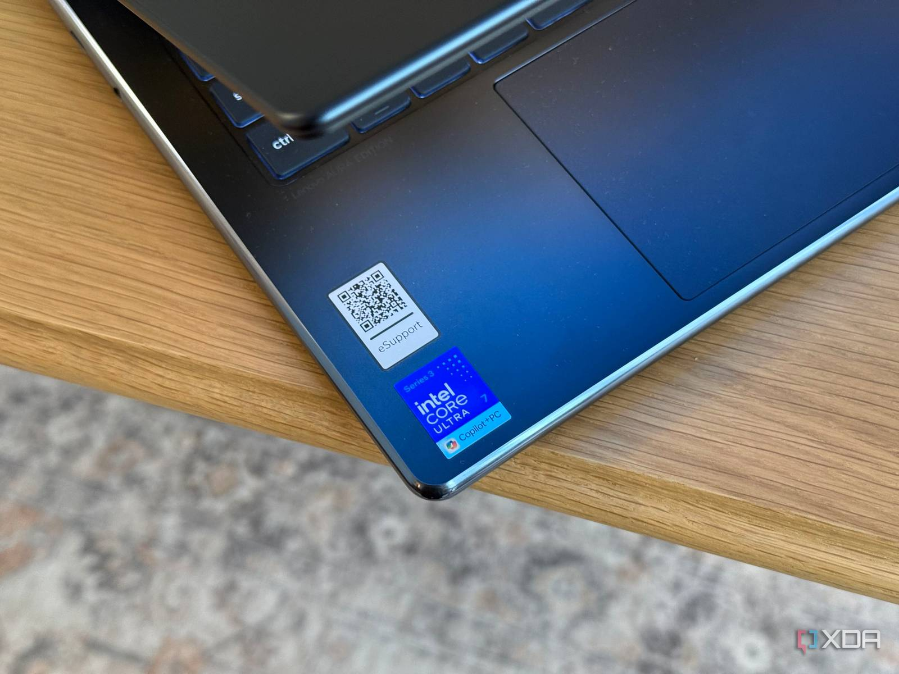

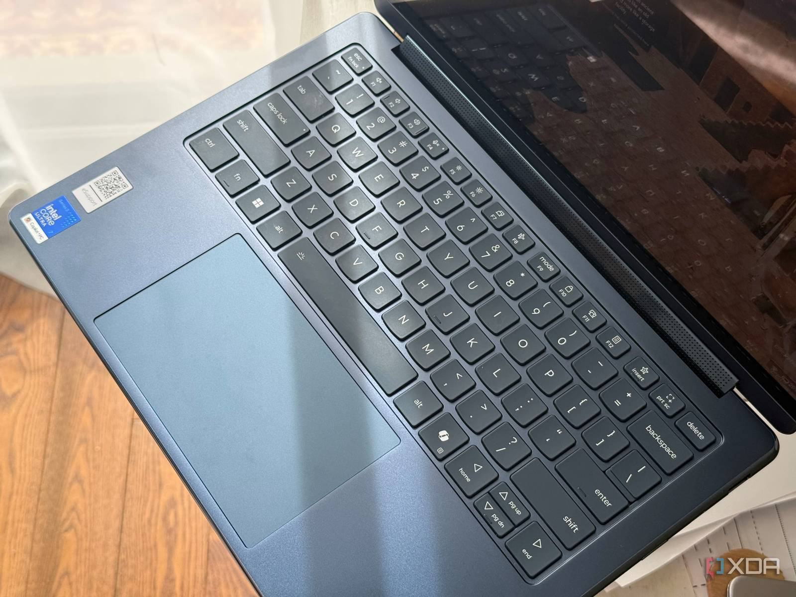

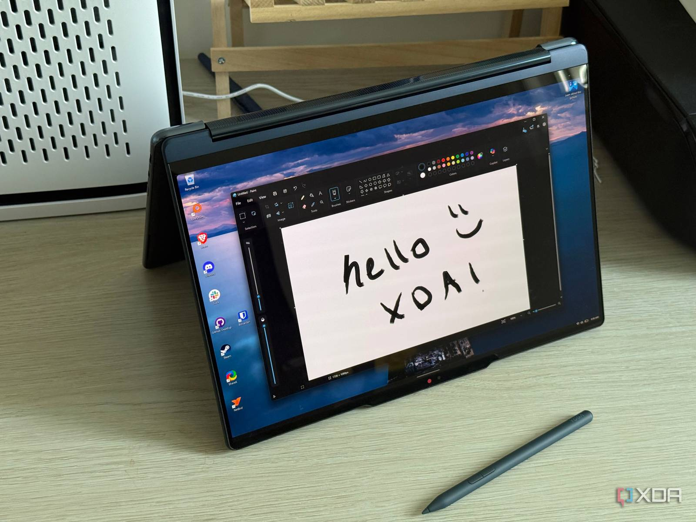

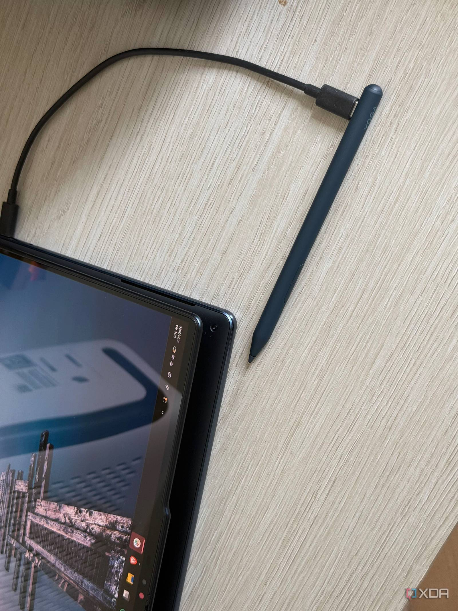

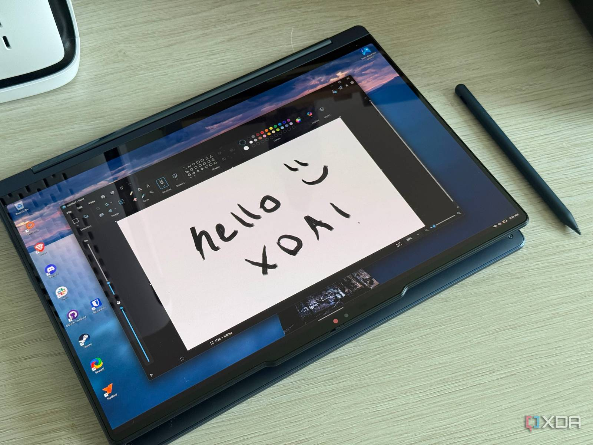

## Panther Lake se estrena en el chasis del Yoga 9i

Bajo el capó, la unidad probada monta un **Intel Core Ultra 7 355** de la generación Panther Lake, acompañado de gráficos integrados de Intel, **32 GB de memoria LPDDR5X-7467** y un **SSD PCIe Gen 4 de 1 TB** que puede ampliarse a 2 TB desde el configurador de Lenovo. La pantalla es la misma OLED de 2.8K (2880 × 1800) táctil del año pasado; Lenovo ha retirado la opción de 4K, una decisión que el autor comparte porque, en este tamaño, la mayor nitidez no compensaría el coste en autonomía.

| Componente | Especificación |
| --- | --- |
| Procesador | Intel Core Ultra 7 355 (Panther Lake) |
| Gráficos | Intel Graphics integrados |
| Pantalla | OLED táctil 2.8K (2880 × 1800), 14 pulgadas |
| Memoria | 32 GB LPDDR5X-7467 (soldada) |
| Almacenamiento | SSD PCIe Gen 4 de 1 TB (ampliable a 2 TB) |
| Batería | 70 Wh |
| Puertos | 2× Thunderbolt 4, 1× USB-A 10 Gbps, 1× HDMI 2.1, jack de 3,5 mm |
| Conectividad | Wi-Fi 7, Bluetooth 5.4 |
| Cámara | 5 MP + IR con obturador de privacidad |
| NPU | NPU 5.0, hasta 50 TOPS |
| Peso | Desde 1,29 kg |
| Sistema | Windows 11 Home |

Esa es, precisamente, la letra pequeña de esta generación: la batería baja de **75 Wh a 70 Wh**. Pese al recorte, el medio no apreció diferencias en una jornada completa de trabajo ligero entre aplicaciones web, algo de edición de fotos y notas con el lápiz. Con el brillo al máximo, eso sí, el cargador hace falta antes de terminar el día; con frecuencia de refresco variable y algo de gestión de brillo, el equipo aguanta la jornada. La carga rápida promete además tres horas de uso con quince minutos enchufado.

En las pruebas del medio, el Yoga 9i 2026 rinde como otros portátiles con el mismo procesador. Estas son las cifras que recoge el análisis comparadas con la generación anterior:

| Prueba | Yoga 9i 2026 (Core Ultra 7 355) | Yoga 9i 2025 (Core Ultra 7 258V) |
| --- | --- | --- |
| Geekbench 6 (mono / multi) | 2.577 / 10.829 | 2.701 / 10.739 |
| Cinebench 2024 (mono / multi) | 120 / 552 | 117 / 490 |
| 3DMark Time Spy | 3.256 | 4.551 |
| 3DMark Wild Life | 5.270 | — |
| 3DMark Night Raid | 29.025 | 34.066 |

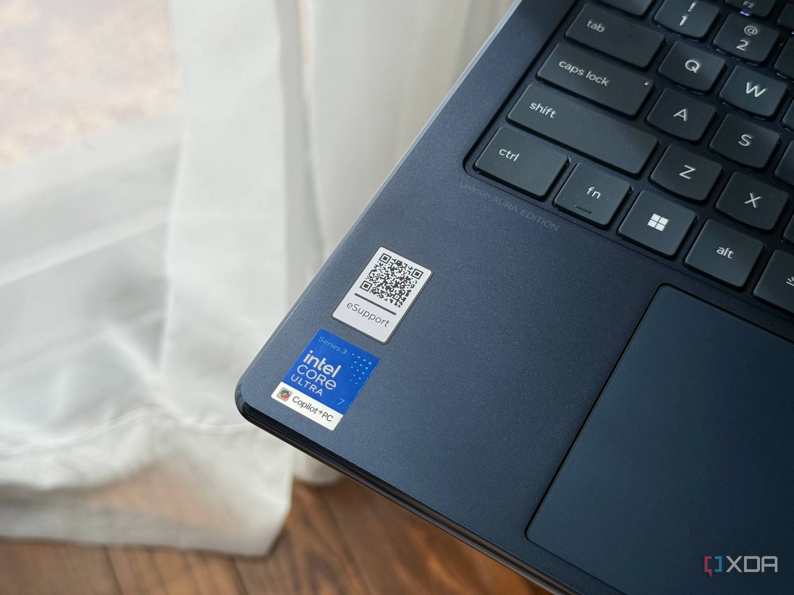

El autor subraya que el rendimiento de CPU es un paso adelante real respecto al año pasado aunque los picos de las pruebas no lo reflejen del todo, y que el equipo se calienta bastante bajo carga sostenida, si bien los ventiladores se aceleran menos que en su predecesor durante el uso normal. También documenta una rareza: ni CrossMark ni PCMark 10 lograron arrojar una puntuación válida en sus pruebas, incluso con una instalación limpia.

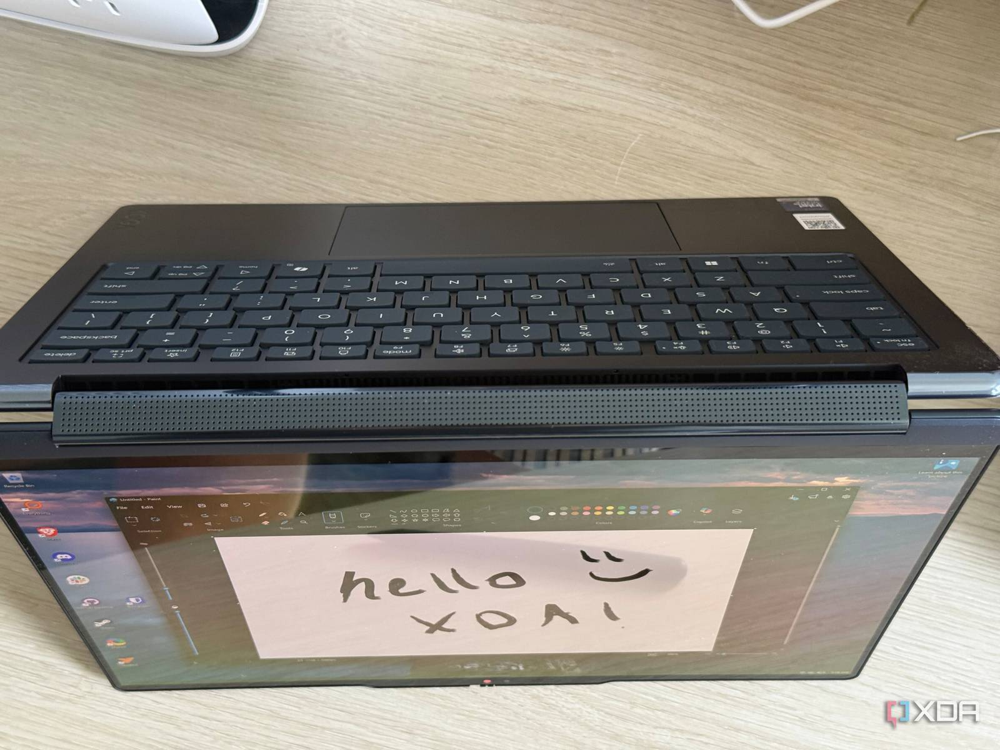

En el apartado de sonido sí hay continuidad total: la barra de altavoces orientada hacia delante, con dos woofers y dos tweeters y certificación Dolby Atmos, sigue llenando sin problema una sala de tamaño medio y se mantiene como uno de los mejores sistemas de audio que el autor ha probado en un portátil.

## Precio y disponibilidad: a quién le encaja

El Lenovo Yoga 9i 2-in-1 Aura Edition de 2026 está disponible en la web de Lenovo desde **2.380 dólares**; en el momento del análisis también aparecía en Best Buy por **2.350 dólares** en su configuración base. Se trata de una máquina de gama alta, y el propio medio advierte que no ganará ningún premio a la mejor relación precio-rendimiento.

Según el análisis, el Yoga 9i es una compra acertada para quien busca un convertible con buen rendimiento, una pantalla OLED brillante y un diseño cuidado. En cambio, no es la mejor opción si el presupuesto manda o si se necesitan gráficos dedicados. Para quien compare opciones dentro de la familia, el [Lenovo Yoga Slim 7x rebajado a 1.549,99 dólares](/noticias/lenovo-yoga-slim-7x-deal/) apunta a un perfil distinto: prioriza la delgadez y el silicio Snapdragon antes que el formato convertible.

El veredicto del medio es que esta iteración conserva la posición de las anteriores: uno de los mejores convertibles del mercado, algo caro, pero lo bastante bien construido y diseñado como para justificar el desembolso.
