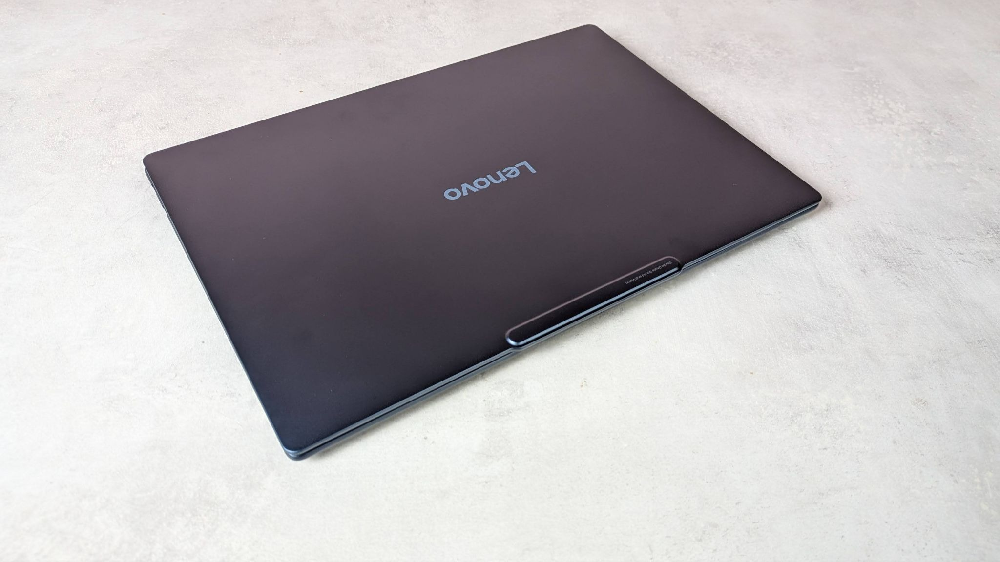
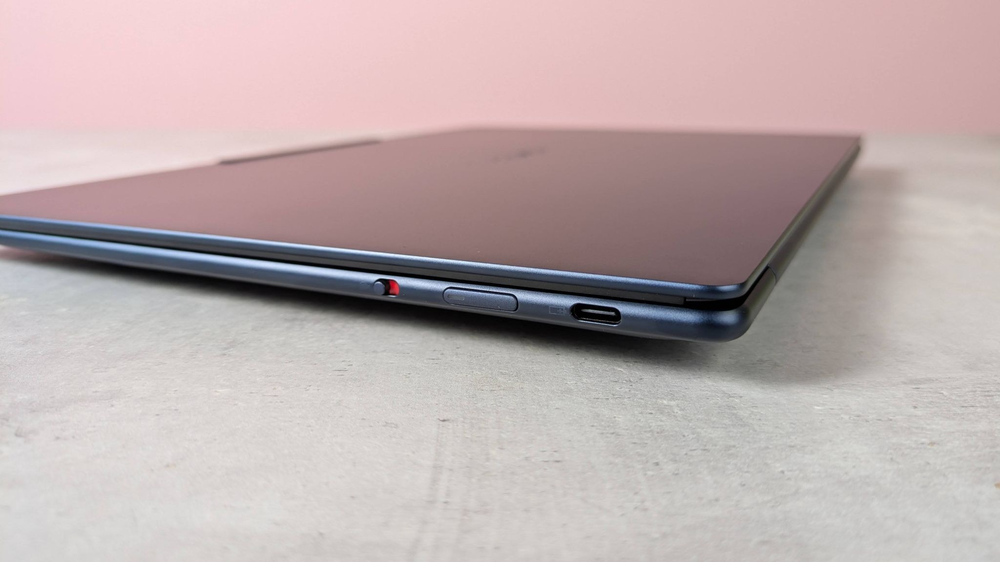
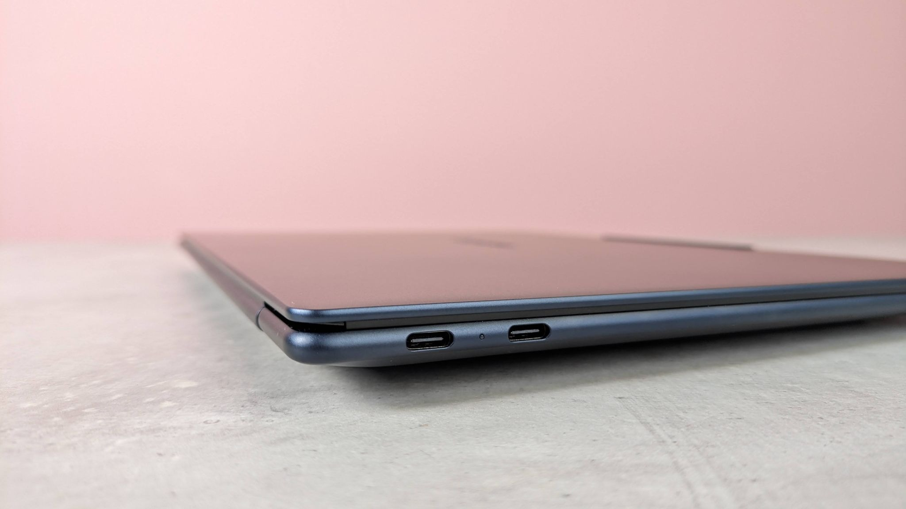
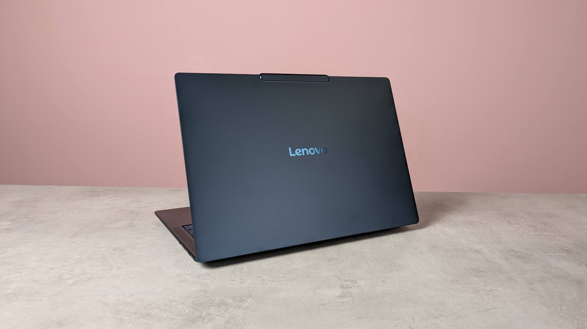

El Lenovo Yoga Slim 7x es uno de esos portátiles que se recuerdan por lo delgado que son. La versión de 14 pulgadas con Snapdragon X2 Elite, 32 GB de memoria y 1 TB de almacenamiento pasa ahora de 2.099,99 a 1.549,99 dólares en la tienda de Lenovo en Estados Unidos, un descuento de 550 dólares respecto al precio anterior. Así lo recoge TechRadar, que firmó recientemente su análisis del equipo.

Conviene tener presente que se trata de una promoción del mercado estadounidense: el precio aplica en la tienda de Lenovo para ese país y no equivale necesariamente a las tarifas de otras regiones. Aun así, sirve de referencia para entender cuánto cuesta un ultraportátil de gama alta con esta configuración.

## Qué configuración tiene el Yoga Slim 7x

El modelo rebajado incluye un procesador Snapdragon X2 Elite X2E-80-100, 32 GB de memoria LPDDR5, un SSD Gen4 de 1 TB, pantalla OLED de 14 pulgadas y Windows 11 Home. En el análisis de TechRadar, la pantalla Full HD OLED alcanza el 100 % de la cobertura DCI-P3, un dato relevante para quien trabaja con color.

En cuanto a dimensiones, TechRadar señala que el equipo mide 0,55 × 12,28 × 8,70 pulgadas y pesa 2,58 libras, lo que lo sitúa en la categoría de los ultraportátiles pensados para llevarse a todas partes.

## La valoración del medio: cuatro estrellas y batería de casi un día

Aquí hay que ser claros: los juicios sobre el rendimiento son la opinión de TechRadar, no datos objetivos. En su análisis, el medio le otorgó 4 estrellas y lo describió como un equilibrio acertado entre potencia y portabilidad. Según sus pruebas, el equipo se desenvuelve sin problemas en tareas de productividad, navegación con muchas pestañas y reproducción de vídeo en 4K, y su batería duró algo menos de 24 horas en sus mediciones. El medio también afirmó que podría ser el portátil más fino que ha probado y destacó la calidad de construcción.

TechRadar matiza que, para contenido, el Yoga Slim 7x encaja mejor en diseño y edición fotográfica que en producción de vídeo a gran escala, y que aunque llegó a mover *Cyberpunk 2077* en ajustes bajos, su terreno natural es la productividad con juego ocasional. En su veredicto de valor, el medio consideró que el precio está justificado: argumenta que la mayoría de portátiles con Snapdragon cuestan entre 1.100 y 1.300 dólares en configuraciones base limitadas a 16 GB de memoria y 512 GB de almacenamiento, mientras que esta unidad duplica ambas cifras.

## ¿Para quién tiene sentido esta oferta?

Según el análisis de TechRadar, este portátil es una buena opción para quienes buscan un ultraportátil ligero para trabajo y estudio. En cambio, el medio desaconseja su compra si se necesitan cargas gráficas dedicadas como edición de vídeo, renderizado 3D o gaming. La recomendación, por tanto, es la de la publicación, que analizó el equipo antes de esta rebaja.

Para un lector hispanohablante, la clave está en el tipo de uso: si el día a día pasa por ofimática, navegación y movilidad, la propuesta encaja; si el plan es exprimir la GPU para crear o jugar, conviene mirar alternativas. El precio de 1.549,99 dólares corresponde a la promoción vigente en la tienda estadounidense de Lenovo en el momento de publicar esta pieza, y puede variar.

