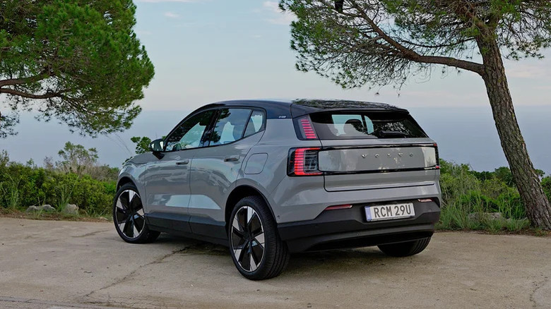
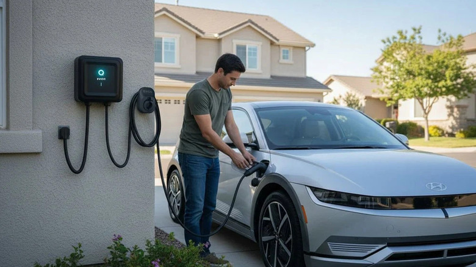

Cargar el coche en casa es barato y cómodo. En Estados Unidos, hacerlo con electricidad doméstica es unas tres veces más económico que repostar gasolina o diésel, y la factura todavía baja más si se aprovechan las tarifas reducidas del horario nocturno. La duda aparece después de comprar el vehículo: ¿basta con un enchufe normal o merece la pena pagar la instalación de un cargador de nivel 2?

No hay una respuesta única. Un coche eléctrico no es un teléfono móvil y no necesita salir de casa al 100 % cada día, así que la decisión depende de tres factores: la capacidad de la batería, la velocidad máxima de carga en corriente alterna que admite el vehículo y cuántos kilómetros se recorren a diario. Estos son los criterios que conviene repasar antes de decidir, tal como los plantea Engadget.

## Qué coche tienes y cuánto lo usas

La batería es el factor que más pesa. No es lo mismo un urbano pequeño como el Fiat 500e, con unos 38 kWh, que un Tesla Model 3 (79 kWh), un Volvo EX30 (69 kWh) o una pickup de batería grande como el GMC Sierra EV (155 kWh). En esta comparación también entran los híbridos enchufables, como el Toyota Prius Prime (14 kWh) o el RAV4 Prime (18 kWh), que mucha gente carga en casa.

En Estados Unidos y Canadá, una toma estándar de 15 A y 120 V entrega como máximo unos 1,8 kW. Con esa potencia, un híbrido enchufable se recarga en menos de 10 horas, mientras que el Fiat 500e necesitaría unas 21 horas, el Model 3 unas 43 horas y el Sierra EV la friolera de 86 horas, más de tres días y medio.

A esto se suma la velocidad máxima de carga que admite cada coche. La mayoría de los híbridos enchufables se conforma con poco: el Prius Prime admite 3,5 kW y el RAV4 Prime, 7 kW. Entre los eléctricos también hay diferencias notables: el Nissan Ariya, el MG4 y el Kia e-Niro se quedan en 7,4 kW, mientras que modelos como el Model 3 y el Model Y llegan hasta 11 kW.

Por último está el uso real. Si cada día se gasta solo una fracción de la autonomía, el enchufe doméstico puede bastar. Si el trayecto diario consume buena parte de la batería, no. El ejemplo que pone el original: recorrer un 40 % de la batería de un Model 3 al día equivale a unos 32 kWh, alrededor de 100 millas (unos 160 km). Recuperar esa energía con corriente doméstica exige unas 18 horas, así que en pocos días la batería quedaría vaciada.

## Cuándo basta con un enchufe de casa

Con esos datos sobre la mesa, Engadget resume así la decisión: para la mayoría de los híbridos enchufables basta con cargar desde una toma doméstica y no hace falta gastar en un cargador dedicado. Lo mismo ocurre si el coche tiene una batería pequeña o si se consumen menos de 15 kWh al día, equivalentes a unos 50 millas (unos 80 km) de autonomía. En ese caso, un enchufe normal y la recarga nocturna son suficientes.

## Cuándo conviene un cargador de nivel 2

Los cargadores de nivel 2 funcionan con corriente alterna (AC) y existen versiones residenciales y comerciales; no deben confundirse con los cargadores rápidos de corriente continua (DC). Se conectan al coche con un conector de 5 pines J1772 o el NACS de Tesla, y es el propio vehículo el que convierte la corriente alterna en continua. Casi siempre trabajan sobre un circuito de 240 voltios, no de 120 como la red doméstica, y pueden entregar entre 3,3 kW y 11,5 kW en instalaciones residenciales, según la capacidad de la acometida de la vivienda.

Para quien supera el umbral anterior, el salto de potencia es notable:

- Un modelo de **16 A y 240 V** duplica la velocidad de carga hasta 3,5 kW y reduce a la mitad los tiempos respecto al circuito doméstico.
- Uno de **32 A y 240 V** sube hasta 7,4 kW, cuatro veces más que los 120 V. Con él, un Tesla Model 3 se carga por completo en casa en unas 11 horas, y la batería de 155 kWh del GMC Sierra EV, en unas 22 horas.
- Un sistema de **48 A** llega hasta 11,5 kW. Antes de elegir esta opción hay que comprobar que el coche admite esa potencia: el Nissan Ariya y otros modelos se quedan en 7,4 kW.

Engadget señala además un beneficio que suele pasarse por alto: la seguridad. Los cargadores domésticos habituales ofrecen una protección limitada y pueden resultar inseguros si la instalación eléctrica tiene algún defecto. Los cargadores dedicados añaden capas adicionales, como la protección de puesta a tierra (fallo de PEN) y la protección contra fugas de corriente continua. Muchos modelos permiten, además, monitorizar el consumo para no exceder la capacidad de los circuitos de la vivienda.

## Instalación y presupuesto

Muchas viviendas nuevas con acometida de 200 amperios pueden asumir un cargador de nivel 2 de alta potencia. En cambio, una casa con 100 amperios o menos puede necesitar una ampliación a 200, un gasto que Engadget califica de considerable y que conviene verificar con un electricista cualificado.

En cuanto al equipo, un cargador de 240 V para un solo vehículo cuesta entre unos 250 y 700 dólares, según la amperaje y las funciones extra. Muchos incluyen monitorización del consumo y gestión del cable, mientras que los modelos más baratos no. A ese precio hay que sumar la instalación, que puede ir de unos cientos a varios miles de dólares según la complejidad.

## Resumen: cómo decidir

En resumen, si se tiene un híbrido enchufable o un eléctrico pequeño, o si se recorren menos de 50 millas (unos 80 km) al día, lo más probable es que no se necesite un cargador de nivel 2. En caso contrario, conviene comprobar la velocidad máxima de carga en corriente alterna del coche e instalar un cargador que la iguale o la supere, siempre que el presupuesto lo permita.

Queda un último caso: si la vivienda ya cuenta con una cocina eléctrica de gran potencia o una toma para autocaravana, puede ser posible comprar un cargador de nivel 2 compatible y conectarlo sin modificaciones eléctricas. En cualquier caso, Engadget recomienda confirmar el estado del cableado con un electricista certificado.
