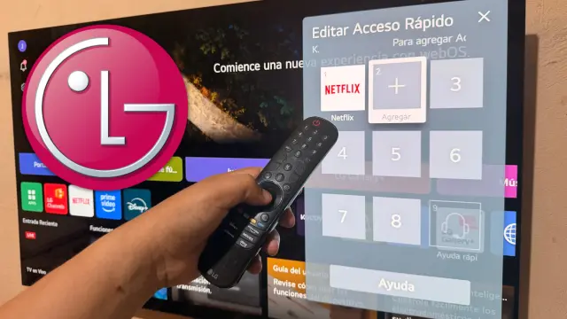

LG ha reestructurado el código interno de webOS para que el sistema consuma menos memoria RAM. El objetivo es que los televisores de generaciones anteriores sigan moviendo la interfaz con fluidez sin necesidad de montar más memoria física, una decisión que encaja con su programa webOS Re:New de extender el soporte a los modelos antiguos.

## La memoria RAM, el cuello de botella del televisor moderno

Comprar un televisor con buen panel y funciones recientes no garantiza que mantenga su velocidad con el paso de los años. Muchos usuarios comprueban cómo su Smart TV responde con lentitud, sufre congelaciones o cierra aplicaciones apenas unos años después de comprarlo, y la causa no está en la pantalla: es el sistema operativo, que acumula procesos hasta colapsar la memoria disponible.

El problema es especialmente visible en la gama media, donde abundan las arquitecturas modestas de entre 1,5 GB y 2 GB de RAM. Cuando plataformas como Netflix o YouTube actualizan sus interfaces con nuevas animaciones y funciones, la memoria libre para gestionar tareas se agota con rapidez. A esto se suma un contexto complicado: la volatilidad en el precio de los semiconductores y la escasez dificultan añadir más memoria física en las gamas de entrada y media, en plena [crisis de la memoria que tensiona a todo el sector](/noticias/acer-ceo-ram-crisis/).

## Qué cambia con la optimización de webOS

La reingeniería planteada por LG no altera el almacenamiento donde se guardan las aplicaciones, sino la forma en que el procesador gestiona los procesos activos en segundo plano. Al liberar margen de maniobra, el sistema evita el cierre de servicios y la interfaz se mueve con fluidez incluso en televisores con especificaciones ajustadas, sin incrementar los costes de fabricación.

Este compromiso respalda la promesa de la marca de ofrecer hasta cinco años de soporte continuado en los modelos integrados en su plan de mantenimiento, con estabilidad garantizada sin exigir un recambio de piezas. Frente a la tendencia de empujar al consumidor hacia la compra de un televisor nuevo, aligerar la carga del sistema combate la obsolescencia programada: alarga la vida útil de las pantallas, disminuye los residuos electrónicos y alivia la presión económica sobre el usuario.

## Cómo recibir la mejora en tu televisor

Para beneficiarse de estas mejoras es necesario mantener el equipo actualizado con el firmware que distribuye el fabricante. El procedimiento, según detalla el medio de origen, es el siguiente:

1. Abre el menú de **Ajustes** con el mando a distancia y entra en **General**.
2. Selecciona **Acerca de este televisor** y pulsa en **Buscar actualizaciones de software**.
3. Activa las descargas automáticas para recibir las mejoras del sistema en cuanto se publiquen.
4. Entra en **Cuidado del dispositivo** y ejecuta la herramienta **Optimización de memoria** para limpiar la caché.

El movimiento demuestra que la fluidez de un dispositivo no depende únicamente de integrar componentes más potentes cada año. Maximizar la eficiencia del sistema es una alternativa realista frente al consumo acelerado y garantiza que un televisor comprado hace años conserve su utilidad ante las exigencias actuales.
