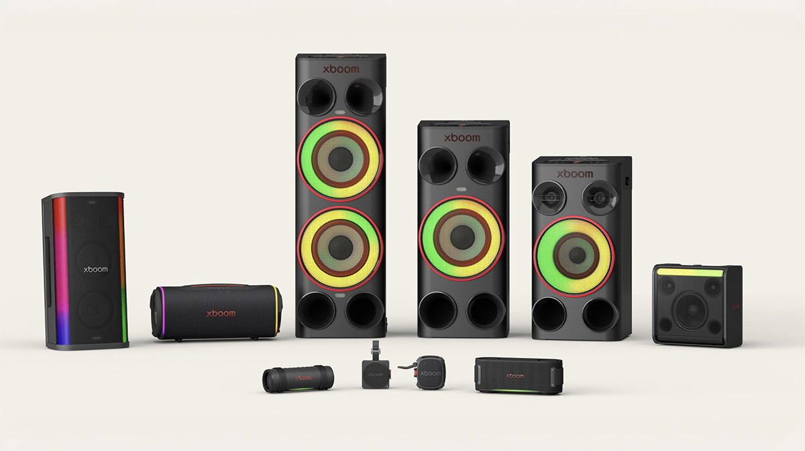
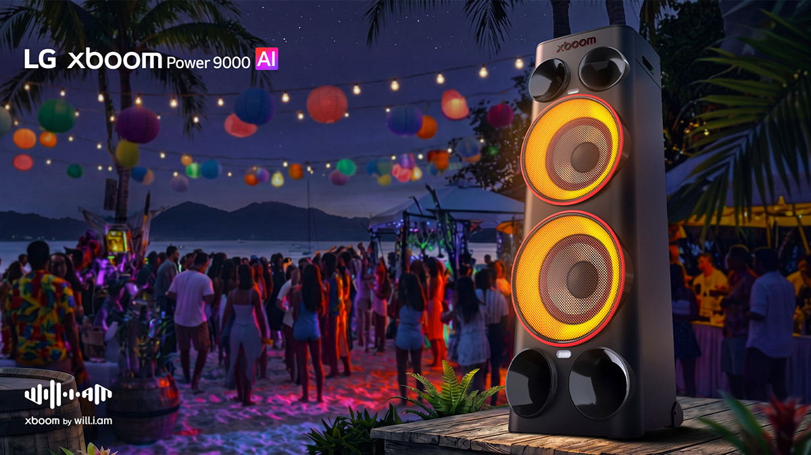

LG ha ampliado su catálogo de altavoces para fiestas con la nueva serie **LG xboom Power**, una familia de tres modelos que combina potencia acústica con funciones de inteligencia artificial. La propuesta más destacada es AI Karaoke Master, un sistema que convierte cualquier canción de nuestra biblioteca en una pista de karaoke, sin depender de temas preparados de antemano.

La gama llega en plena fiebre por los altavoces de fiesta, un segmento en el que LG lleva tiempo insistiendo. En esta ocasión la compañía mantiene la apuesta por el sonido potente, pero pone el acento en la IA: no tanto en reproducir mejor, sino en añadir funciones que hasta ahora exigían aplicaciones o equipos externos.

## Tres modelos de LG xboom Power para cada tipo de reunión

La serie se divide en tres modelos que comparten buena parte de sus funciones, pero con distintos niveles de potencia. El **LG xboom Power 9000** es el hermano mayor, con **440 W**, y apunta a celebraciones multitudinarias y espacios abiertos. El **Power 7000** se queda en **340 W** y está pensado para terrazas, jardines y zonas de entretenimiento. El **Power 5000** cierra la familia con un formato **más compacto y 260 W**.

Más allá de las cifras, los tres incorporan el llamado Sonido absoluto LG xboom, un perfil acústico que la firma asegura haber refinado junto a will.i.am, ganador de varios premios Grammy, para lograr un mayor equilibrio y un tono más cálido. La idea es que incluso el modelo más pequeño conserve las funciones de karaoke, iluminación y ajuste del sonido.

## Karaoke con IA: quitar la voz y ajustar el tono

El eje de la nueva serie es **AI Karaoke Master**. En lugar de recurrir a versiones instrumentales, el sistema trabaja sobre la grabación original: **AI Vocal Remover** reduce la voz principal mediante IA y deja el hueco para que cante el usuario. A eso se suma **Key Changer**, que adapta el tono del tema al rango vocal de cada persona para que nadie tenga que forzar en el estribillo.

La compañía insiste en la sencillez: la función de karaoke arranca con solo pulsar un botón, sin configuraciones previas. Es un enfoque que conecta con la tendencia de llevar procesamiento de audio con IA al propio dispositivo, el mismo terreno que otros fabricantes de chips de sonido están explorando, como la plataforma de audio con IA que Qualcomm presentó días atrás: [Snapdragon Sound Elite Gen 2](/noticias/qualcomm-snapdragon-sound-elite-gen-2/).

## Luces al ritmo de la música y sonido adaptado a la sala

Como corresponde a un altavoz de fiesta, la iluminación tiene su peso. **Multicolor AI Lighting** adapta las luces a la reproducción y se complementa con distintos efectos de DJ para dar más dinamismo. La gama también incluye el **Smart Stand**, un soporte integrado donde colocar un móvil o una tableta para controlar la música o seguir las letras durante una sesión de karaoke.

En el apartado acústico aparecen tres funciones automáticas. **AI Sound** analiza el contenido en tiempo real y ajusta la configuración según el género; **Space Calibration Pro** evalúa el tamaño y la distribución de la sala y adapta la salida, tanto en interiores como en exteriores; y **Sound Field Enhance** amplía la escena sonora para un resultado más espacioso. Todo ello se apoya en **Auracast**, la tecnología que permite enlazar de forma inalámbrica varios altavoces compatibles de la familia xboom, sincronizando el audio y ampliando la cobertura sonora.

## Disponibilidad y precio

La nueva familia **LG xboom Power ya está a la venta**. Los precios oficiales son de **349 euros para el Power 5000**, **449 euros para el Power 7000** y **549 euros para el Power 9000**. En el momento de publicar esta información, la tienda de LG aplica un descuento del 5 % sobre esos precios.

Para quien busque un altavoz de fiesta, el interés de esta serie está en agrupar en un solo equipo el karaoke, la iluminación y la calibración automática del sonido, funciones que a menudo obligan a combinar varios aparatos. La duda razonable es hasta qué punto el karaoke por IA funciona igual de bien con cualquier canción y no solo con las más populares; será el uso real el que lo confirme.

