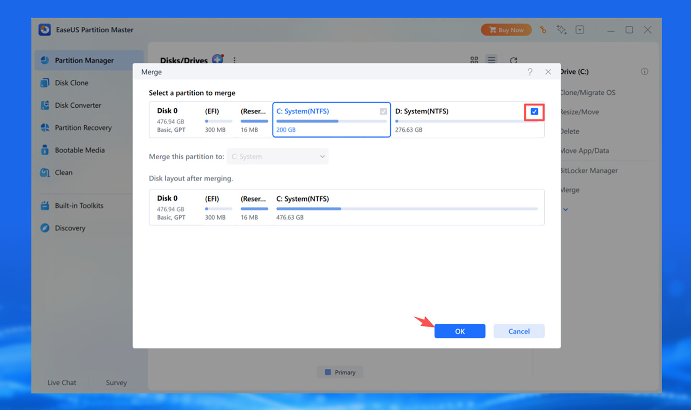
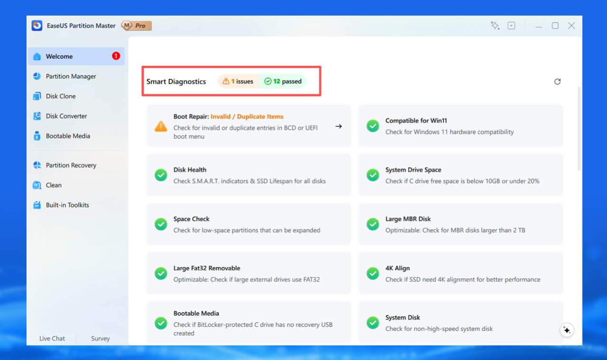

Que la unidad C se acerque a su límite tiene consecuencias concretas: aparecen avisos de poco espacio en disco y las actualizaciones de Windows pueden fallar. La buena noticia es que, en la mayoría de los casos, se puede liberar espacio en la unidad C sin comprar un disco más grande ni recurrir a programas de pago, porque bastan las herramientas que ya trae el sistema.

Esta guía reúne cinco métodos gratuitos para liberar espacio en Windows 10 y 11, ordenados desde la limpieza más sencilla hasta la gestión de particiones. Si borrar archivos no es suficiente, al final se explica cómo ampliar la capacidad de la unidad C combinándola con otra partición que tenga hueco libre.

## Resumen rápido

1. **Limpiar archivos temporales** con Storage Sense, en Configuración > Sistema > Almacenamiento (herramienta integrada de Windows).
2. **Ampliar la unidad C** moviendo el espacio libre de la unidad D o E con EaseUS Partition Master.
3. **Eliminar archivos del sistema**, como las copias de actualizaciones y la carpeta Windows.old, con el Liberador de espacio en disco (herramienta integrada).
4. **Borrar o mover archivos personales grandes** con el Explorador de archivos o un analizador de uso de disco (herramienta integrada).
5. **Desinstalar aplicaciones y juegos** que ya no usas desde Configuración > Aplicaciones (herramienta integrada).

## Requisitos previos

- Un equipo con Windows 10 u 11.
- Una cuenta con permisos de administrador, necesaria para las herramientas del sistema y para cualquier operación sobre particiones.
- Copia de seguridad de los archivos importantes si vas a redimensionar o fusionar particiones.

## Método 1: limpiar archivos temporales con Storage Sense

Storage Sense elimina automáticamente los archivos temporales y otros elementos que ya no se necesitan, lo que ayuda a recuperar espacio sin intervenir de forma manual.

1. Abre **Configuración > Sistema > Almacenamiento > Storage Sense**.
2. Activa el interruptor para que funcione por su cuenta.
3. Si quieres lanzar una limpieza en ese momento, selecciona **Ejecutar Storage Sense ahora**.

Según la configuración elegida, Storage Sense también puede gestionar la papelera de reciclaje, la carpeta Descargas y el almacenamiento en la nube. Es el método más cómodo para la limpieza rutinaria de archivos temporales.

## Método 2: ampliar la unidad C con el espacio de otra partición

No siempre la unidad C está llena porque haya demasiados archivos. Si su espacio está al límite pero otra partición tiene mucho hueco sin usar, se pueden combinar mediante la función de fusión de particiones. En un reparto habitual, la unidad C tendría 120 GB con 112 GB ocupados, mientras que la unidad D dispondría de 500 GB con 200 GB libres.

EaseUS Partition Master, valorado con 4,9 sobre 5 en Trustpilot a partir de más de 39.000 reseñas, ofrece una función de fusión que combina el espacio de una partición adyacente con la unidad C.

1. Haz clic con el botón derecho sobre la unidad **C:** y elige **Merge** (Fusionar).
2. Selecciona la partición de destino, por ejemplo **D:**, cuyo espacio quieres unir a la unidad C, y pulsa **OK**.
3. Pulsa **Execute Task** (Ejecutar tarea) y después **Apply** (Aplicar) para confirmar los cambios.

Los pasos exactos pueden variar según el reparto de particiones y según si son adyacentes. Conviene hacer copia de seguridad de los archivos importantes y revisar bien las particiones seleccionadas antes de continuar.

## Método 3: liberar espacio con el Liberador de espacio en disco

El Liberador de espacio en disco (Disk Cleanup) es la herramienta clásica de Windows para deshacerse de archivos que el sistema considera seguros de borrar.

1. Busca **Liberador de espacio en disco** en el menú Inicio y ábrelo.
2. Selecciona la unidad que quieres limpiar.
3. Revisa las categorías de archivos y marca las que quieras eliminar.

Entre los elementos habituales que permite quitar están los archivos temporales, las miniaturas, los programas descargados, los archivos de Optimización de entrega y el contenido de la papelera de reciclaje.

> Nota: ten cuidado con la opción **Instalaciones anteriores de Windows**. Al marcarla se elimina de forma permanente la carpeta Windows.old, con lo que ya no podrás volver a la versión anterior del sistema.

## Método 4: eliminar o mover archivos personales grandes

Vídeos, fotos, descargas e instaladores ocupan espacio en la unidad C con rapidez. En lugar de borrar archivos que todavía necesitas, muévelos a otra unidad, a un disco externo o a la nube.

1. Abre el **Explorador de archivos > Este equipo**.
2. Revisa carpetas como **Descargas**, **Vídeos**, **Imágenes** y **Documentos**.
3. Ordena los archivos por **Tamaño** para localizar primero los más grandes.

Si no tienes claro qué está ocupando el espacio, un analizador de uso de disco como EaseUS Partition Master puede mostrar qué archivos y carpetas consumen más. Antes de borrar cualquier cosa, asegúrate de que ya no la necesitas o de que tienes una copia.

## Método 5: desinstalar aplicaciones y juegos que ya no usas

Las aplicaciones y los juegos que no utilizas pueden ocupar bastante espacio. Windows incluye su propia herramienta de desinstalación, así que no hace falta software adicional para lo básico.

1. Pulsa **Windows + I** para abrir Configuración y entra en **Aplicaciones**.
2. En Windows 10, selecciona **Aplicaciones y características**; en Windows 11, **Aplicaciones instaladas**.
3. Explora la lista u ordénala por **Tamaño** para encontrar los programas y juegos más pesados.
4. Abre el menú de la aplicación (o los tres puntos) y elige **Desinstalar**; sigue las indicaciones en pantalla.

Céntrate en los programas grandes que ya no uses, pero evita quitar aplicaciones o componentes del sistema si no tienes claro para qué sirven. Si alguna se queda bloqueada y no responde antes de desinstalarla, la guía para [forzar el cierre de una aplicación en Windows](/noticias/force-quit-windows-pc/) explica cómo terminar el proceso sin reiniciar el equipo.

## Cómo verificar que se liberó espacio en la unidad C

Para comprobar el resultado, abre **Configuración > Sistema > Almacenamiento**: esa página muestra cuánto espacio ocupa cada categoría y cuánto queda libre. También puedes ver la barra de espacio disponible de la unidad C en el **Explorador de archivos > Este equipo**.

Ten en cuenta que lo que envíes a la papelera de reciclaje no libera espacio hasta que la vacías, así que revisa la papelera si el espacio recuperado no coincide con lo que esperabas.

## Qué hacer si estos métodos no bastan

Si la unidad C sigue casi llena después de borrar archivos temporales, quitar datos innecesarios y desinstalar aplicaciones, el problema puede estar en cómo se reparte el almacenamiento entre las particiones. EaseUS Partition Master añade herramientas de gestión de discos para esos casos.

- **Allocate Space:** asigna espacio de una partición a otra con unos pocos clics.
- **Extend/Shrink (Ampliar/Reducir):** cambia el tamaño de una partición.
- **Clean Temporary Files:** elimina archivos temporales, cachés y otros restos que ocupan espacio.
- **Move Apps and Data:** mueve aplicaciones o datos a otra unidad cuando la C se queda sin sitio.

## Advertencias y limitaciones

- **La guía original de PCWorld es contenido patrocinado por EaseUS**, el fabricante de la herramienta que recomienda el método 2. Tenlo en cuenta al valorar esa recomendación.
- Cualquier operación sobre particiones entraña cierto riesgo. Haz copia de seguridad de los datos importantes antes de empezar.
- Un corte de luz durante una operación de partición puede interrumpirla y provocar problemas en el disco o en los datos. Evita interrumpir el proceso.
- No borres archivos de las carpetas del sistema a mano. Utiliza las herramientas de limpieza integradas de Windows.
- El **Administrador de discos** de Windows solo puede ampliar una partición cuando hay espacio no asignado justo al lado; si ese espacio no es adyacente, la opción **Extender volumen** aparece atenuada.
