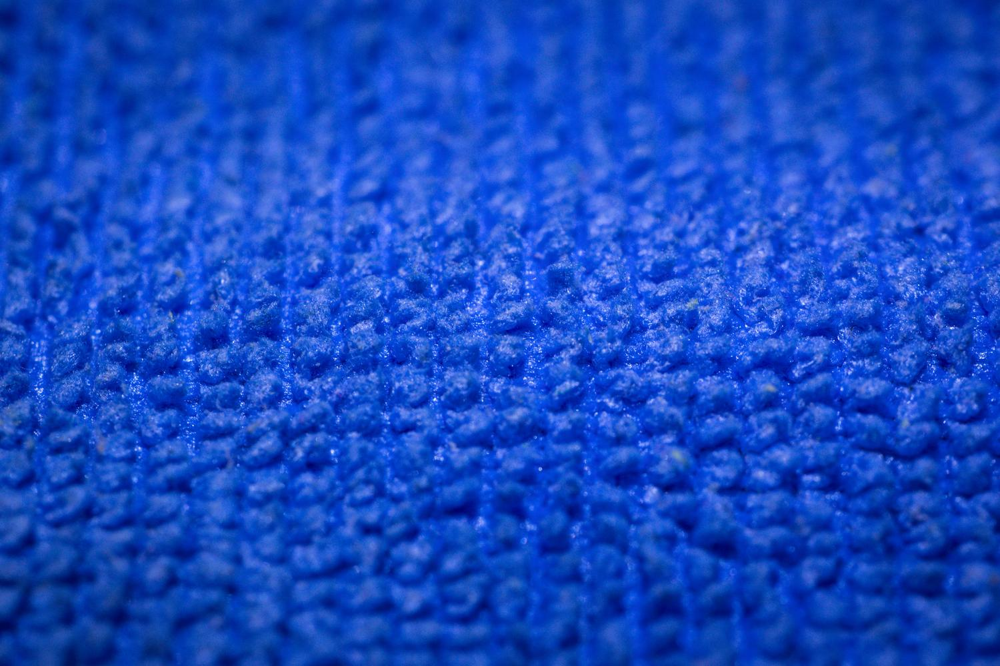
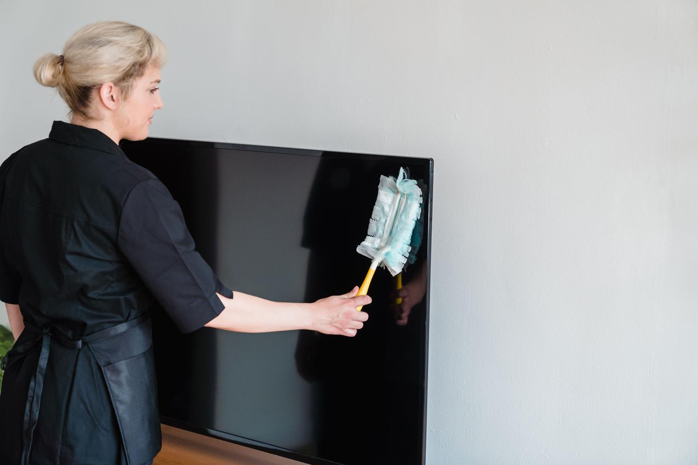

Los televisores actuales no llevan un cristal grueso como los de antaño: sus paneles se construyen con finas capas de polímeros y películas polarizadas muy sensibles. Por eso, un trapo de cocina, un limpiacristales o un poco de alcohol pueden borrar el tratamiento antirreflectante y dejar manchas iridiscentes permanentes. Esta guía explica cómo limpiar la pantalla del televisor paso a paso, tanto para quien acaba de estrenar un panel moderno como para quien quiere recuperar uno que ya muestra polvo y huellas. Se necesitan materiales que probablemente ya tienes en casa y ninguna técnica especial; lo importante es no poner en riesgo la inversión.

## Materiales que necesitas

Antes de empezar, reúne un kit sencillo. No hacen falta productos caros de marketing:

- Un paño de microfibra de alta densidad, preferiblemente de los que se usan para gafas o lentes de cámara, porque no sueltan pelusas ni rayan. Conviene tener un segundo paño para la fase húmeda.
- Agua destilada, la opción más segura para el panel.
- Opcional: una gota mínima de jabón neutro sin perfumes, para manchas de grasa rebeldes.
- Un pulverizador para preparar la mezcla.

Evita el trapo amarillo de limpiar los muebles, que puede soltar partículas abrasivas. Y descarta el agua del grifo: contiene cal y cloro que dejan marcas blancas al secarse.

## Pasos para limpiar la pantalla del televisor

1. **Apaga y desenchufa el equipo.** No es solo una precaución eléctrica: si limpias la pantalla mientras está caliente, el líquido se evapora demasiado rápido y deja cercos imposibles de quitar. Además, con el panel en negro es mucho más fácil detectar el polvo y la suciedad a contraluz.
2. **Haz un barrido en seco.** Pasa el paño de microfibra muy suavemente para retirar el polvo superficial. Es vital no presionar, porque las partículas de polvo actúan como una lija microscópica cuando se frotan con fuerza.
3. **Limpia en húmedo.** Humedece ligeramente un segundo paño de microfibra. El líquido va siempre al trapo, jamás pulverizado directamente sobre la pantalla. Realiza movimientos circulares suaves desde el centro hacia los bordes, o en una sola dirección si lo prefieres, siempre sin apretar.
4. **Pule la superficie.** Usa la parte seca del paño para eliminar cualquier resto de humedad y dejar el panel uniforme.

## Cómo verificar que quedó bien

El truco de experto es revisar el resultado con la linterna del móvil desde un ángulo lateral, con el televisor todavía desenchufado. Esa luz rasante revela cercos, manchas o restos de pelusa que no se ven de frente. Si la superficie queda uniforme y sin brillos irregulares, ya puedes volver a enchufar el equipo.

## Mantenimiento del resto del televisor

La limpieza no termina en la pantalla. El polvo acumulado en el resto del equipo también acorta su vida útil:

- **Rejillas de ventilación traseras:** pásales la aspiradora con un cepillo suave una vez al mes, o usa un bote de aire comprimido con ráfagas cortas. Si se llenan de polvo, el televisor puede sobrecalentarse.
- **Puertos HDMI y USB:** el aire comprimido es la mejor herramienta para evitar cortes de imagen provocados por la suciedad.
- **Mando a distancia:** es un nido de bacterias. Quita las pilas y limpia los huecos entre los botones con alcohol isopropílico, un paño y bastoncillos.

## Cuidados según la tecnología del panel

No todos los paneles aguantan igual. Conviene adaptar la limpieza al tipo de pantalla:

- **OLED y QD-OLED:** son extremadamente finos y sensibles a la presión física. Si aprietas demasiado, puedes llegar a doblar el cristal interno, así que extrema las precauciones.
- **QLED y NanoCell:** son algo más robustos, pero sus recubrimientos químicos son muy delicados. El agua destilada es la única opción segura.
- **Televisores de exterior:** aunque cuenten con certificaciones contra el agua, hay que seguir evitando los químicos fuertes para no degradar la protección UV integrada en el cristal.

## Qué productos y gestos dañan el panel

Hay errores que son prácticamente irreparables. Estos son los que debes evitar a toda costa:

- **Limpiacristales con amoníaco:** disuelve la película antirreflectante y deja manchas iridiscentes permanentes.
- **Alcohol etílico:** ataca esas mismas capas y acelera el deterioro.
- **Papel de cocina o servilletas:** están hechos de celulosa y generan microarañazos que, con el tiempo, dejan la pantalla turbia.
- **Agua del grifo:** la cal y el cloro se secan en forma de marcas blancas.
- **Pasta de dientes para los arañazos:** es un mito peligroso que solo crea una mancha borrosa irreversible.
- **Alcohol isopropílico en la limpieza rutinaria:** aunque es excelente para circuitos electrónicos, en los paneles modernos es un riesgo innecesario. Solo debería usarse muy diluido y de forma puntual, con un bastoncillo, para manchas extremas como la tinta.

Mantener el televisor impecable es cuestión de sencillez y paciencia: microfibra óptica, agua destilada y ningún producto abrasivo. Si además quieres que el equipo dure muchos años, también ayuda entender cómo los fabricantes cuidan su software, como hace [LG al reducir el consumo de RAM de webOS para alargar la vida de sus Smart TV](/noticias/lg-smart-tv-ram-crisis-lifespan/).
