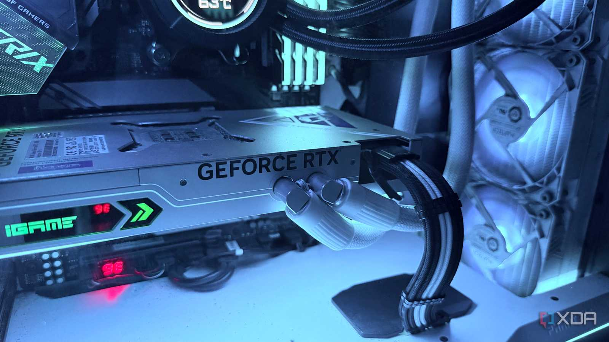
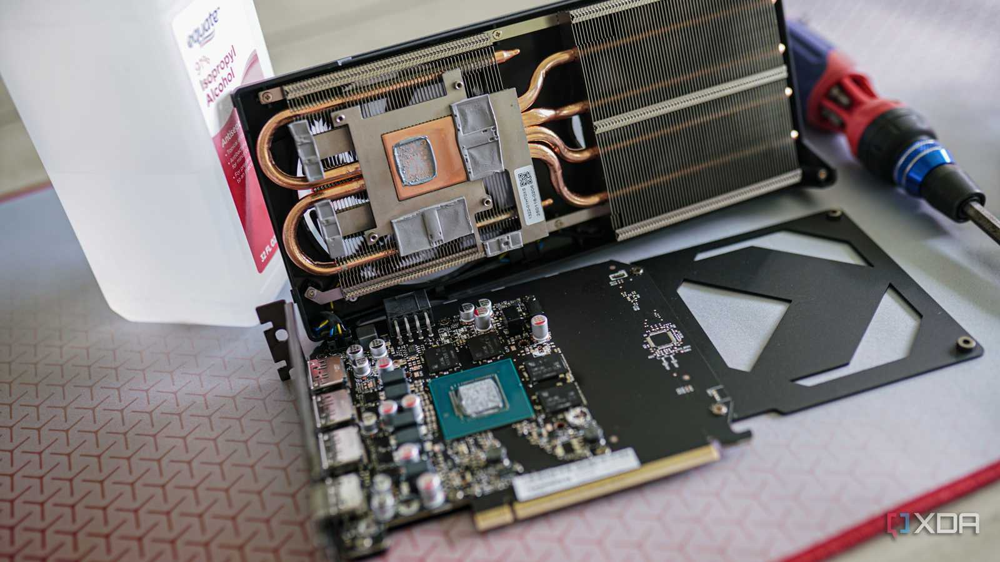
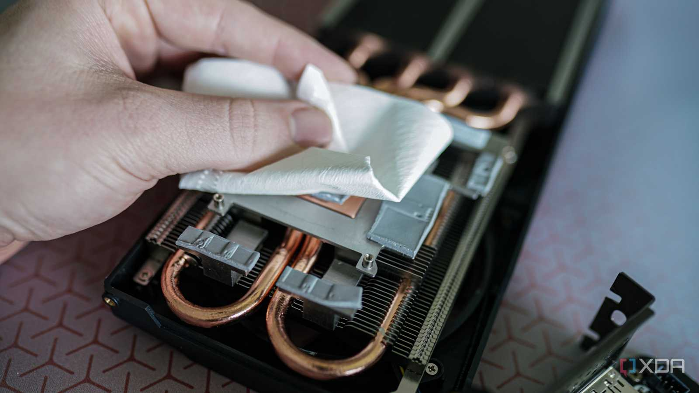
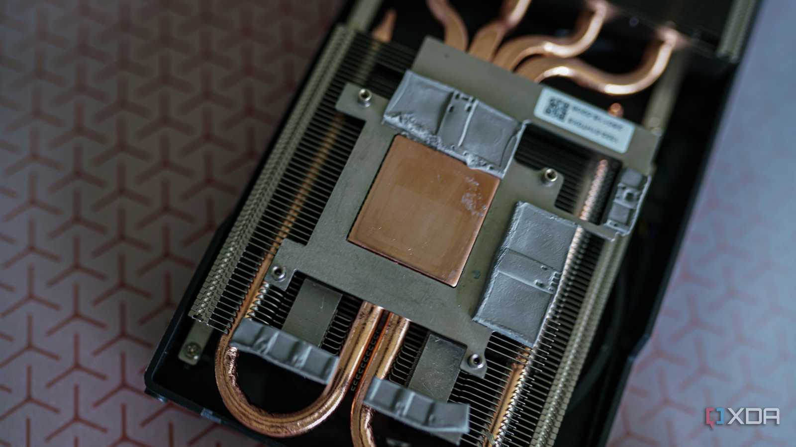
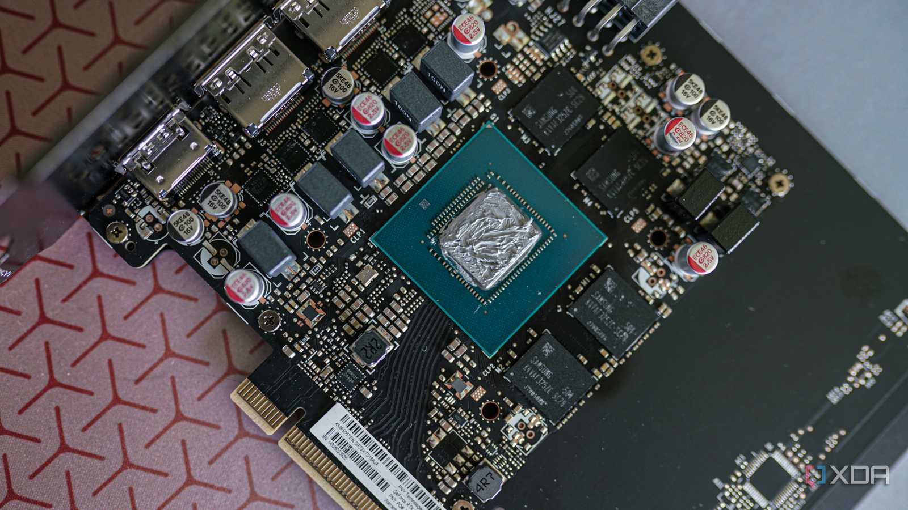
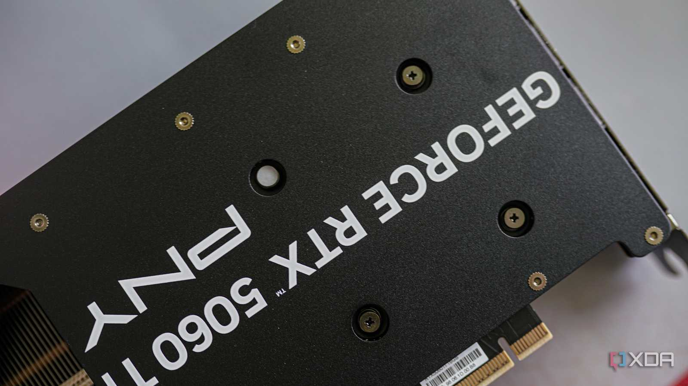
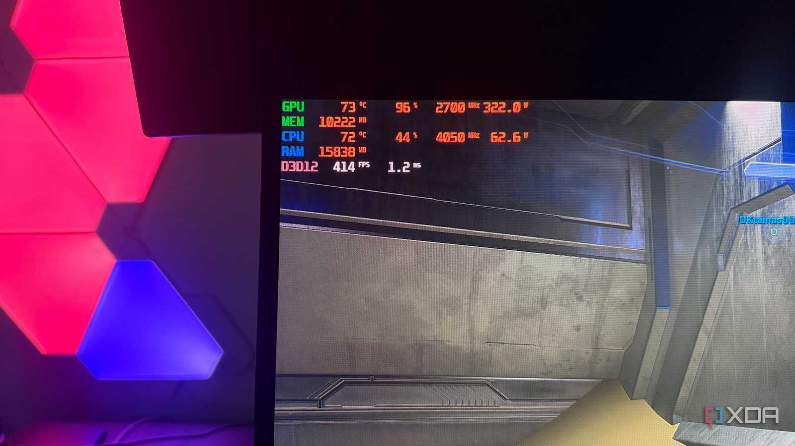

En un artículo de experiencia publicado por XDA Developers, el redactor Hamlin Rozario repasa los cuatro años que lleva usando una tarjeta gráfica con refrigeración líquida y llega a una conclusión que no esperaba: echa de menos la refrigeración por aire. Conviene subrayar el registro desde el principio, porque no se trata de un análisis de laboratorio ni de una comparativa con temperaturas medidas en condiciones controladas, sino del testimonio personal de un usuario sobre lo que ha supuesto convivir con ese sistema de disipación.

El autor viene de una larga trayectoria con tarjetas de aire: una MSI GTX 680 Twin Frozr III, una GTX 1070 en versión triple ventilador de Asus Strix y otra Strix más cuando montó su equipo actual con una RTX 3090. Con esta última notaba que las temperaturas se acercaban a los 80 grados bajo carga pese al triple ventilador y a un disipador voluminoso. Como la RTX 4090 consume aún más, prefirió no arriesgarse con otro modelo de aire y compró una Colorful Neptune RTX 4090 por 2.000 dólares. De nueva, según relata, se mantenía en torno a los 60-65 °C.

## El radiador condiciona todo el montaje

Lo primero que destaca el autor es la parte positiva: la tarjeta en sí es mucho más delgada que las que había usado antes. Después de haber lidiado con el pandeo de su Strix RTX 3090, valora no tener otro disipador pesado colgando del slot PCIe y bloquear una segunda ranura de la placa base.

El problema llega con el resto del sistema: el radiador de 360 mm es más largo que la propia tarjeta y necesita su propio punto de anclaje en la caja. Instalarlo no es complicado, pero reorganizar o actualizar componentes más adelante se vuelve incómodo. El autor cuenta que quiso pasarse a un Arctic Liquid Freezer III 420: su caja Phanteks P500A admite un radiador de 420 mm en la parte frontal, pero no puede usarlo si el radiador de la GPU ocupa ese espacio. Podría cambiar de caja o mover el de 360 mm a la parte superior, pero ese tipo de concesión no tendría que planteársela con una GPU refrigerada por aire, que incluso con un grosor de 3,5 ranuras sigue siendo una única pieza.

## Repastear dejó de ser una tarea trivial

El autor recuerda que reemplazar la pasta térmica de sus tarjetas anteriores no le daba miedo. Desmontó su GTX 1070 y llegó a abrir su RTX 3090 dos veces: una para cambiar la pasta y otra para sustituir unos pads térmicos desgastados tras varios meses de minería. En una GPU de aire, explica, basta con localizar los tornillos y los cables correctos.

Con la RTX 4090 ya no se siente igual de cómodo. Ahora mismo las temperaturas rondan los 80-85 °C —en otro punto del texto menciona 85-88 °C—, un rango que le parece preocupante para una tarjeta que empezó en torno a los 60 °C, pero el mantenimiento se lo ha ido postergando precisamente por el bloque de agua, la bomba y los tubos. Con más hardware en juego, cree que hay más margen para equivocarse en una tarjeta de 2.000 dólares, y el peor escenario que teme es una fuga de refrigerante.

Por el lado del aire, su razonamiento es que los ventiladores son la única pieza del sistema que realmente cabe esperar que envejezca, y los kits de recambio suelen ser económicos. A estas alturas, asegura que aceptaría una GPU más caliente pero más fácil de mantener.

## ¿Merecen la pena unas décimas a cambio de mantenimiento?

El autor no reniega de la compra: reconoce que la Neptune le dio exactamente lo que buscaba entonces, las temperaturas más bajas posibles, con ventiladores menos exigidos y, por tanto, un equipo más silencioso. El error de cálculo fue otro: cuando la compró asumía que la cambiaría mucho antes, así que la longevidad de la bomba y el mantenimiento a largo plazo no le preocupaban. Cuatro años después, con las temperaturas al alza, esas cuestiones pasaron a primer plano.

Su conclusión es que, con el mercado actual, ya no cree que vaya a cambiar de GPU cada dos años aproximadamente. Y para un uso prolongado considera que gana la refrigeración por aire, porque se mantiene más fácilmente y hay menos elementos que puedan fallar en el propio sistema de disipación. Para su próxima tarjeta, dice, está dispuesto a volver a la versión Asus Strix del próximo buque insignia de Nvidia.

Para el lector hispanohablante, el matiz importante es que esto es una experiencia personal y no una regla general. La refrigeración líquida sigue teniendo sentido para quien busca las temperaturas y el nivel de ruido más bajos posibles y no le importa asumir el mantenimiento que implica. Lo que plantea este testimonio es un criterio útil a la hora de comprar: merece la pena pensar no solo en cómo rinde la tarjeta el primer día, sino en cuánto tiempo se va a conservar y en quién va a mantenerla.
