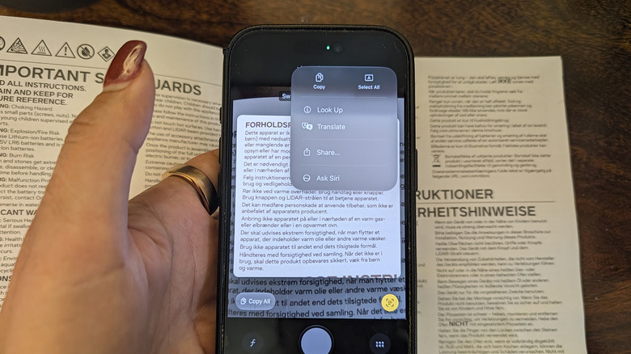
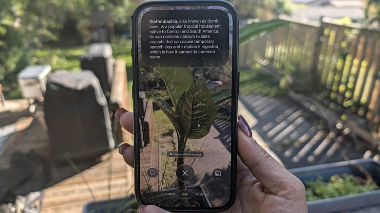

Live Text es la función del iPhone que permite interactuar con cualquier texto que aparezca delante de la cámara: un cartel, un folleto, una web o una nota escrita a mano. Con solo apuntar el teléfono se puede copiar, compartir, traducir o buscar información sin escribir nada. Esta guía explica cómo usar Live Text paso a paso y en qué se diferencia de Visual Intelligence.

## Requisitos previos

- Un iPhone de la gama XS o posterior con iOS 15 o una versión más reciente.
- La app Cámara con la detección de texto activada (viene activada por defecto).
- Para Visual Intelligence, en cambio, se necesita un iPhone compatible con Apple Intelligence (iPhone 15 Pro, 15 Pro Max o posterior) con iOS 18.1 o superior.

## Paso 1: Apunta la cámara al texto

Abre la app Cámara y encuadra el texto que quieras leer: una señal, un póster, un folleto o una página web. Cuando el iPhone detecte texto en el encuadre, aparecerá un marco amarillo alrededor del texto.

## Paso 2: Toca el botón de Live Text

Cuando veas el marco amarillo, toca el icono de cuadrícula (tres líneas con cuatro esquinas alrededor) que aparece en la parte inferior derecha de la pantalla. Se abrirá el menú de opciones para trabajar con el texto detectado.

## Paso 3: Selecciona el fragmento que necesitas

Usa los tiradores de selección para marcar solo la parte del texto que te interese, como una dirección web, o elige la opción **Seleccionar todo** para capturar el bloque completo.

## Paso 4: Elige qué hacer con el texto

Con el texto seleccionado aparecen varias opciones. Las principales son:

- **Copiar**: pega el contenido como texto en apps como Mensajes, Notas o Mail.
- **Compartir**: envía el texto directamente, por ejemplo mediante AirDrop, sin pasar por copiar y pegar.
- **Consultar**: busca una dirección web o la información que necesites investigar.
- **Traducir**: traduce al instante un texto en otro idioma.

Algunos contenidos muestran además una acción rápida en la parte inferior de la pantalla: llamar a un número de teléfono, visitar un sitio web, redactar un correo o convertir una divisa, entre otras acciones habituales.

## Cómo verificar que funcionó

Prueba con un cartel o un documento cercano: encuadra el texto, toca el icono de Live Text y selecciona **Copiar**. Pega el resultado en Notas. Si el texto aparece transcrito y editable, la función trabaja correctamente.

## Cómo desactivar Live Text

Si prefieres no usarla, abre **Ajustes** > **Cámara** y desactiva la opción **Mostrar texto detectado**. A partir de ese momento la cámara dejará de resaltar el texto del encuadre.

## Live Text frente a Visual Intelligence

Apple presentó Visual Intelligence con iOS 18.1 en septiembre de 2024 como parte de Apple Intelligence (si prefieres limitar esas funciones, existe una [guía para desactivar Apple Intelligence en iOS 27](/noticias/disable-apple-intelligence-ios-27/)). Funciona de forma distinta a Live Text: analiza mucho más que texto y exige un iPhone compatible con Apple Intelligence (iPhone 15 Pro, 15 Pro Max o posterior).

Para activarla, primero hay que tener Siri encendido (**Ajustes** > **Siri**). Después se puede invocar de varias formas: mantener pulsado el botón de control de cámara (si el modelo lo tiene), personalizar el botón de acción para llamar a Visual Intelligence (**Ajustes** > **Botón de acción** > **Visual Intelligence**), seleccionar **Siri** desde la app Cámara con Siri AI activado, o añadir el icono a la pantalla de bloqueo o al centro de control (deslizar desde la esquina superior derecha, mantener pulsado un espacio vacío para abrir el menú de edición, elegir **Añadir un control** y seleccionar **Visual Intelligence**).

Una vez activada, basta con apuntar a algo, como una planta o un monumento: se obtiene contexto de Siri, se ejecuta una búsqueda de imágenes de Google o se consulta a ChatGPT. Al apuntar al cartel de un negocio muestra datos como el horario, el menú, las reseñas o una ventana de reserva. Visual Intelligence también interactúa con el texto igual que Live Text: puede traducir, leer en voz alta o resumir, y permite tocar un número de teléfono, un correo o una web para abrirlos en la ventana correspondiente. Mientras Live Text aparece de forma orgánica cuando el teléfono detecta texto en el encuadre de Cámara, Visual Intelligence amplía esa base en un modo de cámara específico con mucha más información.

## Advertencias

- Live Text solo trabaja con texto: para identificar objetos, plantas o lugares se necesita Visual Intelligence y un iPhone compatible con Apple Intelligence.
- La detección depende del encuadre y la iluminación: si el marco amarillo no aparece, recoloca el teléfono hasta que el texto quede nítido en el visor.
- Las acciones rápidas (llamar, abrir una web, convertir divisas) solo aparecen cuando el sistema reconoce ese tipo de contenido en el texto detectado.
