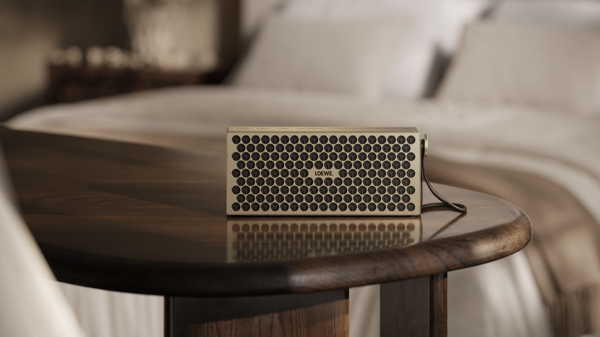

Loewe, marca alemana conocida por sus televisores y equipos de diseño, ha anunciado el Neo, un altavoz Bluetooth portátil con el que quiere combinar rendimiento acústico y un acabado cuidado. El equipo entrega 50 vatios de potencia total y recurre a dos radiadores pasivos de graves, y llegará a las tiendas el 20 de noviembre con un precio de 400 euros.

El Neo se presenta como la apuesta de Loewe para el segmento premium del audio portátil. La compañía sostiene que "renunciar a la fidelidad acústica nunca es una consecuencia de la movilidad", una idea que resume el enfoque de un producto pensado para moverse sin perder calidad de sonido.

## Diseño, controles y personalización del Loewe Neo

El altavoz apuesta por una carcasa de aluminio con rejillas frontales intercambiables, de modo que el usuario puede cambiar su aspecto según el entorno o el gusto personal. A ello se suma una iluminación ambiental integrada que se ajusta desde una tira de luz situada en el propio equipo.

Los controles están montados en la parte superior e incluyen el botón de encendido, refuerzos de graves y agudos, y un interruptor para la luz. Desde la aplicación de Loewe se puede personalizar la iluminación y afinar el sonido con tres preajustes, además de ajustar graves y agudos por separado.

La movilidad se completa con una correa de transporte de piel desmontable y un estuche de fieltro incluido.

## Resistencia, batería y conectividad

El Neo cuenta con certificación IP67, lo que lo hace resistente al polvo y al agua, y declara 12 horas de autonomía por carga. En el apartado inalámbrico incorpora Auracast, la tecnología de retransmisión de audio por Bluetooth que permite enlazarlo con otros altavoces compatibles para repartir el sonido entre varios equipos a la vez.

## Precio y disponibilidad

El Loewe Neo se pondrá a la venta el 20 de noviembre en tres acabados: Alu Silver, Alu Black y Champagne, este último como edición limitada. Su precio será de 400 euros (400 libras en el Reino Unido), por encima de alternativas reconocidas del segmento como el JBL Xtreme 5, que parte de 330 libras / 350 euros.

El consejero delegado de Loewe, Aslan Khabliev, ha enmarcado el lanzamiento en la identidad de la marca: "Durante décadas, Loewe ha sido sinónimo de diseño, innovación e individualidad. El Neo lleva esa filosofía al mundo, combinando potencia acústica excepcional, iluminación inteligente y una personalización sin precedentes en un producto bellamente fabricado".

## El Loewe Neo, un altavoz premium en un mercado competido

La llegada del Neo se produce en un momento de renovación para el audio de consumo. Mientras los altavoces portátiles pelean por diferenciarse con diseño y funciones inteligentes, las plataformas de sonido también evolucionan: Qualcomm presentó hace unos días [Snapdragon Sound Elite Gen 2](/noticias/qualcomm-snapdragon-sound-elite-gen-2/), su propuesta de audio con inteligencia artificial para auriculares. Para el comprador, la clave estará en comprobar si el sobreprecio del Neo se traduce en una calidad de sonido y una experiencia de uso a la altura de su precio.
