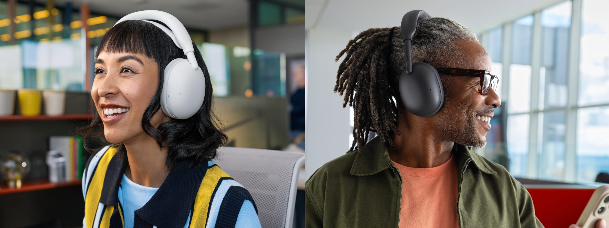
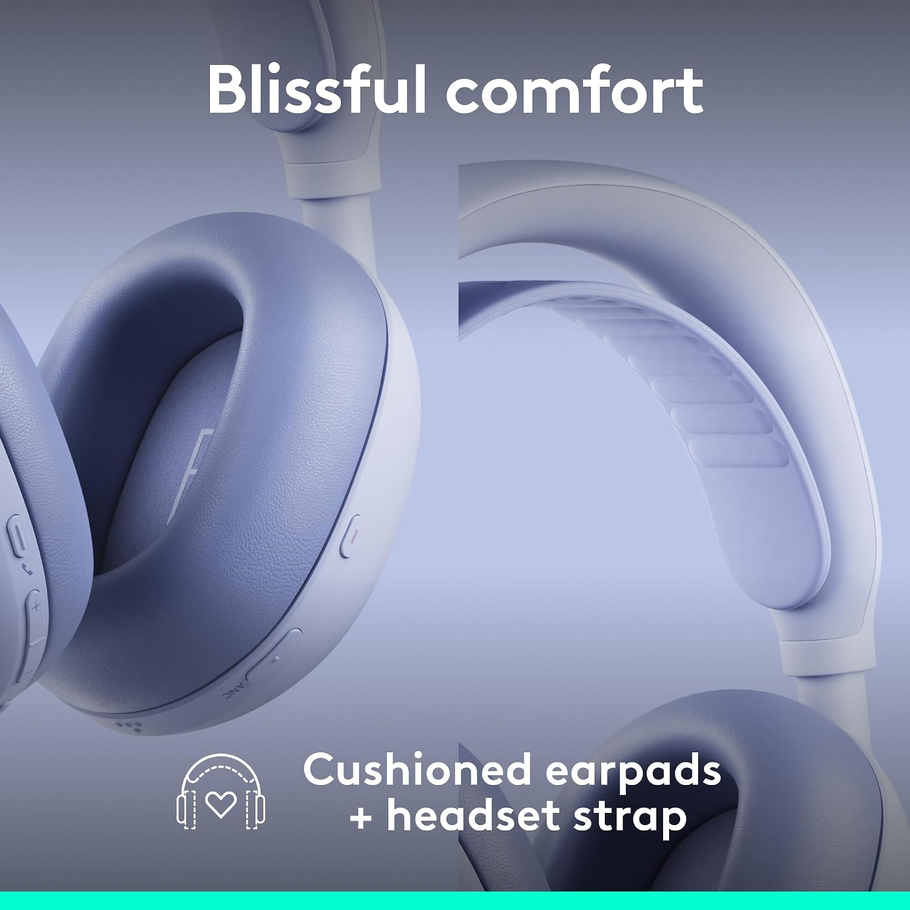
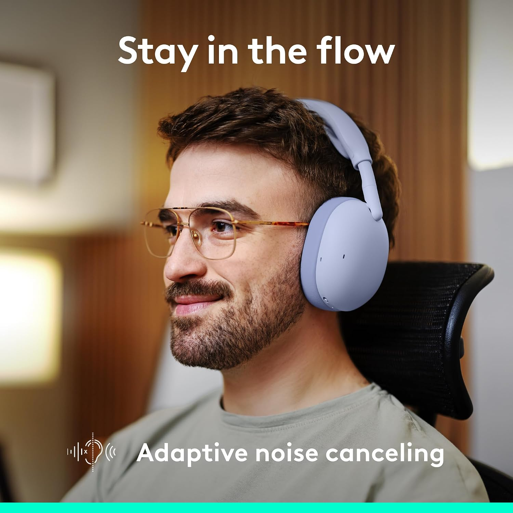

Logitech ha presentado los Zone Vibe Pro, unos auriculares inalámbricos over-ear que la compañía plantea como un modelo para «todo el día» y que buscan cubrir tanto las llamadas de trabajo como el ocio. El fabricante los orienta a quien alterna entre ambos contextos y no quiere depender de dos pares distintos, y llegan con cancelación activa de ruido (ANC) adaptativa, aislamiento de voz asistido por inteligencia artificial y piezas que el propio usuario puede sustituir.

## Diseño sin varilla y llamadas de los Zone Vibe Pro

A diferencia del Zone Vibe 100, su hermano más económico, que recurría a una varilla con micrófono que se silencia al girarla, el nuevo Pro apuesta por un diseño sin varilla. Para captar la voz sin ese brazo físico, Logitech incorpora un sistema de aislamiento de voz con IA que, según la compañía, filtra hasta el 93 % del ruido de fondo.

El apartado de sonido se apoya en unos controladores dinámicos de 40 mm ajustados por el fabricante, junto con modos de transparencia y cancelación adaptativa que se configuran desde las aplicaciones Logi Tune para escritorio y móvil. La propuesta se suma a una tendencia más amplia en el sector: el audio apoyado en IA, como la plataforma [Snapdragon Sound Elite Gen 2 de Qualcomm](/noticias/qualcomm-snapdragon-sound-elite-gen-2/).

## Autonomía, carga y reparabilidad

La autonomía es uno de los argumentos del modelo. Logitech declara hasta 30 horas de escucha continua o 18 horas de conversación con la cancelación activa conectada, y eleva la cifra hasta 66 horas cuando el ANC está desactivado. La carga se realiza por USB-C y, según la empresa, cinco minutos de carga rinden una hora de llamadas. Además, los auriculares pueden funcionar como dispositivo de audio por cable USB mientras se cargan, algo útil para quien encadena reuniones.

En el plano de la durabilidad, Logitech apuesta por piezas reemplazables: las almohadillas, las bandas de la diadema y las baterías pueden cambiarse por el usuario, un gesto pensado para alargar la reparabilidad del producto a largo plazo. También se añade emparejamiento multipunto por Bluetooth.

## Versión para empresas y precio

Junto con la versión de consumo, Logitech comercializa los Zone Vibe Pro for Business, orientados a entornos corporativos. Esta variante añade certificaciones para Microsoft Teams (con los estándares de micrófono Open Office), Zoom y Google Meet, además de gestión remota de flotas mediante Logitech Sync.

La versión estándar se vende a nivel global por 259,99 dólares en cuatro colores: grafito, negro, blanco roto y lila. La edición Business Native Bluetooth cuesta lo mismo, y existe un paquete con receptor inalámbrico USB-C Zone por 279,99 dólares.

