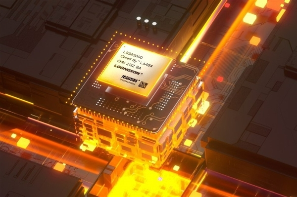

Loongson Technology ha dado un paso que va más allá del silicio. La compañía china ha presentado la primera versión de software de su **plataforma de cómputo acelerado** (Loongson Accelerated Computing Platform), un paquete que cubre desde los controladores de bajo nivel hasta la inferencia de modelos de inteligencia artificial sobre sus propias GPU de propósito general. El desarrollo se apoya en los núcleos **LG200**, integrados en los chips **2K3000** y **9A1000**.

No es la primera noticia de Loongson este mes: la firma ya anunció la futura salida de la GPU [9A1000](https://www.techspain24.com/noticias/loongson-9a1000-gpu/) y obtuvo la [certificación de seguridad de nivel III](https://www.techspain24.com/noticias/loongson-kunpeng-security-levels/). Este anuncio, en cambio, no trata de hardware nuevo, sino del software que pretende hacerlo utilizable.

## Qué incluye la plataforma de cómputo acelerado

Loongson parte de la pila gráfica que ya tenía, basada en **OpenGL** y **Vulkan**, y le añade una capa de cálculo: controladores para los chips de cómputo, compilador, entorno de ejecución, biblioteca de operadores, motor de inferencia y herramientas de depuración y análisis de rendimiento. Según la empresa, el conjunto cubre el flujo completo de desarrollo, desde la selección del sistema y la invocación del cómputo hasta la optimización del modelo y el despliegue de la aplicación.

El entorno de ejecución se ocupa de la gestión de recursos, la memoria, la cola de tareas y la sincronización de eventos. Por debajo, el controlador abstrae y administra los distintos recursos de cálculo del hardware para permitir la ejecución concurrente de varios procesos y tareas sobre el mismo equipo.

## CUDA como puente para el código existente

El detalle con más consecuencias prácticas es el doble soporte de interfaces de programación: **OpenCL 3.0** y **CUDA**. Conviene recordar qué son. CUDA es la plataforma de cómputo en GPU y el modelo de programación que NVIDIA lleva años cultivando como estándar de facto en inteligencia artificial; OpenCL es un estándar abierto de programación paralela para dispositivos heterogéneos. Que una GPU china acepte ambos modelos significa que el código escrito para CUDA puede portarse sin reescribirlo desde cero, que es justamente la barrera más alta a la hora de cambiar de proveedor.

El compilador de Loongson está optimizado para la arquitectura de instrucciones y las particularidades de su GPU, pero mantiene compatibilidad a nivel de API, con la intención declarada de reducir el coste de desarrollo y de migración. En la misma línea, la plataforma es compatible con **ONNX Runtime** y usa su motor **LacInfer** como backend de ejecución: un modelo exportado desde PyTorch o TensorFlow en formato ONNX puede desplegarse en la GPU de Loongson sin conversiones adicionales ni reescritura de código.

## LacInfer y las optimizaciones para IA

El motor de inferencia LacInfer aplica técnicas conocidas para aligerar el grafo de cómputo: fusión de operadores, plegado de constantes, eliminación de operadores y conversión de formato. La fusión abarca operadores elemento a elemento y también los que tienen varias ramas o entradas, además de combinar convolución, sesgo y activación en un solo paso para reducir los accesos a memoria.

La biblioteca de operadores cubre álgebra lineal básica y cálculo de redes neuronales. Los operadores **BLAS** están optimizados a nivel de ensamblador para la multiplicación de matrices (GEMM) en FP32 e INT8, la multiplicación matriz-vector y las operaciones vectoriales; los **DNN** incluyen convolución, *pooling*, normalización, capas totalmente conectadas y funciones de activación. Loongson afirma que el conjunto está ajustado a las unidades tensoriales y a la jerarquía de caché de sus GPU para aprovechar mejor el hardware.

En cuanto a resultados, la compañía dice haber optimizado sobre el 9A1000 modelos de visión por computador como la detección de objetos, la segmentación de imágenes, la estimación de postura y la detección de objetos rotados. Sostiene que la velocidad de inferencia mejora y que la pérdida de precisión asociada a la cuantización queda bajo control. Son cifras del propio fabricante, todavía sin verificación independiente.

## Compatibilidad entre generaciones y qué implica

La plataforma funciona sobre toda la familia de chips de cálculo de Loongson y varias versiones del kernel de Linux. La intención declarada es acompañar la llegada del **9A2000** y el **9A3000** para que el software siga siendo compatible entre generaciones de silicio, un problema recurrente en los ecosistemas de cómputo acelerado.

Loongson asegura que el software ya está al servicio de algunos clientes tempranos y que, sobre los chips 2K3000 y 9A1000, se están desarrollando agentes para varios dispositivos de inteligencia incorporada. Con la publicación de esta primera versión, la empresa dice que quiere construir el ecosistema de software de cómputo e IA junto a socios de la industria y desarrolladores.

Para el lector hispanohablante, el anuncio importa menos por lo que se puede comprar hoy y más por hacia dónde apunta: un ecosistema que intenta ofrecer una alternativa completa —hardware y software— fuera de la órbita de NVIDIA. La asignatura pendiente sigue siendo la misma de siempre, la madurez de los controladores y de las herramientas, pero cada pieza que se publica acerca un poco más esa posibilidad.
