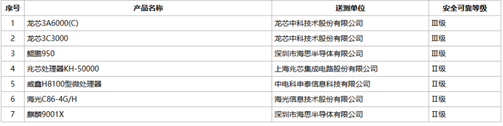
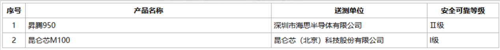
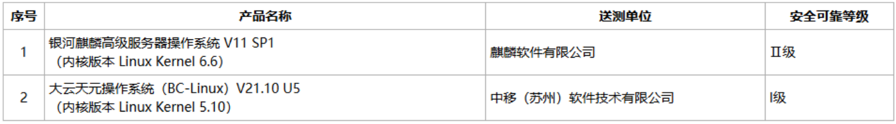
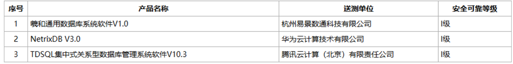
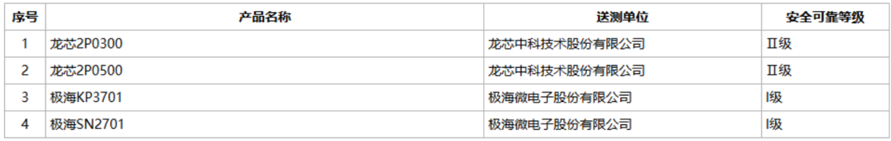

El Centro de Evaluación de Seguridad de la Información de China y el Centro Nacional de Evaluación de Ciencia y Tecnología para el Secreto publicaron el 20 de septiembre el anuncio de resultados de la evaluación de seguridad y fiabilidad correspondiente a 2026 (número 3). El documento, del que se hace eco MyDrivers, confirma que Loongson y Huawei HiSilicon comparten el nivel III en el terreno de las CPU de propósito general, la calificación más alta concedida hasta ahora en esa categoría, y estrena una regla que cambia el marco: los resultados pasan a tener una validez de tres años.

## Qué mide el esquema chino de niveles de seguridad

Conviene no confundir esta certificación con un banco de pruebas de rendimiento. La evaluación de seguridad y fiabilidad es el filtro que determina qué componentes pueden entrar en equipos de administración pública, banca, telecomunicaciones, energía y defensa dentro del programa de sustitución doméstica conocido como xinchuang. No mide cuántos núcleos o cuánta memoria tiene un chip, sino si su diseño y su cadena de suministro se consideran fiables para manejar información sensible.

El esquema concede tres niveles, del I al III, donde el III es el más alto. En la práctica, el nivel III es el que habilita el acceso a los sistemas de máxima clasificación, mientras que el II cubre escenarios de datos sensibles —riesgo financiero, modelos de lenguaje para la administración— sin llegar al secreto más restrictivo. La novedad de esta edición es el plazo: hasta ahora la certificación se leía como un trámite único, y a partir de ahora caduca a los tres años. El fabricante tendrá que volver a demostrar que mantiene el nivel, lo que obliga a invertir de forma continua y presiona a los productos que solo buscaban el sello.

## Loongson y Kunpeng empatan en el nivel III

Las dos CPU de Loongson, la 3A6000(C) y la 3C3000, y el Kunpeng 950 de HiSilicon obtuvieron el nivel III. Para Loongson es la primera vez que su arquitectura LoongArch recibe la calificación más alta, un reconocimiento que el fabricante puede esgrimir ante clientes institucionales que hasta ahora dudaban de su ecosistema. Kunpeng 950, por su parte, consolida a HiSilicon en la primera fila de la computación de servidores.

El resto del cuadro general se queda en el nivel II: Zhaoxin KH-50000, Weixin H8100, Hygon C86-4G/H y Kirin 9001X. MyDrivers llama la atención sobre el caso del Kirin 9001X, un chip de terminal que se queda en el segundo escalón mientras los de servidor suben al tercero; la lectura es que Huawei prioriza los chips de infraestructura ante las restricciones de fabricación que arrastra.

## Ascend 950, el único chip de IA en nivel II

Por primera vez la evaluación separa los chips de entrenamiento e inferencia de inteligencia artificial en una categoría propia, una señal de que la seguridad de la infraestructura de cómputo para IA ya se considera un asunto estratégico. Ascend 950 es el único que alcanza el nivel II, lo que le abre la puerta a usos con datos sensibles como el control de riesgo financiero o los grandes modelos para la administración, aunque todavía no a los sistemas de máxima clasificación. Kunlunxin M100 se queda en el nivel I, orientado al mercado de cómputo general.

## Del chip al sistema: sistemas operativos, bases de datos e impresoras

La lista no se limita al silicio. En sistemas operativos, Kylin V11 SP1, con kernel Linux 6.6, obtiene el nivel II, mientras Dayun Tianyuan, con kernel 5.10, se queda en el nivel I. Esa diferencia de kernel anticipa un reparto por sectores: los bancos pueden preferir un sistema con más años de validación y los negocios de innovación de aseguradoras y corredurías, uno con soporte de computación confidencial.

En bases de datos, NetrixDB de Huawei Cloud, TDSQL de Tencent Cloud y Xihe de Yijing Shutong obtienen el nivel I. La entrada de los grandes proveedores de nube en esta lista apunta a un movimiento más amplio: las plataformas que antes se vendían como servicios empiezan a posicionarse como infraestructura de base.

También aparecen los chips de control para impresoras: la 2P0300 y la 2P0500 de Loongson alcanzan el nivel II, mientras las KP3701 y SN2701 de Geehy se quedan en el nivel I. Son componentes discretos, pero su certificación condiciona qué fabricantes de impresoras pueden seguir vendiendo al sector público.

## Por qué importa fuera de China

Estos niveles no cambian lo que puede comprar un usuario particular, pero sí son un buen termómetro de hacia dónde va el dinero público chino. Que Loongson y Kunpeng lleguen al nivel III marca el techo técnico que el país reconoce a su propio silicio, y el plazo de tres años convierte la certificación en una carrera continua en lugar de una foto fija. Para quien sigue la pujanza del hardware chino, la lista también ordena el mapa: Loongson certifica CPU mientras prepara su [GPU 9A1000](/noticias/loongson-9a1000-gpu/) y Hygon, presente aquí con el C86-4G/H, ultima la [presentación de su serie 1000](/noticias/hygon-1000-series-cpu/). La diferencia entre ambos casos es la que separa una certificación de seguridad de un anuncio de producto.
