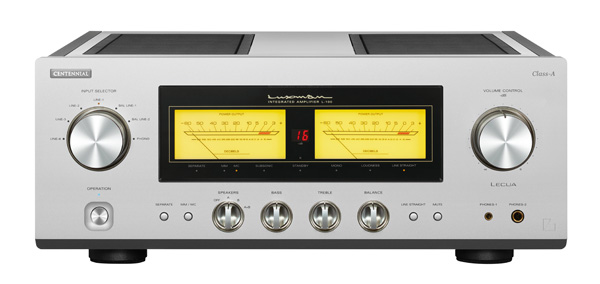
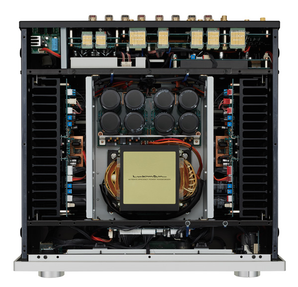
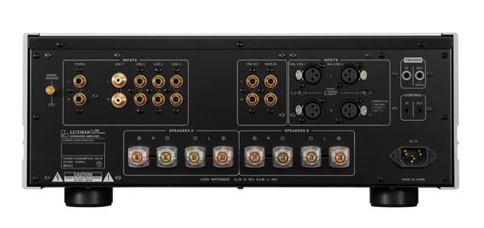

Luxman conmemora sus cien años de actividad con el L-100 Centennial, un amplificador integrado en clase A pura que se coloca un escalón por debajo de su actual buque insignia, el L-509Z, con un precio de 11.995 dólares. La revista Stereophile ha publicado el análisis del equipo firmado por Ken Micallef, en el que repasa la tecnología que incorpora y su comportamiento con distintos altavoces y cápsulas.

## Clase A pura en el Luxman L-100 Centennial

El L-100 Centennial entrega 20 W por canal sobre 8 ohmios y 40 W sobre 4 ohmios en clase A. Según explicó a Stereophile Randy Bingham, del importador y distribuidor estadounidense Rhythm Audio, esas son las cifras en clase A y la potencia de recorte es bastante superior, lo que en la práctica lo sitúa como un diseño en clase AB fuertemente polarizado en clase A.

Su etapa de salida recurre a transistores bipolares Darlington en una configuración push-pull cuádruple en paralelo. Para la entrada, Luxman selecciona transistores de Isahaya Electronics, reconocidos por su bajo ruido, mientras que las etapas segunda y de salida emplean componentes de Toshiba.

En el apartado tecnológico aparecen LIFES 1.1, la última versión del sistema de realimentación de Luxman, y el atenuador LECUA1000. La compañía cifra las mejoras de LIFES 1.1 en datos medibles: la distorsión armónica total baja del 0,003 % al 0,002 % a 1 kHz, del 0,002 % al 0,001 % a 100 Hz y del 0,007 % al 0,006 % a 20 kHz. En cuanto al volumen, el atenuador LECUA detecta el punto de cruce por cero de la señal y conmuta justo en ese instante, de modo que los cambios de nivel son prácticamente silenciosos.

## Qué conserva y qué simplifica respecto al L-509Z

Con esos 11.995 dólares, el L-100 se sitúa justo por debajo del L-509Z, así que la pregunta obligada es qué se ha recortado para llegar a ese precio. La respuesta de Luxman es que priorizó lo audible: renunció a elementos externos costosos, como el mando mecanizado inspirado en el monte Fuji del L-509Z, y destinó ese presupuesto a los componentes internos con mayor influencia en el sonido. También sustituyó los conmutadores analógicos de alta calidad que usaba hasta ahora por relés, que según la firma ofrecen un mejor rendimiento sónico.

La fuente de alimentación mantiene el nivel del buque insignia: un transformador EI a medida desarrollado junto a Homerun Electric y ocho condensadores de filtrado de 10.000 µF fabricados por Nippon Chemi-Con, los mismos que monta el L-509Z. La etapa de fono MC/MM comparte arquitectura con la del 509Z, con la salvedad de que el L-100 fija la carga de MC en 100 ohmios en lugar de ofrecer un valor ajustable.

En lo físico, el chasis mide 17,3 pulgadas de ancho, 7 de alto y 17,9 de fondo, y pesa 56 libras (unos 25 kg). Combina una tapa de aluminio de 3 mm con paneles frontales y laterales de aluminio extruido de 5 mm y acabado granallado, sobre una estructura de acero. Se fabrica en Japón, en un sistema de producción celular en el que cuatro especialistas montan, inspeccionan y ajustan cada unidad a mano en la prefectura de Kanagawa. El mando a distancia es el mismo que acompaña al L-507Z.

## Qué dice la crítica

Micallef somete al integrado a pruebas con altavoces como los DeVore Fidelity Super Nines, los Voxativ Ampeggio 2024 y los Volti Audio Lucera, además de las cápsulas de bobina móvil Ortofon MC X30 y Sumiko Oriole. Su veredicto es contundente: lo describe como el mejor Luxman que ha escuchado y como un producto emblemático para la marca, con una recomendación muy alta. Como pega, apunta una ligera rigidez mecánica frente a la soltura de un SET de válvulas en clase A.

Entre las grabaciones que usa para las escuchas figuran *Wasting Light* de Foo Fighters, *Boulez Conducts Varèse* con la Filarmónica de Nueva York y el debut de Bass Desires, un repertorio que le sirve para valorar la escena, la dinámica y el control del bajo.

El análisis refuerza el perfil de un equipo pensado para quien ya tiene un sistema de altavoces a la altura y busca una fuente de amplificación de corte audiófilo, un terreno en el que también se mueve el [análisis del tocadiscos Thorens TD 404](/noticias/thorens-td-404/).

## Precio y disponibilidad

El L-100 Centennial se anuncia a 11.995 dólares, por debajo del L-509Z. El análisis de Stereophile no detalla precios ni disponibilidad para Europa, por lo que de momento la referencia disponible es la del mercado estadounidense.
