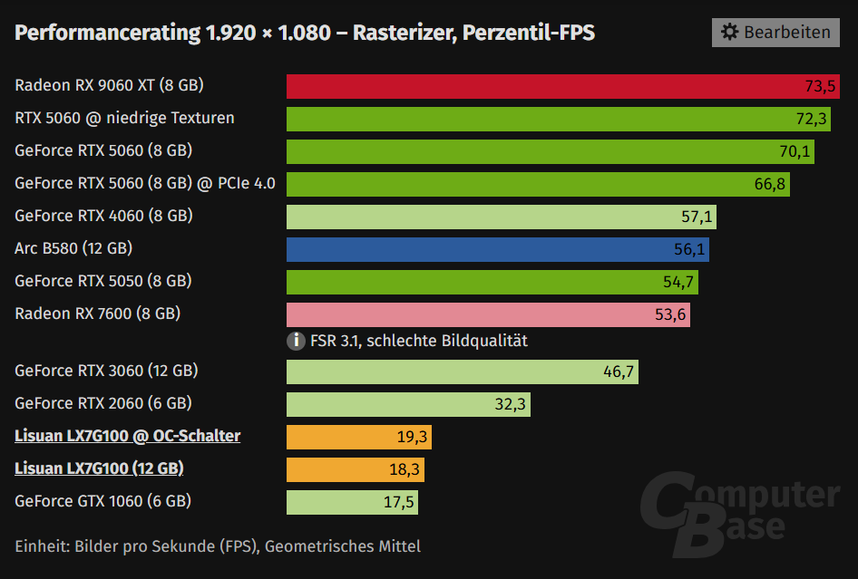
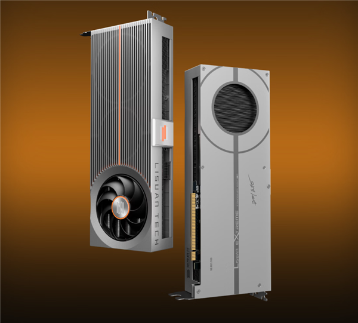

La tarjeta gráfica china Lisuan 7G100 deja una de esas comparaciones que resumen un mercado entero: en los test sintéticos mira de tú a tú a la GeForce RTX 4060, pero en juegos reales rinde al nivel de una veterana GeForce GTX 1060. El análisis de los datos, publicados por MyDrivers a partir de la revisión del medio alemán ComputerBase, pone cifra al desfase: la 7G100 entrega en torno a un tercio del rendimiento en juegos de la RTX 4060.

La Lisuan 7G100 es la apuesta jugable del fabricante chino Lisuan Technology. Se anunció a mediados del año pasado con marcas sintéticas a la altura de la RTX 4060 e incluso comparables con la RTX 5060 en 3DMark, y salió a la venta durante el festival de compras 618: primero la edición de fundadores por 3.299 yuanes y después la versión comercial, desde 2.688 yuanes, con 12 GB de memoria de vídeo. Junto con la MTT S80 de Moore Threads —que apuntaba a la RTX 3060—, es una de las pocas GPU chinas para juegos que ha llegado de verdad a las tiendas.

## Qué dicen las pruebas en juegos de la Lisuan 7G100

Los resultados en juegos proceden de la revisión de ComputerBase recogida por MyDrivers, con medias a 1.920 × 1.080 en rasterización. La Lisuan 7G100 de 12 GB firma 26,7 FPS de media, que suben a 28,6 FPS con el conmutador de overclocking de la tarjeta. En la misma tabla, la RTX 4060 alcanza 68,3 FPS, la RTX 3060 llega a 55,6 FPS y la RTX 2060 a 39 FPS, mientras que la GTX 1060 se queda en 20,3 FPS. Dicho de otro modo: la 7G100 supera por poco a la GTX 1060, pero queda a menos de la mitad de una RTX 3060 y en torno a un tercio de la RTX 4060.

El segundo gráfico, el de fotogramas por percentil, cuenta la parte que más se nota al jugar: la fluidez real. Ahí la conclusión de MyDrivers es la misma y da título a la historia: sobre el papel, la Lisuan 7G100 es una RTX 4060; en la práctica de los juegos, es una GTX 1060.

## Por qué el papel no llega al juego: los controladores

La explicación que da MyDrivers no apunta al silicio, sino al software. Conseguir unas especificaciones competitivas sobre el papel es la parte asequible; convertirlas en rendimiento en decenas de juegos exige años de trabajo en controladores y de optimización juego por juego. El medio recuerda que ni siquiera AMD, con mucha más trayectoria, se libró durante años de las críticas a sus controladores, y que su optimización solo se puso al día hace poco, con desventaja todavía frente a NVIDIA en reescalado y trazado de rayos.

Ese es el contexto en el que hay que leer la 7G100: una arquitectura joven, sin el bagaje de optimización acumulado por NVIDIA y AMD, que paga la novatada justo donde más duele, en los juegos.

## Precio, memoria y a quién le puede encajar

Con 12 GB de memoria, la versión comercial de 2.688 yuanes juega una baza interesante en un momento de encarecimiento de la memoria y de los procesos avanzados, como señala MyDrivers. Aun así, el medio admite que el calendario no ha ayudado a Lisuan: la subida de precios de los componentes deja poco margen para competir por precio, que era la vía natural de una tarjeta así.

De cara al futuro, MyDrivers apunta a que Lisuan difícilmente lanzará pronto una nueva arquitectura para juegos y que la 7G100 acabará orientándose al ámbito profesional, donde hay menos juegos que optimizar y menos clientes a los que satisfacer. Para el lector español, la lectura es doble: como tarjeta de juego importada hoy no compite con las opciones establecidas, pero como síntoma de una industria china que ya vende GPU propias —igual que [Loongson prepara su 9A1000](/noticias/loongson-9a1000-gpu/)— merece seguimiento. Si los controladores maduran, la distancia entre el papel y el juego podría estrecharse con cada revisión.
