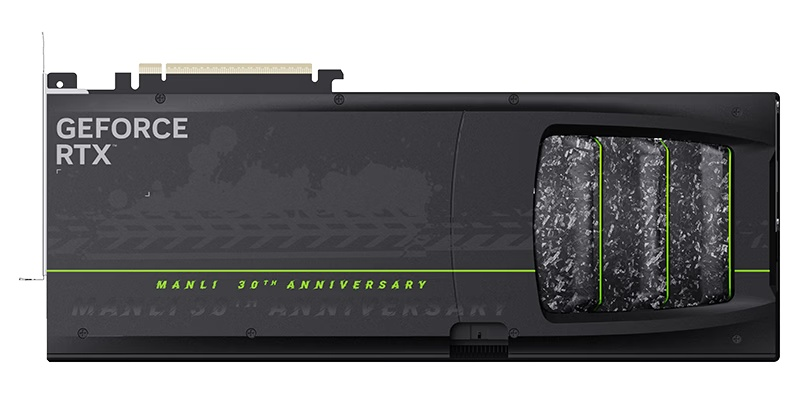
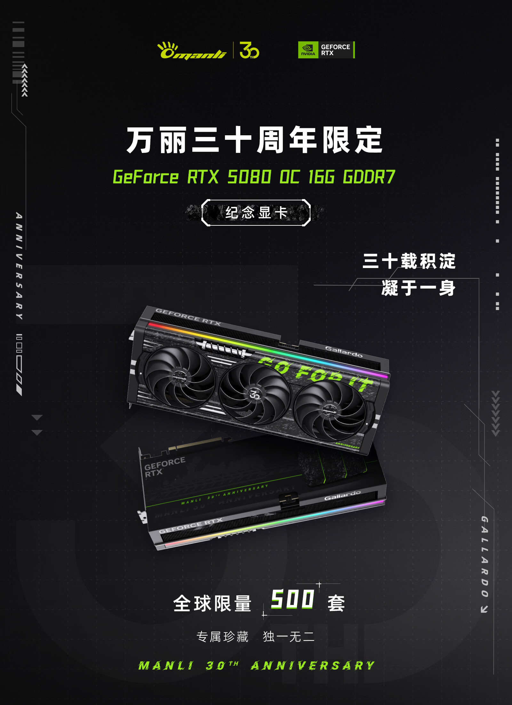

Manli ha puesto a la venta una edición conmemorativa de su GeForce RTX 5080 para
celebrar su 30.º aniversario. El modelo, denominado GeForce RTX 5080 OC 16G GDDR7,
se comercializa en una tirada global limitada a **500 unidades**, con un precio de
**16.599 yuanes** en China, según detalla ITHome.

## Especificaciones y refrigeración

La edición conmemorativa mide 359×146×74 mm y equipa una alimentación de 18+3 fases.
Para mantener las temperaturas a raya combina material de interfaz térmica de cambio
de fase Honeywell PTM7950, una cámara de vapor, diez heat pipes de 8 mm, tres
ventiladores de aro y el sistema de flujo de aire DRS de segunda generación.

En el apartado de frecuencias, la GPU acelera hasta los 2730 MHz, es decir, 113 MHz
por encima del modelo de referencia, mientras que el consumo total de la tarjeta
asciende a 400 W (+40 W respecto a la referencia).

## Diseño conmemorativo y ecosistema

El apartado estético es uno de los ejes de esta edición: incorpora elementos
decorativos de fibra de carbono forjada en varias zonas del cuerpo y una estructura
con amortiguador en el frontal. Además, integra un sensor de actitud y es plenamente
compatible con el ecosistema de control inteligente por voz MIE de Manli.

## Una edición pensada para coleccionistas

La tirada de 500 unidades y el acabado de fibra de carbono sitúan a esta RTX 5080 OC
más cerca del mercado de coleccionista que del de reemplazo convencional. Aunque las
especificaciones mantienen la esencia de la RTX 5080 original, el sobrepuesto de
frecuencia, el refuerzo en la alimentación y el conjunto de refrigeración la
diferencian del modelo de referencia, y el precio de 16.599 yuanes la aleja del
comprador que solo busca rendimiento por euro.
