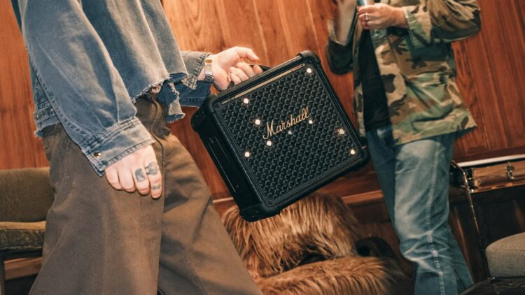
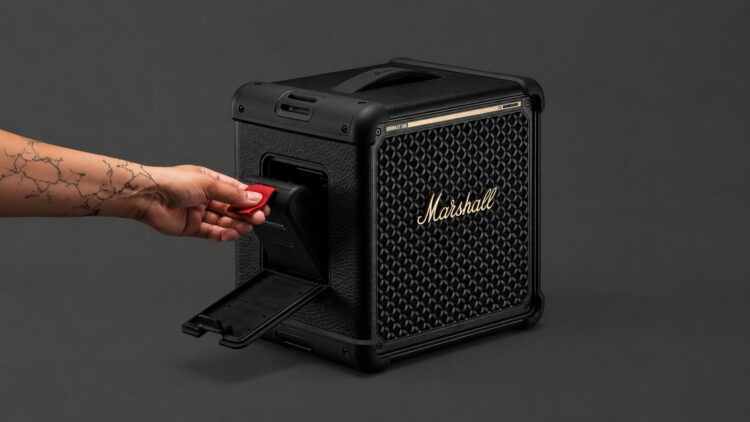

Marshall amplía su familia de altavoces para fiestas en la dirección contraria a la habitual: en lugar de agrandar el producto, lo reduce. El nuevo **Marshall Bromley 150** se presenta como el modelo más compacto de la gama Bromley, por debajo del Bromley 450 y del Bromley 750, pero conserva buena parte de las prestaciones de sus hermanos mayores.

Compacto es, en este contexto, un término relativo: el Bromley 150 pesa 6,3 kg, frente a los 12,2 kg del Bromley 450 o los casi 24 kg del Bromley 750. Marshall le ha añadido un asa retráctil en la parte superior y sus dimensiones son de 290 × 297 × 208 mm, según las especificaciones del fabricante.

## Sonido 360° del Bromley 150 con altavoces delante y detrás

El pilar del Bromley 150 es el sistema que Marshall denomina **True Stereophonic 360°**. En vez de concentrar la salida en la parte frontal, el altavoz combina transductores orientados hacia delante y hacia atrás para repartir el sonido alrededor del equipo y evitar un único punto óptimo de escucha.

En el apartado técnico encontramos un woofer de 6,5 pulgadas, dos controladores de rango completo de 2 pulgadas y un radiador pasivo de 7,5 pulgadas. La amplificación es de clase D, con un amplificador de 90 W para el woofer y dos de 55 W para los controladores de rango completo, mientras que el nivel máximo de presión sonora declarado llega a los 97 dB a un metro. La respuesta de frecuencia anunciada cubre de 42 Hz a 20.000 Hz y los graves y agudos se pueden ajustar desde el panel del propio altavoz.

## Más de 40 horas con una batería reemplazable

Marshall promete **más de 40 horas de reproducción** con una sola carga en el Bromley 150, pero el detalle relevante es el tipo de batería: se trata de una unidad LFP (LiFePO4) **extraíble y reemplazable**. Eso permite llevar una segunda batería cargada y sustituirla cuando se agote la primera, sin depender del cable. La batería incluida es la Marshall 415, ya colocada de fábrica.

La carga rápida también está bien resuelta: con 20 minutos conectado se consiguen hasta cinco horas adicionales de reproducción, y una carga completa requiere alrededor de tres horas. El altavoz puede usarse igualmente enchufado a la corriente. En cuanto a la protección exterior, la certificación **IP55** lo deja preparado para polvo y salpicaduras, aunque no para sumergirlo en el agua.

## Luces, micrófonos y Auracast

Como buen altavoz de fiesta, el Bromley 150 incorpora **iluminación detrás de la rejilla frontal** con tres modos, incluidos efectos capaces de reaccionar al ritmo de la música. Marshall ha concentrado prácticamente todos los controles en un lateral para despejar la zona frontal.

En conectividad suma **Bluetooth 5.3**, conexión multipunto y compatibilidad con **Auracast**, la tecnología que permite enlazar varios dispositivos compatibles entre sí. El fabricante declara además un alcance Bluetooth superior a los 70 metros en condiciones sin obstáculos. También hay entrada y salida auxiliar de 3,5 mm y USB-C. La propuesta inalámbrica del Bromley 150 convive con otras apuestas de audio reciente, como la [plataforma Snapdragon Sound Elite Gen 2 de Qualcomm](/noticias/qualcomm-snapdragon-sound-elite-gen-2/), centrada en auriculares con IA y cancelación adaptativa.

El punto más llamativo son sus **dos conectores combo XLR/jack de 6,35 mm**, pensados para conectar micrófonos o instrumentos y con controles independientes de nivel y efectos. Con ellos, el Bromley 150 no se limita a reproducir música: también puede funcionar como un pequeño sistema de karaoke o para enchufar directamente una guitarra.

## Precio y disponibilidad

El **Marshall Bromley 150** llegará en el acabado **Black and Brass**, el clásico negro con detalles dorados de la marca. En Europa, Marshall lo sitúa en **449 euros**, con las primeras unidades previstas para octubre. La caja emplea madera con certificación FSC y el fabricante incluye la batería entre los componentes reparables del producto.
