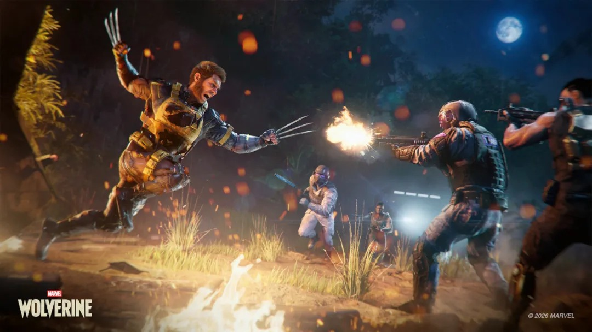
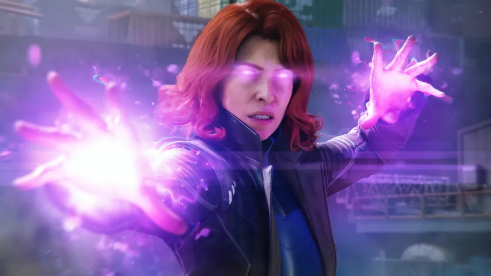
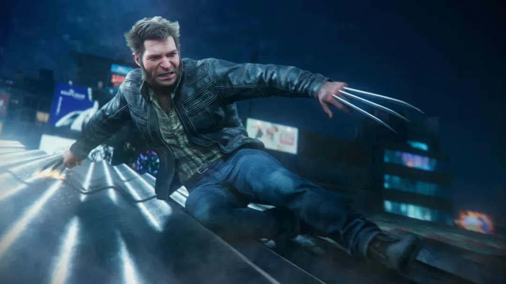
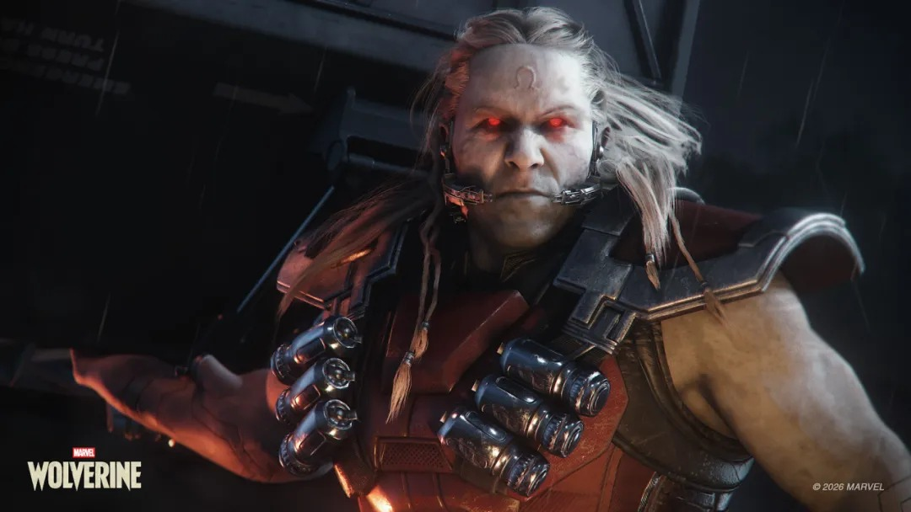
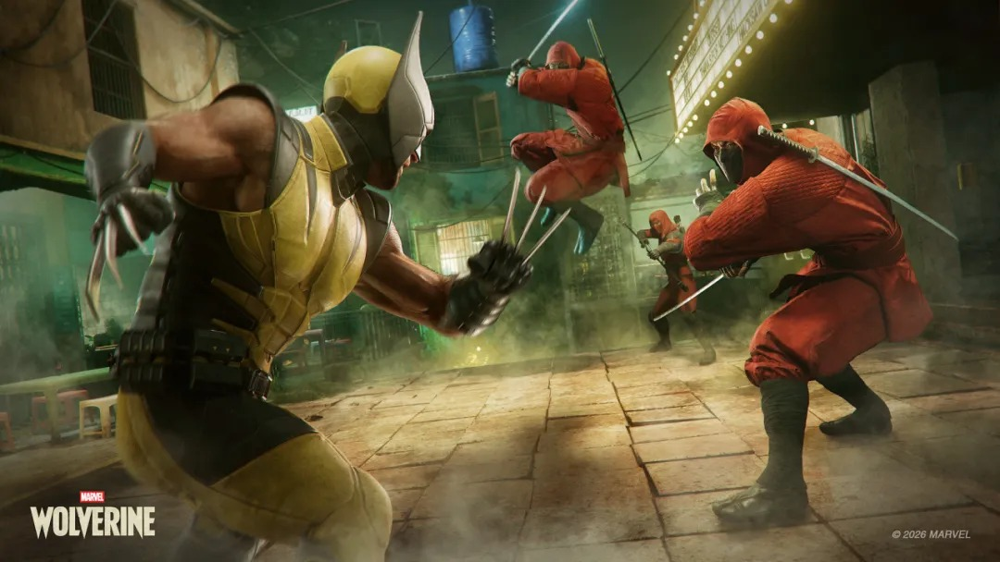
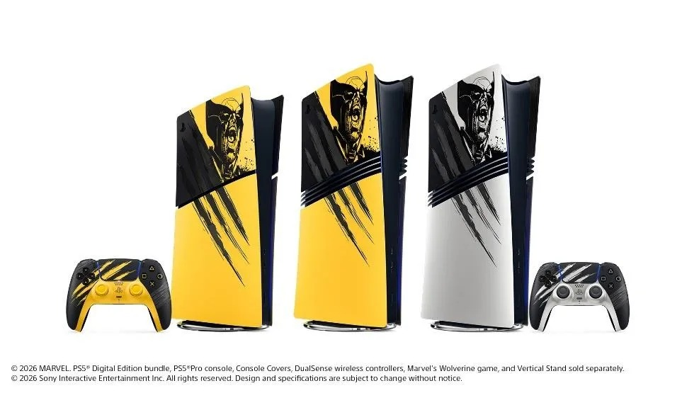

Tras años de espera, **Marvel's Wolverine** ya es una realidad: el nuevo título de **Insomniac Games**, publicado por **Sony Interactive Entertainment**, se pone hoy a la venta en exclusiva para **PlayStation 5**. Es el proyecto más ambicioso del estudio desde que firmó con Marvel, y llega con una propuesta que rompe con el tono familiar de sus entregas anteriores de Spider-Man: una aventura de acción en tercera persona, de estructura lineal y clasificación para público adulto.

## Precio y ediciones

Tomando como referencia la tienda de PlayStation en Hong Kong, la **edición estándar** se vende por **548 dólares de Hong Kong** (unos 469,9 yuanes, según la conversión que apunta ITHome), mientras que la **edición Deluxe** sube a **628 dólares de Hong Kong** (unos 538,5 yuanes). La versión superior no es solo cosmética: incluye **cinco trajes exclusivos**, **cinco pares de garras** y **tres puntos de habilidad adicionales** de salida.

## Una aventura lineal, adulta y exigente

El juego abandona el mundo abierto para apostar por una **narrativa lineal**: la historia principal se completa en unas **12 a 15 horas**. En el plano técnico, la instalación ocupa alrededor de **79,36 GB**, cifra que el parche de lanzamiento eleva hasta los **81,4 GB** aproximadamente.

Uno de los datos que más ha llamado la atención es el rendimiento: en la **PS5 estándar**, y **con el trazado de rayos activado**, el juego mantiene una tasa de **60 fotogramas por segundo**. Es una señal de que Insomniac ha primado la fluidez incluso en el modelo base de la consola, no solo en la PS5 Pro.

La trama gira en torno a **Logan**, al que el jugador controla durante toda la partida, sin alternar con otros personajes. La historia recorre **Canadá, Japón y Madripoor**, la isla ficticia del universo Marvel, y enreda a Wolverine en la conspiración de captura de mutantes de **Bolívar Trask**. Por el camino aparecen clásicos de los X-Men como **Jean Grey** y **Mystique**. Insomniac lo define como su primer juego de Marvel para público adulto, con una calificación M (ESRB) y una violencia gráfica pensada para reflejar el estilo de combate salvaje del personaje.

## El parche de lanzamiento y la recepción de la crítica

El lanzamiento llega acompañado de un **parche de día uno** que no solo corrige, sino que amplía el contenido: añade un **modo foto completo** y soporte para **Nueva Partida +**, que conserva las habilidades y mejoras desbloqueadas en la primera pasada. También introduce un reto adicional de mayor dificultad conocido como **«desafío de pesadilla»**.

En lo que respecta a la prensa, el recibimiento es desigual. **Metacritic** agrega una media de **78 puntos** sobre 112 análisis. **IGN** y **GameSpot** coinciden en un **6**, mientras que medios como **GameInformer, Wccftech o DualShockers** se mueven en torno al **8,5**. El consenso es claro en dos frentes: se alaba la construcción de personajes y la puesta en escena narrativa, pero se cuestiona la **profundidad del combate** y un **diseño de niveles conservador**.

Con Marvel's Wolverine, Sony cierra el ciclo de exclusivos de Insomniac para esta generación con un título de autor: menos accesible que Spider-Man, más directo en su violencia y con una duración contenida. Queda por ver si el público respalda esa apuesta por una experiencia adulta y lineal, o si las notas templadas de la crítica pesan más que el tirón del personaje.
