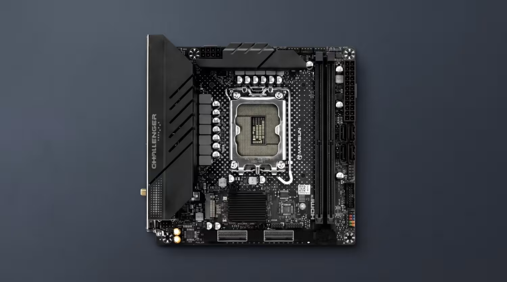
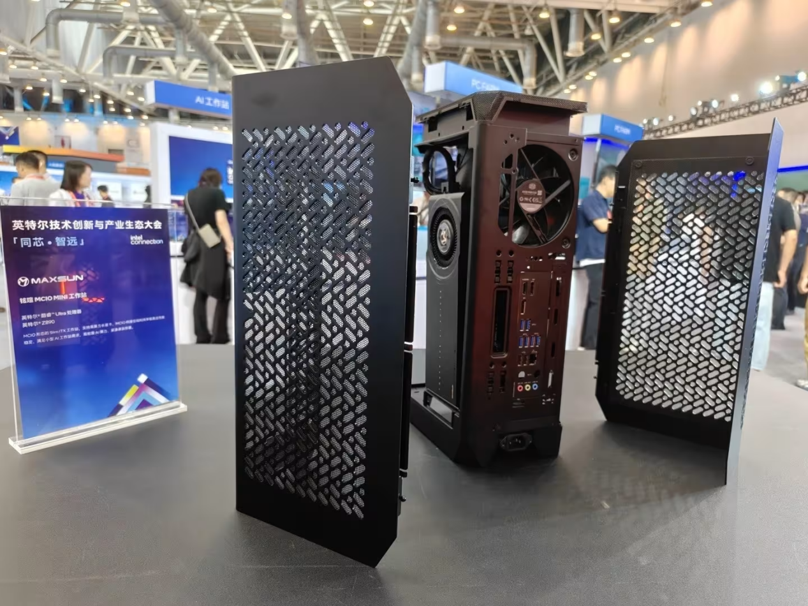

Maxsun presentó en Intel Connection 2026 una estación de trabajo compacta construida alrededor de una placa base Z890 en formato Mini-ITX que prescinde de la ranura PCIe x16 tradicional. Según detalla MyDrivers, la conexión PCIe 5.0 x16 de la tarjeta gráfica se traslada fuera de la placa mediante dos conectores MCIO y un cable.

## Adiós a la ranura x16: dos conectores MCIO para un PCIe 5.0 x16

La placa Maxsun Z890 ITX sustituye la ranura gráfica por dos conectores MCIO. MCIO (Mini Cool Edge I/O) es un conector de la especificación SFF-TA-1016 pensado para PCIe 5.0 y 6.0: con solo 74 pines ocupa mucho menos espacio que una ranura PCIe x16 y ofrece un ancho de banda bidireccional teórico de 512 Gbps, equivalente a un PCIe 5.0 x8. Al combinar los dos conectores, la placa entrega el ancho de banda completo de un PCIe 5.0 x16.

El planteamiento recuerda hasta qué punto la ranura física condiciona el diseño: a diferencia de lo que ocurre con equipos donde [la ranura PCIe 3.0 no obliga a cambiar de placa base](/noticias/gpu-legacy-pcie-slot/), aquí es la propia placa la que elimina la ranura para ganar espacio.

## Qué cambia para un PC compacto: gráfica espalda con espalda

El valor del diseño es físico más que de rendimiento. En un montaje clásico, la tarjeta gráfica debe insertarse en vertical en la ranura de la placa; al sacar el enlace PCIe por cable MCIO, la gráfica puede instalarse espalda con espalda al otro lado de la caja.

Maxsun demostró el concepto dentro de una caja Cooler Master i100 Air: la placa base y la tarjeta gráfica quedan a lados opuestos del chasis, unidas por el cable MCIO, lo que libera espacio interior en un formato donde cada centímetro cuenta.

## Bifurcación PCIe y estado del proyecto

Las versiones Z890 y Q870 de esta placa admiten además bifurcación de carriles PCIe: el enlace x16 puede dividirse en modos x8+x8 o x8+(x4+x4). Esa flexibilidad permite combinar gráfica, matrices de almacenamiento M.2 o tarjetas de expansión dedicadas, un escenario pensado para estaciones compactas de alta densidad.

Con todo, el conjunto sigue siendo una demostración de plataforma: en el extremo de la gráfica todavía hace falta un adaptador para conectar el cable MCIO, y Maxsun no ha anunciado fecha de venta ni precio.
