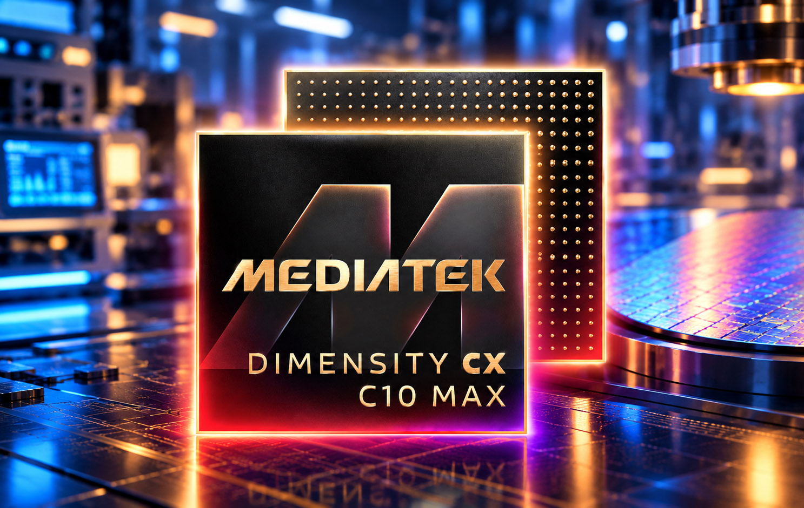
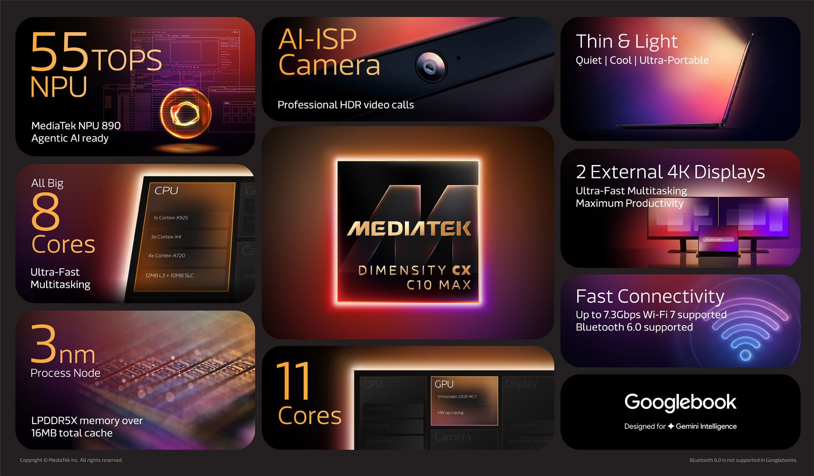

MediaTek ha presentado el **Dimensity CX C10 Max**, el primer procesador de su nueva
familia Dimensity Compute Experiences (CX), con la que la compañía taiwanesa quiere
entrar de lleno en el mercado de los portátiles. El chip está fabricado en un nodo de
3 nm de TSMC, emplea un diseño de ocho núcleos «All Big Core» y llegará al mercado
dentro de un Googlebook prémium, la nueva categoría de portátiles Android que Google
estrenó con Intel y Qualcomm como primeros proveedores y a la que ahora se suma
MediaTek. De momento no se ha detallado qué modelo concreto lo estrenará ni a qué
precio.

## Así es el Dimensity CX C10 Max: 3 nm y ocho núcleos All Big Core

La arquitectura del C10 Max renuncia a los núcleos de eficiencia y reparte sus ocho
núcleos en tres niveles: **un Cortex-X925** para las cargas más exigentes, **tres
Cortex-X4** y **cuatro Cortex-A720**. MediaTek acompaña a la CPU con 12 MB de caché
L3 y 10 MB de caché de sistema, además de memoria LPDDR5X a 9600 Mbps y
almacenamiento UFS 4.0.

La GPU es una **Arm Immortalis-G925 MC11 de 11 núcleos** con trazado de rayos por
hardware, y el apartado de pantalla queda en manos del procesador MiraVision 1090,
capaz de mover hasta tres paneles 4K: el interno del equipo y dos monitores externos.
Según el fabricante, este conjunto permite a los ensambladores diseñar portátiles más
finos y ligeros, **sin ventilador** para el SoC principal y con autonomía para toda la
jornada.

## IA en el dispositivo: la NPU 890 y Gemini Intelligence

El apartado que MediaTek coloca en el centro de su discurso es la inteligencia
artificial. El chip integra la **NPU 890, de octava generación**, que alcanza un
rendimiento de **55 TOPS** en precisión INT8 y soporta INT16, FP16 y BF16. La
compañía la presenta como la pieza pensada para ejecutar **Gemini Intelligence** y
agentes de IA que trabajan íntegramente en el equipo, sin depender de la nube: desde
flujos de trabajo en tiempo real hasta transcripción y resumen en directo, con la
privacidad como argumento.

A ello se suma la ISP **Imagiq 1090**, compatible con sensores de hasta 32 megapíxeles
y con funciones como vídeo HDR, zoom fluido, enfoque sostenido y estabilización
electrónica de imagen. En conectividad, el C10 Max incorpora **Wi-Fi 7 a 7,3 Gbps** y
**Bluetooth 6.0 de doble motor**, además de soporte para HDCP 2.3, Widevine L1 y
TrustZone de Arm.

## Qué promete frente a Snapdragon y qué cambia para el comprador

MediaTek compara su chip con el **Snapdragon X Elite X1E-84-100** de Qualcomm, no con
la generación X2 más reciente. Las cifras que maneja son dos: hasta un **15 % más de
rendimiento multihilo** a la misma potencia (12 W) y hasta un **50 % menos de consumo
en cargas de un solo hilo**, medidas ambas con Geekbench 6.5. La compañía también
declara hasta **19 horas de batería** en una placa de referencia con ChromeOS y una
batería de 60 Wh.

Conviene tomar estas promesas con cautela. Los equipos de prueba no eran equivalentes
—un prototipo con ChromeOS frente a un Samsung Galaxy Book4 Edge con Windows 11— y
MediaTek no publicó las puntuaciones absolutas, solo los porcentajes. A esto se añade
que buena parte de la ficha recuerda al **Kompanio Ultra 910**, el anterior tope de
gama de la firma para Chromebooks, del que el C10 Max hereda la misma combinación de
núcleos, GPU y NPU; la diferencia más visible es la velocidad de memoria, que sube de
8533 a 9600 Mbps.

Para el comprador hispanohablante, la noticia tiene una lectura clara: la gama alta de
portátiles se prepara para recibir un tercer fabricante de silicio junto a Intel,
Qualcomm y, en menor medida, Apple. El C10 Max llega al mismo tiempo que la primera
hornada de [Googlebook, cuyas reservas se abrieron el 21 de septiembre](/noticias/googlebook-preorders-september-21/),
y no debe confundirse con el [Dimensity 9600 Pro presentado unos días antes](/noticias/oppo-find-x10-dimensity-9600-pro/),
que es un chip distinto, de 2 nm y orientado a móviles. El C10 Max, en cambio, es la
apuesta de MediaTek para el segmento de los ultraligeros con IA, un terreno donde su
rendimiento real todavía está por verificar en equipos de serie.
