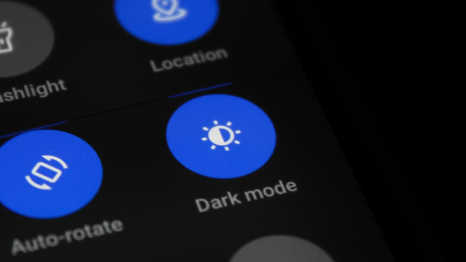
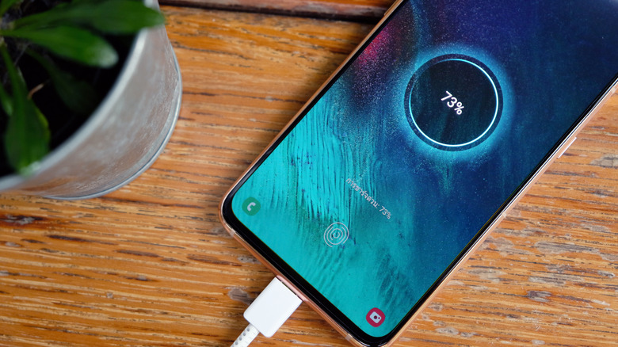

Que la batería de tu móvil Android baje a media antes del mediodía es una queja
muy común, y en la mayoría de los casos obedece a causas evitables: una pantalla
demasiado brillante, aplicaciones que se refrescan en segundo plano sin descanso,
hábitos de carga poco cuidadosos o una app que sigue consumiendo mientras tú sigues
con lo tuyo. No hace falta activar el modo avión, conformarse con una pantalla tan
tenue que apenas se lee ni apagar el Wi-Fi: unos ajustes concretos pueden devolver
horas al día sin que se note apenas diferencia en el uso cotidiano.

Conviene mirar el problema por dos caras. La primera es el consumo diario; la
segunda, la salud de la batería a medio plazo, porque nadie quiere terminar
cambiándola antes de tiempo. Esta guía ordena los ajustes en cuatro pasos y cada
uno indica la ruta real del menú, tal y como la documenta Engadget.

## Requisitos previos

- Un móvil Android con acceso completo a la aplicación **Settings**.
- Unos minutos: los ajustes de este tutorial se cambian en menos de cinco minutos.
- Ten en cuenta que los nombres de los menús varían según la marca: rutas como
  **Battery Protection** pueden aparecer con otro título en tu fabricante.

## Pasos

### 1. Ajusta la pantalla, el mayor consumidor

Casi siempre la pantalla es el mayor desgaste de batería del teléfono, así que por
ahí hay que empezar.

- Reduce el brillo manualmente o activa el brillo automático. Se hace en
  **Settings > Display**, en la sección *Brightness*: así la pantalla no gasta
  energía de más en entornos poco iluminados.
- Acorta el apagado de pantalla a 30 segundos para que no se quede encendida cuando
  no la estás mirando. El ajuste está en **Settings > Display > Screen timeout**.
- Si tu móvil admite una frecuencia de 120 Hz, baja a 60 Hz para el uso diario:
  en **Settings > Display > Motion smoothness** elige *Standard* en lugar de
  *Adaptive*. El desplazamiento y los juegos serán menos fluidos, pero no es el fin
  del mundo. Es el mismo principio que funciona en un portátil con
  [frecuencia de refresco reducida en Windows 11](/noticias/windows-11-pantalla-bateria/).

También está el modo oscuro, aunque los resultados varían: en pantallas OLED o
AMOLED, un estudio de la Universidad de Purdue cifra el ahorro de consumo de la
pantalla entre el 39 % y el 47 % a brillo máximo, mientras que a los niveles
habituales de interior ese ahorro se reduce a una horquilla del 3 % al 9 %.

### 2. Activa Battery Saver y Adaptive Battery

Más allá de la pantalla, hay dos herramientas del sistema que trabajan en silencio:

- **Battery Saver** (también llamado *Power Saving*) restringe la actividad cuando
  la carga baja de un umbral que tú defines. Está en **Battery > Battery saver** y
  ofrece dos modos: *Standard* y *Maximum*.
- **Adaptive Battery** va un paso más allá: aprende qué aplicaciones abres de
  verdad y limita la energía de las que casi no tocas. Se activa en
  **Settings > Battery > Background usage limits > Three-dot menu > Adaptive battery**.

### 3. Cambia tus hábitos de carga

La carga también decide cuánto dura la batería a la larga. La mayoría de usuarios
enchufa el móvil por la noche y lo deja al 100 %, y ese hábito degrada la celda de
forma silenciosa.

- Las baterías de iones de litio están más sanas entre el 20 % y el 80 % de carga.
  Según Battery University, mantener ese rango mantiene el voltaje más bajo, lo que
  puede alargar de forma notable la vida en ciclos; cargar al 100 % y dejar el
  teléfono enchufado, sobre todo en un ambiente cálido, acelera la pérdida de
  capacidad.
- Cuando puedas, carga hasta alrededor del 80 % y desconecta antes de acostarte si
  tu móvil no tiene límite de carga integrado.
- Muchos Androides actuales sí traen ese límite: **Settings > Battery >
  Battery Protection** (el nombre varía según la marca) permite elegir un tope
  entre el 80 % y el 95 %.

- Si prefieres ver siempre la batería al 100 %, la opción *Basic* corta la carga al
  llegar a ese nivel y solo retoma el remate cuando vuelve al 95 %.
- Conviene hacer cargas parciales: subir hasta el 70 % es más amable con la celda
  que descargarla del todo y volver a llenarla.
- La carga rápida, cómoda, genera más calor que la estándar, y el calor es la
  causa principal de la degradación.

Para otro ecosistema, la misma filosofía de cuidado está explicada en nuestra guía
para [optimizar y cuidar la batería de un iPhone](/noticias/iphone-battery-optimization-guide/).

### 4. Detecta qué está agotando la batería

Si el móvil sigue perdiendo carga más rápido de lo que debería a pesar de todo lo
anterior, toca mirar qué se la lleva.

1. Entra en **Settings > Battery > Battery usage** y revisa qué aplicaciones han
   consumido más energía en las últimas 24 horas o más. Busca lo que llame la
   atención: una app de navegación que estuvo en segundo plano todo el día, una red
   social refrescándose sin parar o un juego que no se cerró del todo.
2. Toca el nombre de la aplicación. Verás información adicional y, sobre todo, un
   botón para fijar límites de uso en segundo plano, con el que la app pasa a
   *sleep* o a *deep sleep*. En *sleep* la app corre en segundo plano de vez en
   cuando y sus actualizaciones y notificaciones se retrasan; en *deep sleep* nunca
   se ejecuta en segundo plano.
3. Descarta también un malware: otra causa posible de un drenaje anómalo es que el
   teléfono esté infectado, con spyware incluido.

4. Si nada de lo anterior cambia la situación, haz una prueba de batería. En
   Samsung, abre la app **Members**, ve a **Support > Phone diagnostics** y
   ejecuta el análisis; después comprueba el estado de la batería. En otros móviles
   la ruta es distinta, por ejemplo **Settings > Battery > Battery Health**, pero
   el objetivo es el mismo.

## Cómo verificar que funcionó

- Vuelve a **Settings > Battery > Battery usage** al día siguiente y compara el
  ranking de consumo con el de antes de los cambios: las aplicaciones que habías
  limitado deberían aparecer por debajo.
- Comprueba que *Adaptive Battery* sigue activo en **Settings > Battery >
  Background usage limits**.
- Ejecuta de nuevo la prueba de diagnóstico: el estado de la batería debe marcarse
  como `Normal` (o `Good`, según la marca).
- En el uso real, el objetivo es que el teléfono aguante el día sin llegar a media
  batería a mediodía.

## Advertencias y limitaciones

- Los nombres de las rutas varían según el fabricante: *Battery Protection*, por
  ejemplo, no se llama igual en todos los modelos, y el diagnóstico de la app
  **Members** es exclusivo de Samsung.
- Bajar de 120 Hz a 60 Hz se nota en la fluidez al desplazar y al jugar.
- El ahorro del modo oscuro depende del brillo: en uso interior normal ronda el
  3 %–9 %, lejos de las cifras que se alcanzan a brillo máximo.
- Las apps en *sleep* retrasan notificaciones y actualizaciones, y las de *deep
  sleep* no se ejecutan en segundo plano: si necesitas que una app esté siempre
  viva (mensajería, navegación), no la limites.
- Cargar con carga rápida sube la temperatura, y el calor degrada la batería.
- Si el diagnóstico devuelve cualquier valor distinto de `Normal` o `Good`, la
  batería puede necesitar sustitución: ningún ajuste de software recupera una celda
  ya desgastada.
