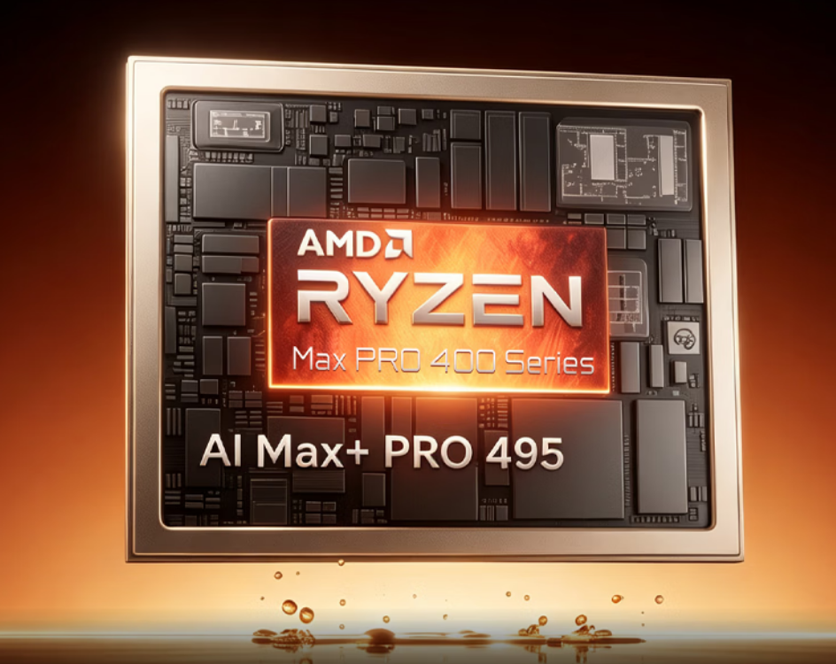

ACEMAGIC ha puesto a la venta el F9A, una estación de trabajo compacta que llega al mercado chino con una configuración poco habitual en este formato. El dato que define al equipo no es el procesador, sino la memoria: 192 GB de LPDDR5X-8533 unificada, de la que hasta 160 GB se pueden ceder a la GPU. La firma apunta a desarrolladores de IA y creadores profesionales, y lo hace con un precio de salida de 50.999 yuanes, rebajado a 49.998 yuanes como oferta de lanzamiento.

## Qué ha presentado ACEMAGIC

El F9A es un equipo de formato pequeño construido sobre una carcasa de aluminio con rejillas de ventilación a ambos lados. Sus medidas son 158,5 × 158,5 × 81,5 mm y pesa 1,4 kg, lo que lo sitúa en el terreno de los mini PC que se pueden dejar sobre la mesa sin renunciar a hardware de gama alta. La compañía lo describe como una estación de trabajo orientada a cargas de inteligencia artificial local, no como un equipo de juego.

En el apartado de cómputo, el sistema se apoya en un Ryzen AI Max+ Pro 495 con 16 núcleos y 32 hilos, capaz de alcanzar los 5,2 GHz de frecuencia máxima. El chip integra una gráfica Radeon 8065S y una NPU de arquitectura XDNA 2, con una capacidad total declarada de 131 TOPS para tareas de IA. Es la misma familia de APU que ya hemos visto en otras estaciones compactas, como la [Minisforum MS-S1 MAX-P495](/noticias/componentes/minisforum-ryzen-ai-max-495-workstation/) o el [Framework Desktop](/noticias/componentes/framework-desktop-ryzen-ai-max-pro-495/).

## La LPDDR5X unificada, la clave real del F9A

Los 192 GB de LPDDR5X-8533 son el argumento del equipo. Al tratarse de memoria unificada, el mismo bloque alimenta a la CPU, a la gráfica y a la NPU, y ACEMAGIC permite reservar hasta 160 GB para la VRAM de la Radeon 8065S. Según la compañía, esa capacidad basta para ejecutar en local modelos de lenguaje de hasta 300.000 millones de parámetros, un escenario que en hardware de consumo obligaría a repartir el modelo entre varios dispositivos.

Conviene ser preciso con lo que esto significa. La ventaja no está en los timings ni en una latencia CAS baja, sino en la **capacidad**: aquí no hay un perfil EXPO/XMP que ajustar porque la LPDDR5X va soldada a la placa y opera a una velocidad fija de 8533 MT/s. Lo que se gana es poder mantener en memoria modelos que de otro modo no cabrían, a costa de perder cualquier posibilidad de ampliación posterior. Es una plataforma de configuración cerrada: se compra con la memoria que trae y no admite cambios.

## Almacenamiento y conectividad

El apartado de expansión interna se limita al almacenamiento. El F9A incluye dos ranuras M.2 2280 para SSD NVMe PCIe 4.0 x4, con soporte para hasta 8 TB en total, de modo que la capacidad de disco sí queda en manos del usuario.

En conectividad, la máquina ofrece USB4, DisplayPort, OCuLink, HDMI, varios USB-A y una toma Ethernet de 2,5 GbE. A ello se suman Wi-Fi 7 y Bluetooth 5.4. La dotación se completa con dos altavoces de 2 W, un conjunto de cuatro micrófonos digitales en matriz y una tira de luz ARGB integrada en la base.

## Qué cambia para quien lo compre

El F9A es una propuesta de nicho con una condición muy clara: sus 192 GB de LPDDR5X soldada son irrenunciables y no se pueden ampliar después, así que la decisión de compra se toma de una vez. Si tu flujo de trabajo depende de ejecutar modelos grandes en local y necesitas esa capacidad en un equipo de 1,4 kg, el formato tiene sentido; si no, hay mini PC más baratos que cubren el resto de usos sin ese sobrecoste.

Queda un matiz de plataforma importante: los precios publicados corresponden al mercado chino (el equipo aparece listado con enlace a JD) y están en yuanes, por lo que no hay confirmación de disponibilidad ni de tarifa para España. Como ocurre con cualquier APU de memoria unificada, la estabilidad y el rendimiento real dependerán del firmware y de los drivers de la plataforma, no solo de la cifra en la ficha. Antes de comprar, conviene verificar que la versión concreta soporte el reparto de memoria a VRAM que anuncia el fabricante.
