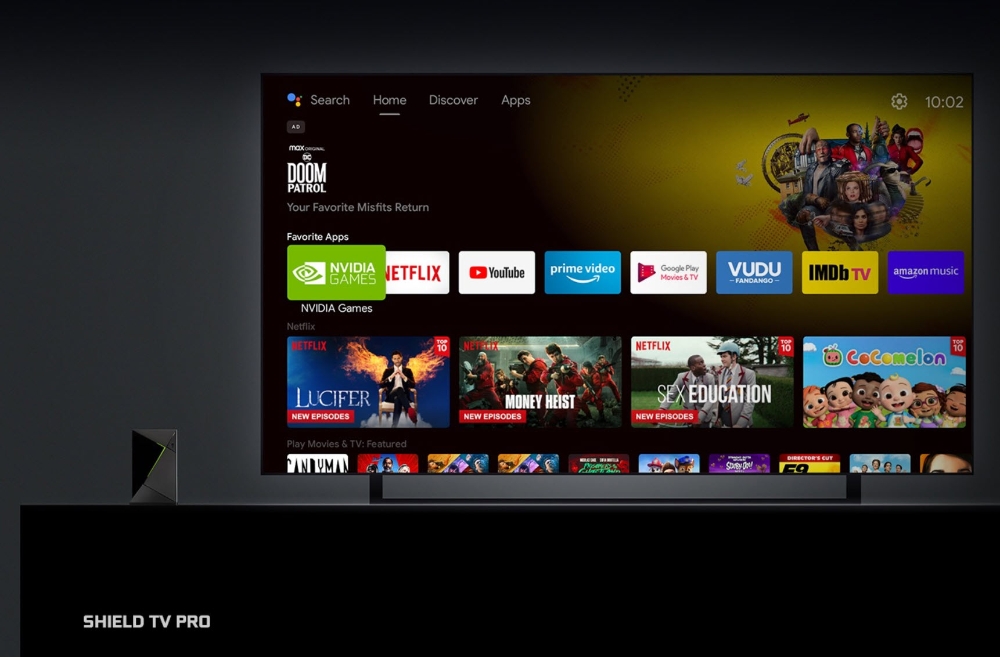

NVIDIA ha decidido subir el precio de su reproductor Shield TV Pro hasta los 299,99 dólares, 100 dólares más que los 199,99 anteriores, a partir del 2 de octubre. En el mismo movimiento, la compañía ha dejado de producir el Shield TV estándar y concentra la fabricación en la variante Pro. La razón que esgrime la firma no está en el producto, sino en su factura de componentes: el coste de la memoria, incluida la DRAM, se ha disparado en toda la industria.

## El coste de la memoria empuja el precio del dispositivo

El ajuste llega en plena escasez de memoria, con los precios de la DRAM al alza por el desvío de capacidad hacia la HBM que demanda la inteligencia artificial. NVIDIA lo resume en un comunicado en el que atribuye la subida al encarecimiento generalizado de los componentes, confirma que el Shield TV Pro pasa a costar 299 dólares desde el 2 de octubre y anuncia que deja de producir el modelo estándar para centrar la producción en la variante Pro.

El patrón no es exclusivo de NVIDIA. Otros fabricantes ya han trasladado esa misma presión de costes al precio final de sus equipos: [XMG subió hasta 300 euros el precio de sus portátiles por la crisis de la memoria](/noticias/xmg-sube-precios-portatiles-ram/), un movimiento que comparte el diagnóstico de fondo aunque se aplique a otra categoría de producto.

## Qué cambia y qué se mantiene en el Shield TV Pro

En lo técnico no hay novedades. El Shield TV Pro sigue apoyándose en el SoC Tegra X1 con GPU de 256 núcleos, 3 GB de memoria y hasta 16 GB de almacenamiento. Mantiene la salida 4K HDR con Dolby Vision y HDR10, además de un reescalado asistido por IA que alcanza los 4K a 60 FPS. Lo que cambia es únicamente el precio: el mismo hardware cuesta ahora un 50 % más que antes.

Conviene recordar de dónde viene la familia. El Shield nació como una apuesta de NVIDIA por el juego en movilidad con el Shield Portable y su Tegra 4, y en 2015 llegó el Shield TV en versiones estándar y Pro. Desde entonces el producto ha recibido actualizaciones de SoC y de capacidad, pero hace tiempo que no ve una generación nueva.

## Qué significa para quien quiera comprarlo

La decisión tiene dos efectos prácticos. El primero es que desaparece la puerta de entrada más barata a la plataforma Shield: quien buscara el modelo básico tendrá que pasar por el Pro, ahora más caro. El segundo es que el precio deja al Shield TV Pro en una franja incómoda frente a otros reproductores de salón, especialmente si se compara con equipos más recientes y con más memoria.

Para el jugador, el principal argumento sigue siendo GeForce NOW, que mantiene al Shield TV Pro como una forma sencilla de llevar el juego en la nube al televisor. Para el resto, la compra se vuelve más difícil de justificar salvo que ya se buscara específicamente este dispositivo. Y con la memoria como factor de coste, no es descartable que otros fabricantes de electrónica de consumo sigan el mismo camino en los próximos meses.
