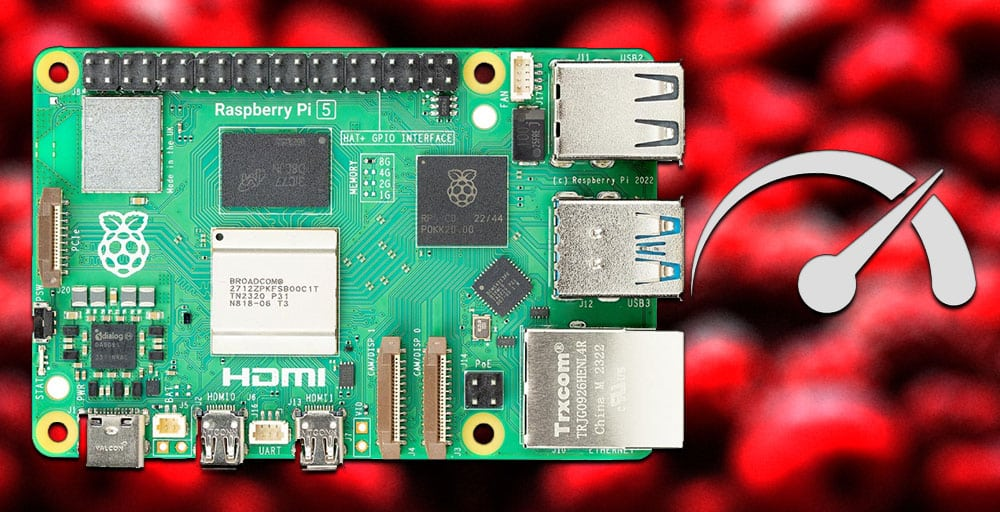

Raspberry Pi ha subido el precio de las versiones de 2 GB de la Raspberry Pi 4 y la Raspberry Pi 5 en 12,5 dólares. El anuncio llegó el 1 de octubre de 2026 y la subida entró en vigor de inmediato. La causa no está en la placa: la escalada del coste de la memoria ha dejado de hacer sostenible mantener esas configuraciones como puerta de entrada barata al ecosistema, como recoge el [anuncio oficial de la compañía](https://www.raspberrypi.com/news/price-increases-for-2gb-raspberry-pi-4-and-raspberry-pi-5/). Raspberry Pi reconoce que ya no podía absorber el gasto de la LPDDR4 que va soldada en estos modelos.

## La subida que arranca en octubre

El ajuste afecta solo a las versiones de 2 GB de la Pi 4 y la Pi 5. Los demás modelos mantienen su precio: la Pi 4 y la Pi 5 de 1 GB siguen igual, y también conservan tarifa los Compute Module 4 y Compute Module 5 de 2 GB. Es decir, la subida no es general ni responde a una revisión de toda la gama, sino a las variantes con menos memoria.

El caso más llamativo es el de la Raspberry Pi 5 de 2 GB. Este modelo costaba originalmente 50 dólares, pasó a 55 dólares (+5) en diciembre de 2025, subió a 65 dólares (+10) en febrero de 2026 y ahora se queda en 77,50 dólares (+12,5). En conjunto, supone cerca de un 55 % más que su precio de lanzamiento. Raspberry Pi subraya que la memoria se ha encarecido de forma muy pronunciada en los dos últimos años y que había intentado proteger las configuraciones con poca RAM para conservar una entrada económica a su catálogo.

## La LPDDR4, el origen del ajuste

El detonante es el mismo que ya presiona al resto del mercado: la demanda de memoria para infraestructuras de inteligencia artificial compite por la capacidad de fabricación y empuja los precios de toda la cadena. Raspberry Pi ya lo advirtió en febrero de 2026, cuando explicó que algunos componentes habían llegado a duplicar su coste en apenas un trimestre. El 1 de abril del mismo año puso una cifra al problema: la LPDDR4 que usan la Pi 4 y la Pi 5 era siete veces más cara que un año antes.

La escalada no se limita a los modelos de 2 GB. Según los precios anunciados, la Raspberry Pi de 4 GB sube 25 dólares, la de 8 GB otros 50 y la Raspberry Pi 5 de 16 GB suma 16 dólares. La Raspberry Pi 500 se encarece 50 dólares y la Pi 500+ lo hace en 150. [Micron ya anticipó que la escasez de memoria será aún mayor en 2027 y 2028](/noticias/memorias/micron-escasez-ram-2027-2028/), de modo que el ajuste de Raspberry Pi encaja en una tendencia de fondo y no en un movimiento aislado.

## Qué cambia al comprar una Raspberry Pi

La clave para el comprador es que la memoria de estas placas va soldada: no hay módulo que ampliar después. La decisión de capacidad se toma una sola vez, al comprar, y ya no se puede corregir con un kit posterior. Por eso el ajuste de las versiones de 2 GB tiene un efecto directo: quien necesite ese escalón tendrá que pagar más por una placa que, además, no podrá ampliar.

La comparación práctica pasa por revisar la gama al completo. Si el proyecto cabe en 1 GB, esas versiones no han subido y siguen siendo la opción más barata del catálogo. Si el uso pide más margen, conviene calcular el salto de 2 a 4 GB con los nuevos precios, porque la subida estrecha la diferencia entre ambos escalones. Y si el montaje depende de un Compute Module, los de 2 GB se quedan igual por ahora.

## Raspberry Pi mantiene el suministro pese a la subida

La crisis de memoria, de momento, no está frenando a la compañía. En el primer semestre de 2026 registró 256,9 millones de dólares de ingresos, un 90 % más interanual, con 4,2 millones de placas enviadas y 2,6 millones de unidades pendientes de envío. Parte de esa resistencia se explica porque Raspberry Pi compró inventario de memoria a precios inferiores antes de que la escasez se agravara, y la empresa afirma que tiene suficiente memoria comprada o contratada para cumplir sus objetivos de producción de 2026, además de estar asegurando suministro para 2027.

Con ese respaldo, la subida de las versiones de 2 GB funciona como un ajuste de márgenes antes que como un problema de abastecimiento. Para quien ya tenga la placa, no cambia nada; para quien esté decidiendo la compra, el consejo de siempre se refuerza: elegir la capacidad pensando en el uso real, porque en estas placas no hay segunda oportunidad para ampliarla.
