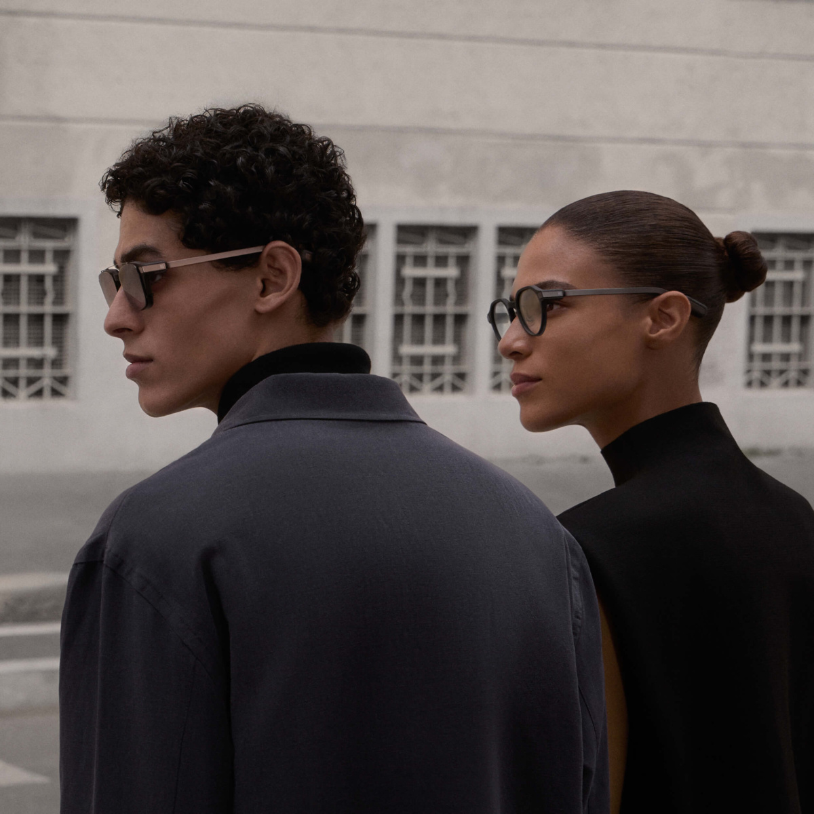

El mercado de las gafas de IA marcó un récord en la primera mitad de 2026 con 4,2 millones de unidades enviadas en todo el mundo, un 127 % más que un año antes, según los datos de Omdia recogidos por Mixed. Meta concentró 3,4 millones de esos envíos, lo que le otorga una cuota del 81,3 %, mientras la segunda posición fue para Even Realities, con 102.000 unidades y un 2,4 % del mercado gracias a unas gafas que no llevan cámara ni altavoces.

## Qué ha pasado en el mercado de las gafas de IA

Even Realities escaló desde la quinta posición del segundo semestre de 2025 hasta el segundo puesto, impulsada por la demanda de su serie G2 en Norteamérica y Europa occidental, siempre según Omdia. Su planteamiento es opuesto al de Meta: elimina cámara y altavoces a cambio de una montura más fina, una pequeña pantalla monocroma y funciones de productividad como la transcripción en tiempo real.

El resto del mapa lo completa China como polo de nuevos fabricantes. Los envíos en la China continental crecieron un 306 % interanual, aunque el mercado sigue fragmentado: Alibaba, INMO y Xiaomi suman juntas el 46,1 % de los envíos locales. Estados Unidos, por su parte, continúa siendo con diferencia el mayor mercado de gafas de IA, y ejerce además como centro de la cadena de suministro y banco de pruebas de nuevas configuraciones, de acuerdo con el informe.

## Por qué importa que el segundo no tenga cámara

El 2,4 % frente al 81,3 % no es una amenaza para el liderato de Meta, pero sí una señal de diversificación: el segundo fabricante más vendido apuesta por prescindir justo de los dos elementos que definen la propuesta de Meta, la captura de foto y vídeo manos libres y el audio de oído abierto. La analista senior de Omdia Qiran Ju atribuye el crecimiento a "el impulso sostenido de Meta y una oleada de nuevos participantes procedentes de China", y añade que los fabricantes han dejado clara la propuesta de valor al centrarse en la captura manos libres, el audio abierto y la asistencia de IA en monturas convencionales.

La privacidad aparece como el otro gran factor. El director de investigación de Omdia Jason Low advierte de que, ante el escrutinio creciente sobre las gafas con cámara, no bastará con ajustes de privacidad más estrictos ni con mensajes más claros: las compañías deberán definir qué captan las cámaras siempre activas, explicar el uso de ese contenido y garantizar que nunca llegue a terceros. La apuesta sin cámara de Even Realities encaja directamente en esa grieta.

Conviene leer las cifras con cautela metodológica: Counterpoint midió para el mismo semestre un crecimiento del 263 % con el 96 % de los envíos en monturas sin pantalla, e IDC situó a las gafas en cerca del 85 % de los envíos de XR en el segundo trimestre. Son cestas de productos distintas y Omdia no publica su definición de la categoría, pero la dirección coincide en todos los casos.

## Qué cambia para quien valora unas gafas de IA

A corto plazo, el comprador elige sobre todo dentro del ecosistema de Meta, que amplió su gama justo al cierre del periodo medido: las [Ray-Ban Meta de tercera generación, con más autonomía y un precio más alto](/noticias/ray-ban-meta-gen-3/) llegaron el 23 de septiembre por 449 dólares en Estados Unidos, y el modelo sin cámara Ray-Ban Meta Audio, de 349 dólares, sale a la venta el 13 de octubre. La propia Meta prevé ofrecer más de un centenar de variantes entre Ray-Ban, Oakley y Meta Glasses antes de fin de año, así que la tabla del segundo semestre se jugará contra una alineación mucho más amplia que la que produjo el 81,3 %.

Para el lector europeo, la conclusión práctica es doble: si la cámara es lo que frena la compra, ya existe una alternativa sin cámara que escala posiciones en Occidente; si lo que busca es el asistente con captura y audio integrados, la oferta dominante sigue siendo la de Meta y ningún otro competidor supera aún el 3 % de cuota.
