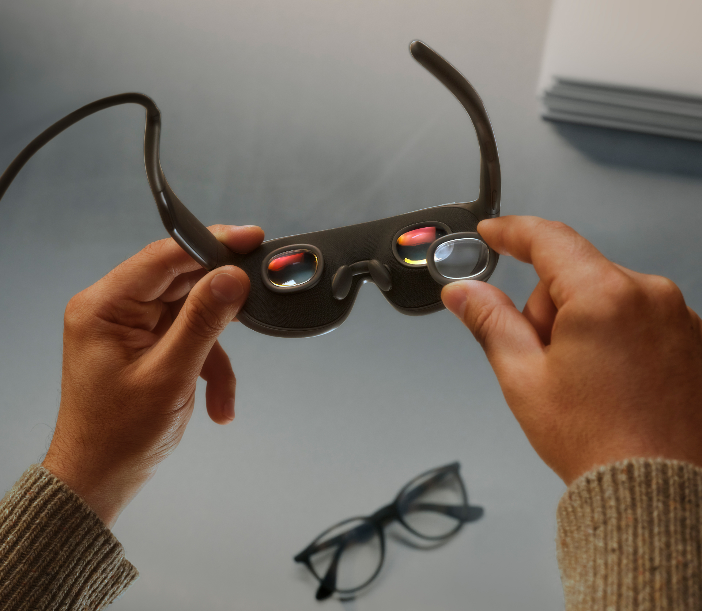
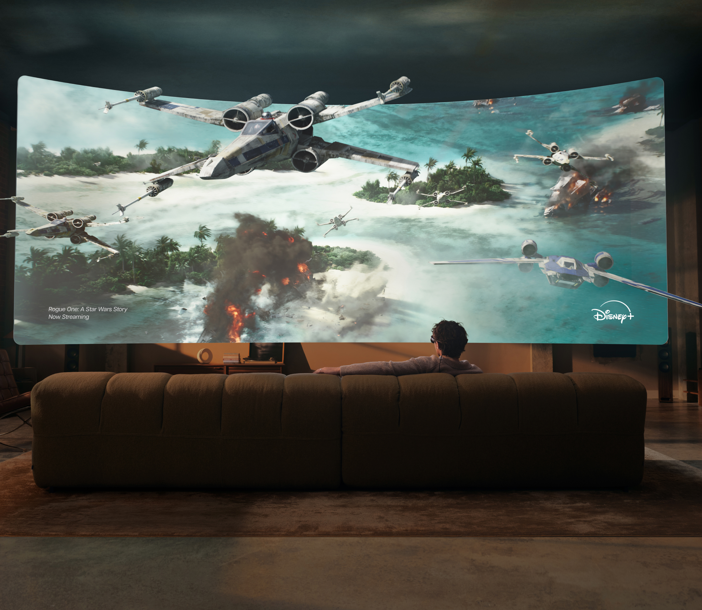
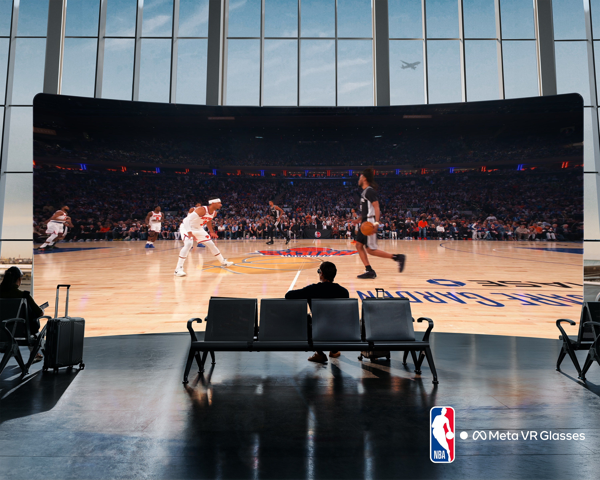

Meta presentó el 23 de septiembre de 2026, durante su conferencia Meta Connect, un visor de realidad virtual al que llama oficialmente **Meta VR Glasses**. No son unas gafas de realidad aumentada ni unas gafas inteligentes al uso: son unas gafas de realidad virtual con visión passthrough —cámaras que reproducen el entorno real en color— y su objetivo declarado es que se puedan llevar puestas durante horas. Llegarán en primavera de 2027 por 1.299,99 dólares en Estados Unidos.

La compañía lleva más de una década construyendo visores de realidad virtual y presenta este como un intento de llevar esa experiencia a un formato mucho más ligero. El apunte es relevante porque el mercado de las gafas inteligentes crece con fuerza, pero buena parte de ese volumen sigue concentrado en modelos sin pantalla, como recoge [la comparativa de pantallas del sector](/noticias/smart-glasses-display-comparison/).

## Meta VR Glasses: un sistema de dos piezas para bajar el peso a 100 gramos

El truco para reducir el peso está en partir el dispositivo en dos. Las gafas se quedan con la pantalla y los sensores y pesan unos **100 gramos**, aproximadamente lo que una baraja de cartas. Todo lo demás —el procesador, la batería y el almacenamiento— viaja en un segundo módulo de unos **300 gramos**, un puck que se engancha al bolsillo o a la bolsa y que se conecta a las gafas mediante un cable óptico.

Ese reparto es el que permite prescindir de correas y de hardware pesado sobre la cara, y Meta afirma que las VR Glasses son unas **cinco veces más ligeras que las Quest 3**. Los laterales van abiertos y la cámara de passthrough mantiene la visión del entorno, de modo que el dispositivo no aísla por completo a quien lo lleva. Además, es autónomo: funciona con el sistema operativo y la tienda de Quest, así que no necesita un móvil ni un PC conectados. El conjunto se completa con **seis cámaras externas y cuatro de seguimiento ocular**, situadas también en la parte inferior para que los gestos puedan hacerse con las manos en el regazo.

## Pantalla, potencia y batería: las cifras clave

La ficha técnica sitúa a las VR Glasses en la gama alta de la realidad virtual, con algunos compromisos claros.

| Componente | Especificación |
| --- | --- |
| Pantalla | micro-OLED «5K Infinite Display», 2.412 x 2.288 px por ojo, 37 PPD, hasta 120 Hz, lentes pancake |
| Campo de visión | 70° horizontal x 66° vertical |
| Procesador | Snapdragon Reality Elite (XR2 Gen 3) |
| Memoria | 12 GB de RAM |
| Almacenamiento | 128 GB, ampliables por microSD hasta 1 TB |
| Batería | Hasta 3 horas de reproducción continua, carga rápida de 45 W |
| Audio | Dolby Atmos integrado en la montura |
| Control | Mirada y pinza; sin mandos en la caja (los Touch Plus se venden aparte) |
| Precio y disponibilidad | 1.299,99 dólares; primavera de 2027 |

El control por la mirada y por gestos de pinza permite moverse por la interfaz sin mandos, y Meta integra su agente de Meta AI en el sistema operativo para abrir aplicaciones, reproducir contenido o buscar cosas hablando. En el audio, el sonido se emite desde la propia montura, con la misma filosofía de altavoces abiertos que ya usan las gafas de la compañía.

## Cine, deportes y trabajo: los usos que Meta destaca

El primer gran argumento de las VR Glasses es el consumo de contenido. Meta asegura que son el **primer dispositivo de realidad virtual con certificación IMAX Enhanced** y que serán una de las pocas formas de ver determinadas películas en el formato de relación de aspecto ampliada de IMAX desde casa. A ello se suma el soporte de **Dolby Vision** y un catálogo que incluye películas en 3D desde servicios como Disney+, además de aplicaciones de vídeo y deportes como Prime Video, YouTube, ESPN o Crunchyroll. En deportes, la compañía habla de más de 100 eventos en directo al año con vistas inmersivas de 180 grados.

También llega la **Hologram Calling**, una función de videollamada que genera una versión holográfica y fotorrealista de la persona, con sus expresiones y reacciones en tiempo real, y que coloca su voz en el espacio con audio espacial. Meta dice que funciona con las aplicaciones de llamadas habituales, de WhatsApp a Zoom, y que quien recibe la llamada desde un móvil u ordenador ve el holograma en su pantalla.

Para el trabajo, la propuesta es la de una pantalla grande —o varias— en cualquier lugar, con la posibilidad de convertir una superficie plana en teclado y panel táctil, y con el passthrough a color dejando ver el escritorio o el móvil mientras se trabaja. En juegos, habrá más de **75 títulos optimizados para seguimiento de manos** desde el primer día, y el catálogo de Xbox Cloud Gaming añadirá cientos más.

## Qué cambia para el lector

Meta no ha llamado «Quest Air» a este dispositivo, y la decisión no es casual: con las VR Glasses quiere dirigirse a un público profesional y entusiasta que valore algo más ligero y transportable que sus visores de juegos. El precio de 1.299,99 dólares lo coloca por debajo de alternativas como [el Vision Pro de Apple](/noticias/john-ternus-vision-pro-defense/) —cuesta una fracción de aquel y pesa mucho menos—, aunque sigue siendo un producto caro frente a una consola de realidad virtual.

El compromiso más evidente está en el campo de visión: los 70 grados horizontales de las VR Glasses quedan por debajo de los 110 grados de las Quest 3, como apuntan los primeros análisis. A cambio, el formato de gafas permite llevarlas más tiempo y usarlas en contextos en los que un visor tradicional resulta incómodo, desde un vuelo largo hasta una sala de espera.

Para el público español, de momento hay que recordar dos cautelas: el precio anunciado está en dólares y no se ha confirmado su equivalente en euros, y la fecha de lanzamiento se queda en una ventana genérica, la **primavera de 2027**, sin un día concreto. Será entonces cuando se pueda comprobar si la apuesta por separar la potencia del visor se traduce en comodidad real y no solo en una ficha técnica llamativa.
