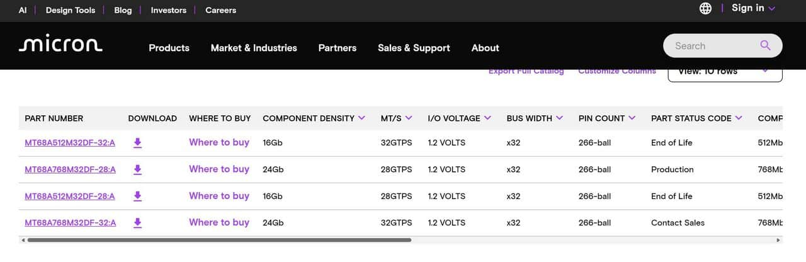

Micron ha marcado como EOL (End of Life) sus chips de memoria GDDR7 de 2 GB, tal y como refleja su propio catálogo de productos. La compañía deja de fabricar las versiones de 28 Gbps y 32 Gbps de esos módulos, de manera que su única alternativa dentro de esta familia de DRAM pasa a ser la de 3 GB por chip.

## Qué cambia para las tarjetas gráficas actuales

Los chips retirados se empleaban en algunas tarjetas de la serie GeForce RTX 50 de Nvidia. Conviene, sin embargo, no dramatizar: Micron no era el proveedor principal de VRAM para esas GPU, ya que Samsung y SK Hynix siguen cubriendo la mayor parte del volumen que necesita la serie. Por eso el impacto inmediato sobre los modelos que hoy están a la venta es limitado.

## Los módulos de GDDR7 de 3 GB no son un reemplazo sencillo

A primera vista, sustituir los chips de 2 GB por los de 3 GB sería el paso natural, pero no resulta tan simple. Los módulos de mayor densidad son más caros y no encajan de forma eficiente en los buses de memoria de las GPU actuales, lo que empuja el coste al alza. Ese es, precisamente, el motivo por el que la serie RTX 50 Super de Nvidia ha quedado pausada.

El sector, mientras tanto, ya mira hacia delante: los fabricantes planean lanzar memorias GDDR7 de 4 GB y 6 GB entre 2027 y 2028, pensadas para la próxima generación de GPU, la arquitectura Rubin.

## Una industria que prioriza la IA

El movimiento de Micron responde a un ajuste más amplio. La industria está reordenando sus líneas de producción para dar prioridad a los proyectos más rentables, en un contexto de memoria muy tensionado. El mercado reclama cada vez más capacidad para trabajar con inteligencia artificial, y los fabricantes no quieren dejar pasar esa oportunidad.

Es una dinámica que ya se deja notar en las previsiones de gasto: como recogemos en nuestro análisis sobre [la memoria y el gasto mundial en IA](/noticias/ai-cost-memory-2027/), el presupuesto destinado a estos chips crece a un ritmo muy superior al del resto de componentes. Para quien esté pensando en comprar o ampliar equipo, en esta guía repasamos [qué tarjetas gráficas de segunda mano siguen mereciendo la pena](/noticias/old-gpus-dram-crisis/) con el mercado actual.
