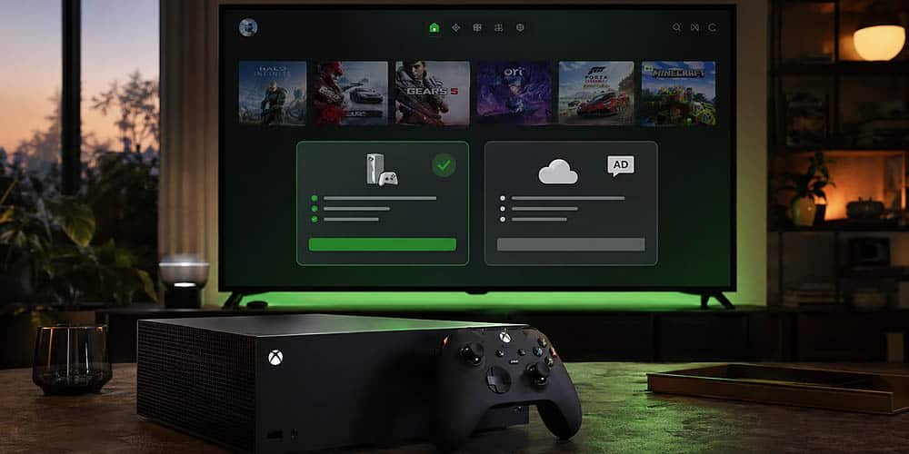

Microsoft ha publicado una solicitud de patente que describe un sistema capaz de pausar un videojuego para mostrar publicidad y, a cambio, devolver al jugador un tramo de partida sin anuncios. El documento, registrado con el número US 2026/0260258 A1 y titulado «Contextually Aware Management of Interactive Software Application Access», lo firma Microsoft Technology Licensing y apunta a juegos de PC y consola.

Conviene aclararlo desde el principio: se trata de una solicitud de patente, no de un producto. Registrar una técnica no significa que Microsoft vaya a implementarla, ni que exista un plan anunciado para llevarla a las consolas, a un servicio de suscripción o a la nube. Es decir, no es un anuncio comercial, sino la descripción de cómo podría funcionar una idea.

## Qué describe la patente de Microsoft

El documento plantea un sistema de gestión de contenidos que concede al jugador un crédito inicial de juego sin publicidad, definido por tiempo (cita ejemplos como 30 minutos) o por progreso, como completar un nivel o superar a un jefe. Cuando ese crédito se agota, el sistema abre una ventana para emitir «contenido promocionado».

La diferencia frente a un anuncio intrusivo está en cómo elige el momento. En lugar de interrumpir en plena acción, se apoya en señales del propio motor del juego para detectar pausas naturales: al terminar una cinemática, tras vencer a un jefe, al completar una misión, durante una pantalla de carga o al entrar en un menú. Mientras el anuncio se reproduce, el juego queda congelado o suspendido para que el jugador no pierda progreso y, al terminar, se concede un nuevo crédito que retrasa la siguiente interrupción.

La patente también menciona el uso de aprendizaje automático (machine learning) para localizar el instante más oportuno y una lógica de filtrado: si la señal de pausa llega en mitad de una pelea contra un jefe o de una partida en curso, el anuncio no se emite.

## Por qué genera rechazo

El parecido con los free-to-play de móvil es inevitable, y es justamente lo que ha encendido las alarmas. En esos juegos el jugador ve publicidad voluntariamente a cambio de recompensas o de seguir jugando; aquí la pausa no la decide el usuario, sino el sistema. Aunque el texto promete interrumpir menos y en mejores momentos, la idea de que la partida se detenga por un anuncio choca con la expectativa de una experiencia sin cortes que se asocia a consola y PC.

A esto se suma un debate de fondo que la propia industria arrastra: la percepción de que el modelo free-to-play, sostenido por microtransacciones y publicidad, empuja a los estudios hacia la monetización y no hacia juegos originales. Una patente como esta alimenta esa discusión incluso antes de existir un producto real.

## Antecedentes: nube con anuncios y free-to-play

La solicitud no llega en el vacío. Microsoft ya ha explorado una capa gratuita con publicidad para Xbox Cloud Gaming, y el sector lleva años probando fórmulas para financiar juegos sin cobrar por ellos. En ese contexto, una técnica que inserta anuncios en pausas controladas encaja como una pieza más de esa estrategia, especialmente en títulos gratuitos y en el juego en streaming.

La compañía tampoco es ajena a los rumores sobre cambios en la monetización de sus servicios: ya se ha especulado con un [plan de Xbox Game Pass con anuncios](/noticias/xbox-game-pass-day-one-changes/) dentro de una posible reorganización de suscripciones, un movimiento que encajaría con la misma lógica de negocio.

## Qué significa para el jugador

Por ahora, nada cambia en la práctica. Una patente puede describir tecnología que nunca llegue a producción, y en este caso no hay confirmación de que el sistema se haya desplegado en ningún juego. La relevancia de la solicitud está en la dirección que insinúa: anuncios que no interrumpen, sino que esperan a que el jugador ya esté detenido.

Para el usuario hispanohablante, la lectura útil es prudente. Si algún día aparece una función así, será sobre juegos gratuitos o servicios con publicidad, no sobre los títulos de pago que ya se compran a precio completo. Y si llega, la pregunta clave será cuánto tiempo libre concede cada anuncio y si el jugador puede rechazar la pausa.
