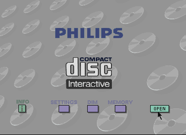
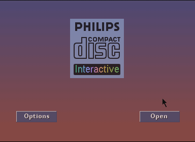
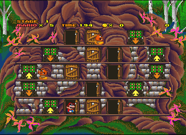
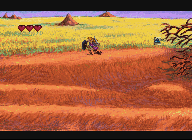

El desarrollador **CatmanFan** ha publicado **miniCDi**, un emulador experimental de **Philips CD-i** escrito en C++17 y diseñado para ejecutarse en GameCube, Wii, Wii U, Nintendo 3DS y Windows. El proyecto se dio a conocer el 28 de agosto de 2026 en un hilo de GBAtemp, donde el propio autor ha ido respondiendo las dudas de la comunidad. No se trata de un emulador construido desde cero: aprovecha código de emulación ya existente y lo reorganiza para que funcione en consolas domésticas, un terreno en el que el CD-i apenas tiene presencia.

## Qué consolas cubre y cómo se instala

miniCDi se distribuye como compilaciones separadas para cada plataforma, y las rutas de instalación cambian según el sistema anfitrión:

- **Wii**: la BIOS del sistema va en `sd:/miniCDi/rom` y las imágenes de disco en `sd:/miniCDi/discs`.
- **Wii U**: la BIOS se coloca en `/vol/external01/wiiu/apps/miniCDi/rom` y los discos en `/vol/external01/wiiu/apps/miniCDi/discs`.
- **Nintendo 3DS**: la BIOS en `sdmc:/3ds/miniCDi/rom` y los discos en `sdmc:/3ds/miniCDi/discs`.
- **Windows y macOS**: el emulador se ejecuta desde la línea de comandos con `miniCDi <boot.rom> [disc.bin]`, o bien arrastrando primero el archivo ROM del sistema y después la imagen del disco sobre la ventana del programa.

El soporte de mandos abarca el mando de GameCube (solo en la compilación para GameCube), el Wiimote, el Wii Classic Controller y el Wii U Pro Controller.

## Qué funciona en el emulador de CD-i y qué queda pendiente

El nivel de compatibilidad depende de la placa del reproductor. Según la documentación del proyecto, la **placa Mono-I** (modelos CDI 200 y CDI 220/20) está plenamente soportada y puede ejecutar tanto discos comerciales como homebrew. Las placas **Mono-II** y **Mono-IV** solo están cubiertas de forma parcial: arrancan la carcasa del reproductor, pero no llegan a emular el disco.

Entre los componentes implementados figuran el procesador SCC68070, el chip de vídeo MCD212, el controlador CDIC, el módulo SLAVE y los periféricos IKAT. La limitación de fondo es que el DRVDSP y el CIAP de las placas posteriores apenas son esbozos, de modo que únicamente el controlador Mono-I es capaz de leer discos de CD-i.

El proyecto también reproduce la **pantalla de tubo fluorescente (FTD)** del panel frontal del reproductor y ofrece una emulación de audio parcial: la reproducción de mapas de sonido a través de la CPU no es completa, aunque sí puede leer los sectores de audio del disco. El control es el otro punto flojo, porque el puntero del CD-i es de tipo absoluto —como el de una tableta— y no relativo; esa emulación es experimental y funciona bien en la carcasa del reproductor, pero se traduce en controles torpes en los juegos reales.

Algunos programas además pueden bloquearse por el sondeo constante de la cruceta que realiza SLAVE, con *Zelda: Wand of Gamelon* o `CDi_BadApple` como ejemplos citados en la documentación.

## Código heredado, no generado por IA

Buena parte de la conversación en el foro giró en torno a si el emulador se había construido con ayuda de inteligencia artificial. El autor lo negó de forma tajante: aseguró que **no se utilizó IA** en su desarrollo, que considera ese atajo una forma de hacer trampa, y que el trabajo le llevó entre tres y cuatro meses. Según su explicación, miniCDi es sobre todo un port de código de emulación ya existente —MAME, cdiemu y CeDImu, entre otros— reordenado para ser lo más multiplataforma posible.

La parte técnica respalda ese enfoque: el emulador usa el núcleo **Musashi 4.10** para el procesador 68070 y se apoya en la documentación de componentes de CD-i Fan, en el análisis del CDIC de Slamy y en las implementaciones de Stovent para CeDImu. El código general se publica bajo licencia **GPLv3**, con las licencias propias de cada fragmento reutilizado, y el repositorio acumula ya 386 confirmaciones de cambios.

## Qué puede esperar el usuario

miniCDi está en fase temprana y su propia documentación advierte de que no todas las compilaciones alcanzan la velocidad completa. Los mensajes del hilo lo confirman: varios usuarios reportaron dificultades para arrancar la BIOS o para que el emulador detectara las imágenes de disco, incluso probando formatos como CUE+BIN y CHD. En algunos casos el sistema no arranca a la primera y el propio autor recomienda volver al menú y reintentarlo.

El desarrollo, sin embargo, sigue avanzando. Un miembro del foro adelantó que la siguiente versión incluirá mejoras de rendimiento y una interfaz gráfica al estilo de los demás emuladores de la familia GX. En la lista de pendientes del proyecto figuran además corregir el cambio entre mapas de audio y XA y añadir una interfaz ImGui para Nintendo 3DS.

Para quien siga la escena del homebrew en consolas Nintendo, miniCDi se suma a un año especialmente activo, en el que ya han aparecido propuestas como [Cemu-nx, el port que lleva la emulación de Wii U a Nintendo Switch](/noticias/cemu-wii-u-switch-port/). El CD-i, recordado por la serie de Zelda que Philips produjo para la plataforma y que terminó convertida en meme, sigue siendo un sistema poco habitual en este terreno.
