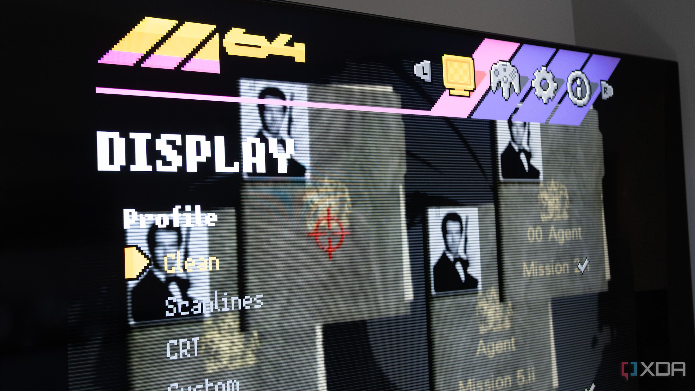
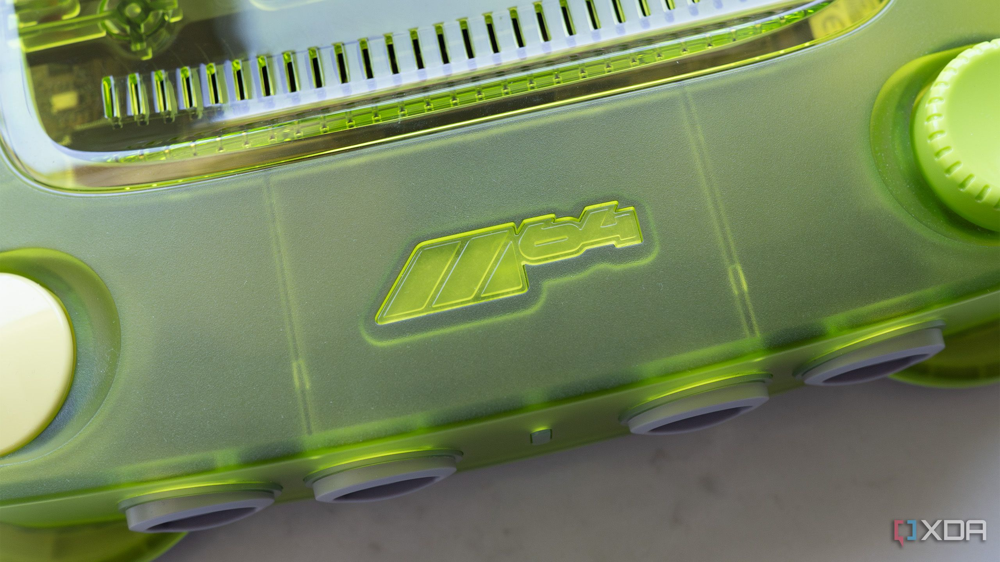
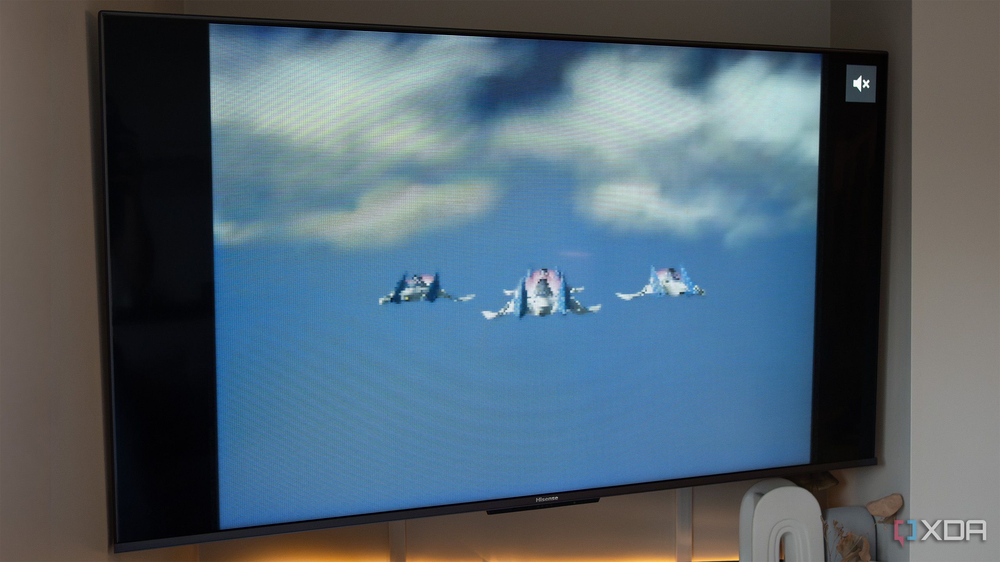
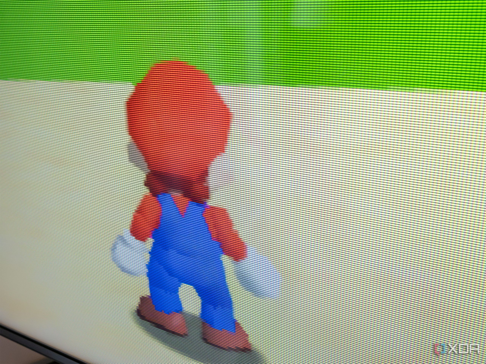
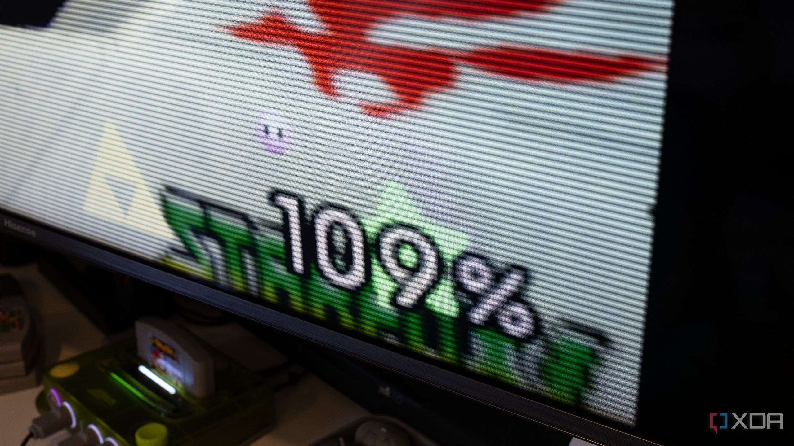
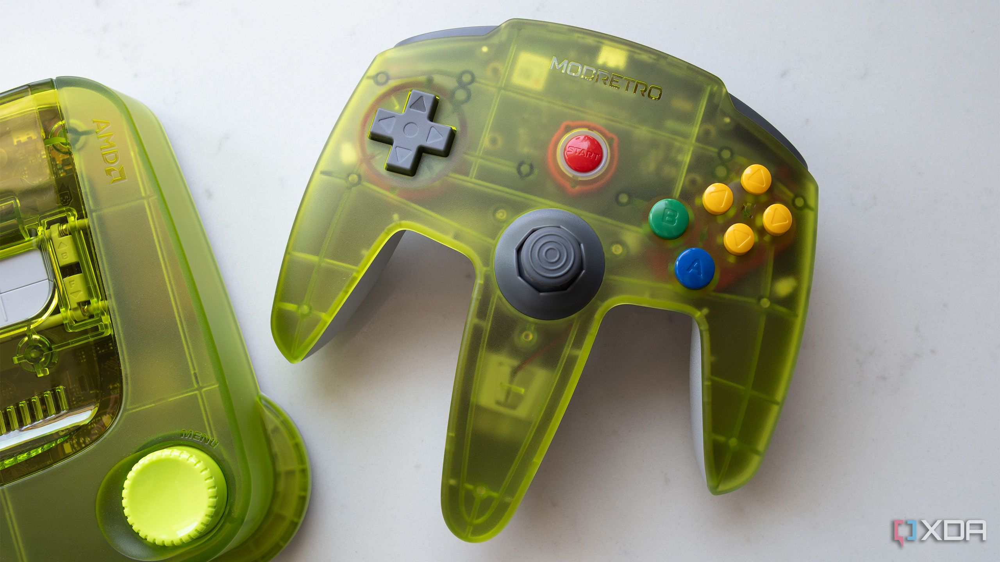
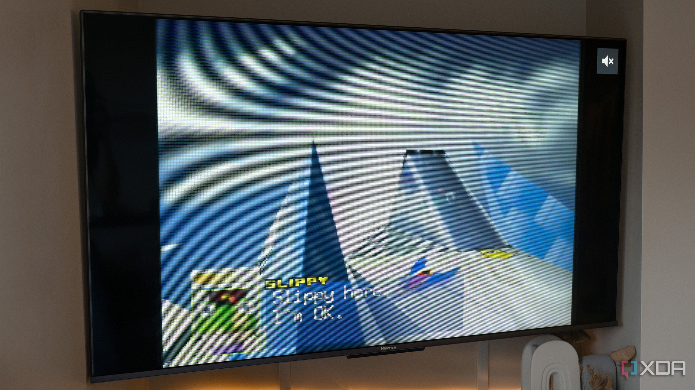
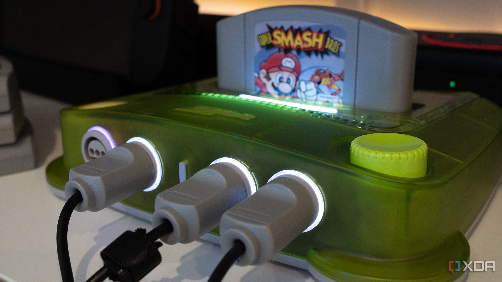

La M64 de ModRetro, la consola que recrea el Nintendo 64 mediante hardware dedicado, ha recibido una serie de actualizaciones que, según el redactor de XDA Developers Patrick O'Rourke, corrigen buena parte de los problemas que encontró en sus primeras pruebas. La novedad más destacada son los ajustes experimentales de overclocking. Además, en su repaso dedica especial atención a los filtros de imagen, pensados para reproducir el aspecto de los televisores de tubo (CRT) en pantallas modernas.

El texto original es una pieza de experiencia personal: las valoraciones que aparecen a continuación pertenecen a su autor y no constituyen mediciones independientes.

## Un N64 moderno con FPGA de AMD

A diferencia de las soluciones basadas en emulación por software, la M64 recrea el hardware del Nintendo 64 con una FPGA, en concreto la Artix UltraScale+ de AMD, fabricada en un proceso de 16 nm. La propuesta es ejecutar los cartuchos originales en un televisor actual a través de HDMI buscando eliminar problemas habituales de la emulación, como la latencia de entrada, los errores gráficos o los fallos de audio.

Según el autor, los ajustes experimentales de overclocking resuelven la mayoría de los problemas de rendimiento que había detectado en títulos como *GoldenEye 007* y *Top Gear Rally*, y en algunos casos suavizan caídas de fotogramas que, asegura, se producían incluso en la consola original. Además, la lista oficial de compatibilidad de la M64 ha mejorado de forma notable: 274 títulos figuran sin incidencias y 20 correcciones siguen en curso.

Entre las mejoras acumuladas, el medio cita actualizaciones de firmware por Wi-Fi más fiables tanto para la consola como para su mando Pro, salida de baja latencia, compatibilidad ampliada con mandos de terceros y correcciones en la negociación del enlace HDMI.

## El modo CRT: devolver el aspecto de los 90 a una pantalla 4K

La parte que el autor destaca como más satisfactoria es la personalización de imagen. La consola ofrece varios perfiles: *Clean*, que suaviza la imagen y, a su juicio, se parece a una versión desenfocada de una emulación; *Scanlines*, un punto intermedio que solo añade líneas horizontales; y *CRT*, que combina esas líneas con suavizado y *bloom* para recrear el efecto de un televisor de tubo.

Según relata, al principio el resultado le pareció extraño, acostumbrado a la nitidez de los emuladores, pero acabó siendo su forma preferida de jugar. Para quien quiera afinar más, el sistema permite crear un perfil propio con parámetros como Scanline, Aperture Grille, Sharpness, Horizontal Bloom y Gamma Mode, además de la opción Integer+ para escalar la imagen en pantallas grandes.

La diferencia se aprecia bien en las líneas de escaneo que el perfil CRT superpone a la imagen:

El autor también elogia el mando Pro, que recrea el mando original del Nintendo 64 con un acabado moderno y que, en su opinión, contribuye a una de las experiencias retro más fieles disponibles.

## Lo que aún queda por mejorar

El texto señala que la distancia con la Analogue 3D, la otra consola de Nintendo 64 basada en FPGA, se ha reducido, aunque la propuesta de Analogue sigue por delante en algunos aspectos: mejor compatibilidad de cartuchos, soporte integrado del Controller Pak para guardar partidas y compatibilidad con VRR.

En la M64, guardar en los juegos que requieren Controller Pak obliga a conectar la pequeña tarjeta de memoria a un segundo mando del Nintendo 64, ya que el mando Pro no incluye ranura para ella. El autor describe este rodeo como un inconveniente frustrante, aunque apunta que ModRetro prevé incorporar esa función más adelante. También recuerda su conflicto ético con la figura de Palmer Luckey, fundador de ModRetro, y aclara que el equipo de la compañía va mucho más allá de su fundador.

## Precio y disponibilidad

Según XDA Developers, la ModRetro M64 puede pedirse por 230 dólares y el mando Pro por 50 dólares. El autor confía en que la compañía siga publicando actualizaciones que mejoren la experiencia, sobre todo en lo relativo a la compatibilidad de juegos, el punto que considera más importante de cara al futuro.
