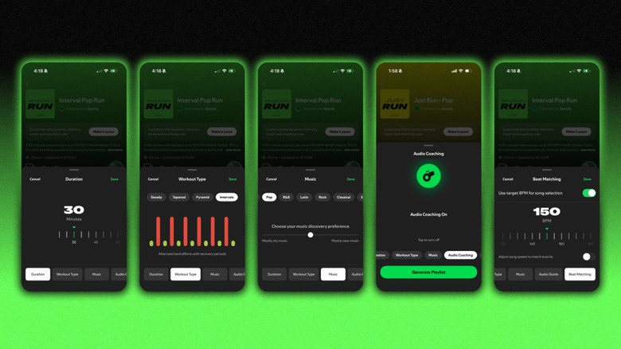

El modo Running de Spotify crea listas de reproducción que se adaptan al tipo de carrera que vas a hacer, con el ritmo de la música (BPM) ajustado a cada fase del entrenamiento. Esta guía explica cómo activarlo en iOS y Android, elegir el entrenamiento y personalizar la música, según lo describe Engadget.

## Requisitos previos

- Una suscripción a Spotify Premium: el modo Running es exclusivo para suscriptores de pago.
- La aplicación de Spotify instalada en un iPhone o en un móvil Android.
- Estar en uno de los mercados donde la función está disponible, ya que no se ha lanzado en todos los países.

## Pasos

### 1. Abre Spotify y entra en el centro Fitness

Abre la aplicación de Spotify en tu móvil y accede al centro Fitness (Fitness hub). Allí encontrarás el modo Running junto con varios géneros y tipos de entrenamiento predefinidos.

### 2. Elige el tipo de entrenamiento Running

Selecciona una de las modalidades disponibles: Intervalos, Pirámide, Easy, Long o Advanced.

- **Intervalos (Intervals):** alterna automáticamente entre tramos rápidos y pausas, usando el BPM para indicar cuándo acelerar y cuándo reducir el ritmo.
- **Pirámide (Pyramids):** empieza con un calentamiento (Warm Up) y continúa con las fases Build, Peak, Downshift y Cooldown, cada una con un BPM adaptado a su intensidad.
- **Easy:** mantiene una cadencia estable de 135 BPM en una sesión corta de 20 minutos.
- **Long y Advanced:** suben el tempo hasta 150 BPM durante 45 minutos para mantener el ritmo en las sesiones largas.

### 3. Ajusta la duración y el ritmo con Beat Matching

Sea cual sea el entrenamiento elegido, puedes ajustar su duración entre 10 y 90 minutos. Para afinar el ritmo, usa la función Beat Matching: el valor de referencia ronda los 160 BPM, pero si buscas un tempo más exigente puedes subirlo hasta los 170–180 BPM.

Si no quieres configurar nada antes de salir por la puerta, elige una de las sesiones «Just Run», de 20 minutos, y empieza a correr directamente sin repasar los ajustes.

### 4. Elige qué escuchar: géneros o lista personalizada

Cada modalidad incluye listas por género: pop, hip-hop, EDM, country o rock. Esas listas se actualizan a diario, y las que más te gusten se pueden guardar para recuperarlas en futuras carreras.

Si quieres más control, usa la función «Prompted Playlist»: pulsa «View prompt» y escribe tu petición con tus palabras, desde algo general («canciones con mucha energía que no escucho desde el año pasado») hasta algo concreto («temas de hip-hop de 2013 para un trote dominical»), y Spotify añadirá canciones acordes.

### 5. Activa o silencia las indicaciones de voz

Para un empujón extra, puedes activar las señales de audio opcionales con ánimos y mensajes de motivación a mitad del entrenamiento. Si prefieres correr solo con tu música favorita, siléncialas.

## Cómo verificar que funcionó

Al iniciar la sesión verás la lista generada con el entrenamiento elegido, la duración configurada y el BPM correspondiente. Si la lista se actualiza a diario y puedes guardarla para reutilizarla, el modo Running está activo y funcionando.

Si además quieres que tus carreras suenen lo mejor posible, revisa [cómo conseguir la mejor calidad de audio en Spotify](/noticias/spotify-best-audio-quality/).

## Advertencias

El modo Running no detecta tu zancada ni adapta las canciones a tu velocidad en tiempo real, a diferencia del antiguo Spotify Running retirado en 2018: el ritmo lo defines tú al elegir el entrenamiento y el BPM. Además, la función requiere Premium y solo está disponible en mercados seleccionados, por lo que el centro Fitness puede no aparecer en todas las cuentas.
