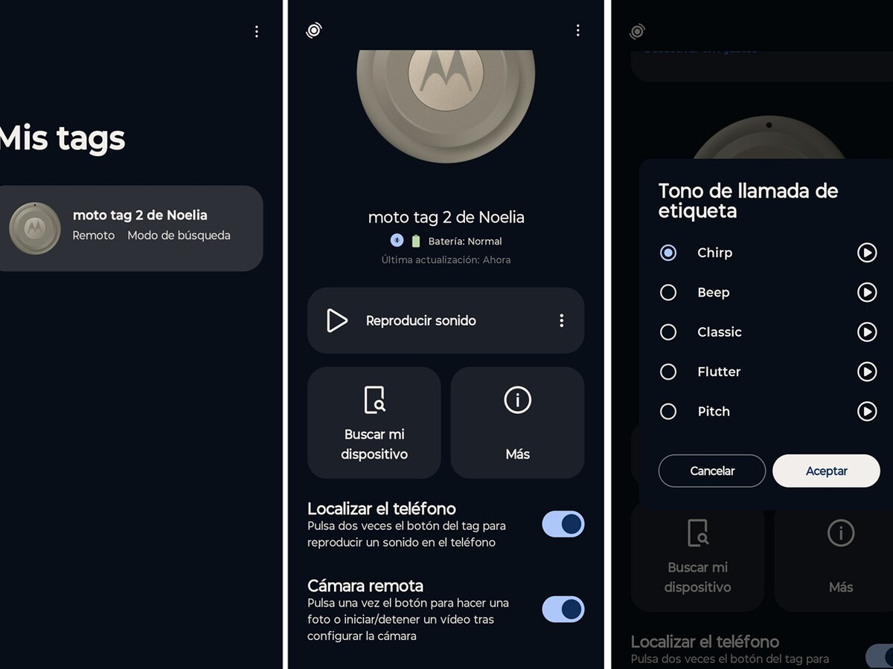
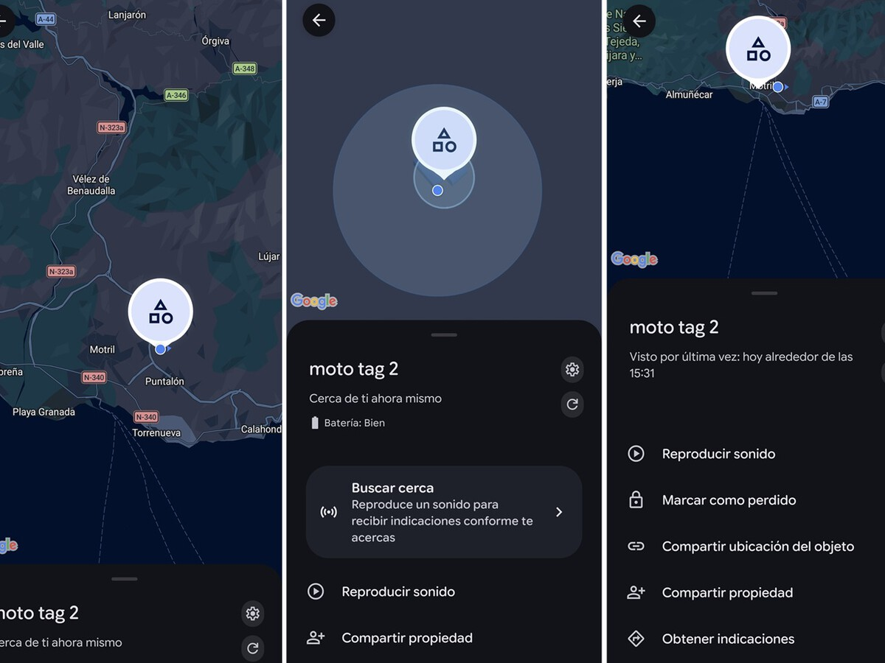
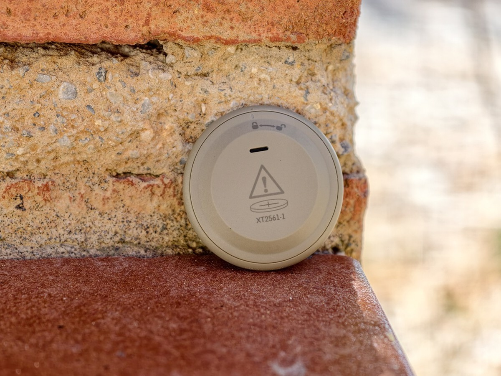
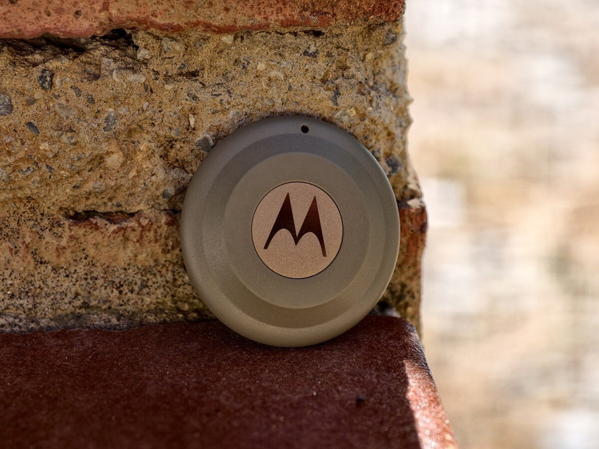

Motorola ya vende en España su segundo localizador de objetos, el Moto Tag 2, y Xataka ha publicado su análisis tras varias semanas de uso. Se trata de un pequeño rastreador Bluetooth pensado para dejar dentro de la mochila, la cartera o junto a cualquier objeto personal que convenga tener controlado. Su precio oficial es de 39,00 euros, aunque el análisis recoge ofertas por debajo de esa cifra en otros comercios.

El veredicto del medio es claramente favorable: lo describe como un accesorio sencillo, útil y relativamente barato, de esos que no se recuerdan hasta que hacen falta. La autora del análisis, Noelia Hontoria, resume su experiencia con una idea: la magia de este tipo de producto es que pasa desapercibido hasta el momento en que realmente se necesita.

## Un rastreador Bluetooth con UWB y sin suscripción

El Moto Tag 2 se apoya en dos piezas de software. Por un lado está la aplicación Localizador de Android, que muestra la posición del dispositivo en el mapa; por otro, la app específica Moto Tag, donde se ajustan detalles como el sonido que emite al buscarlo o su uso como disparador remoto de la cámara. La configuración requiere, por tanto, un doble paso, pero Xataka la califica de sencilla.

Una de las ventajas que destaca el análisis es que no exige ningún tipo de suscripción. En su lugar, emplea la tecnología UWB (Ultra-Wideband) para emitir su posición y se apoya en la red Find Hub de Google. La autora probó el rastreador tanto en entornos urbanos como en zonas rurales, a unos diez minutos en coche del núcleo urbano, y asegura que le dio la posición exacta en todo momento.

## Diseño, autonomía y el detalle que falta

En el apartado físico, Xataka describe el Moto Tag 2 como un dispositivo ultrafino, compacto y muy ligero, disponible en dos colores: Arabesque y Laurel Oak. Su resistencia al polvo y al agua es IP68, un extra de tranquilidad que el análisis valora de cara a la durabilidad del producto.

El principal reproche del análisis tiene que ver, precisamente, con la construcción: falta un ojal o pasacintas que permita colgarlo directamente del llavero. Sin ese detalle, quien quiera llevarlo junto a las llaves tendrá que comprar por separado algún accesorio compatible, lo que encarece el conjunto.

La autonomía, en cambio, sale muy bien parada. El dispositivo funciona con una pila CR2032 y Motorola promete más de 600 días de uso, es decir, casi dos años. La analista no pudo agotarla durante la prueba, pero señala que después de mes y medio de uso el indicador de batería seguía completamente en verde.

El uso no se limita a localizar objetos. Xataka también probó dos funciones adicionales: hacer sonar el smartphone con una doble pulsación del botón, útil para encontrarlo dentro de casa, y usarlo como disparador remoto de la cámara con una pulsación corta.

## La opinión de Xataka: precisión sobresaliente, solo para Android

El análisis atribuye al Moto Tag 2 una precisión "espectacular" y un funcionamiento excelente en todas las pruebas realizadas. También valora como un plus que se integre en el ecosistema de Google, algo relevante para quien ya usa Android. En cuanto a la comparación con la competencia, Xataka lo sitúa como una alternativa solvente al AirTag de Apple dentro del universo Android.

Hay un motivo de peso para descartarlo y el propio medio lo señala con claridad: no es compatible con iPhone. Quien use un teléfono de Apple debe decantarse por el AirTag, mientras que para el resto de usuarios el Moto Tag 2 es una opción muy válida. El análisis añade que su precio, aunque está ligeramente por encima de la competencia, resulta lo bastante razonable como para no resultar un problema si no se necesita comprar accesorios adicionales.

En resumen, Xataka concluye que el dispositivo cumple con creces lo que se espera de él: buena precisión, autonomía prolongada, resistencia al agua y al polvo, y funciones extra útiles. Su recomendación es un sí rotundo para usuarios de Android, con la única salvedad del desembolso extra que exige colgarlo del llavero.

## Ficha técnica del Moto Tag 2

| Especificación | Detalle |
| --- | --- |
| Dimensiones | 31,9 x 31,9 x 8 mm |
| Peso | 8,5 gramos |
| Colores | Laurel Oak / Arabesque |
| Materiales | Plástico y metal |
| Conectividad | Bluetooth 6.0 y Ultra-Wideband |
| Altavoz | Sí, 77 dB a 10 cm |
| Resistencia | IP68 |
| Batería | CR2032 con más de 600 días de autonomía |
| Compatibilidad | Android |
| Otros | Alertas de rastreadores no deseados, cifrado de extremo a extremo, control remoto de cámara, localizador remoto de smartphone y compartir ubicación |
| Contenido de la caja | Moto Tag 2, pila CR2032, pincho y manuales |
| Precio | 39,00 euros |

El precio oficial que figura en la ficha es de 39,00 euros. El análisis recoge además otras referencias del mercado en el momento de su publicación: 29,90 euros en El Corte Inglés y 32,86 euros en PcComponentes, ambos sujetos a variación.

El dispositivo fue cedido para la prueba por Motorola, según indica Xataka en su análisis.
