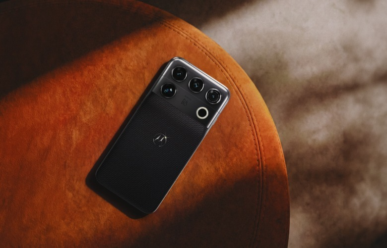

Motorola ha aprovechado el Snapdragon Summit para presentar el **Signature 27**, una actualización de su gama Signature que la compañía sitúa como su teléfono más avanzado hasta la fecha. El dispositivo estrena el procesador **Snapdragon 8 Elite Extreme Gen 6** y se coloca entre los primeros móviles del mercado en incorporar el chip más reciente de Qualcomm.

## El Signature 27, con el chip más reciente de Qualcomm

El Signature 27 es una renovación del modelo Signature ya existente, no una línea nueva. Según Engadget, Motorola lo describe como "el smartphone más avanzado" que ha creado, una etiqueta que encaja con su decisión de reservarle el último system-on-chip de gama alta de Qualcomm en lugar de esperar a la siguiente generación de teléfonos.

Más allá del procesador, la firma ha puesto el foco en dos aspectos que suelen marcar la diferencia en el uso diario: el sonido y la temperatura. El terminal incorpora altavoces firmados por **Bang & Olufsen** y un **sistema de refrigeración mejorado** para evitar que los componentes se calienten en sesiones exigentes. El acuerdo con Bang & Olufsen no es puntual: Motorola y la casa de audio han anunciado una **alianza de varios años**, de modo que este teléfono no será el último en llevarla.

## Cámaras: continuidad en la principal y un salto en el teleobjetivo

En el apartado fotográfico, el cambio más visible está en el teleobjetivo. La cámara principal parece mantenerse sin novedades, con un **sensor Sony Lytia 910 de 50 megapíxeles**, mientras que la lente teleobjetivo sube de los 50 megapíxeles del modelo anterior hasta los **200 megapíxeles**. Es, sobre el papel, la mejora más concreta de esta generación.

## Android 17, siete años de actualizaciones y más herramientas de IA

El software también forma parte del argumento de venta. El Signature 27 llega con **Android 17** y la promesa de **siete años de actualizaciones del sistema**, una cifra que lo alinea con lo que ya ofrecen otros fabricantes para sus teléfonos de gama alta.

La capa de inteligencia artificial se apoya en herramientas del ecosistema de Gemini. Motorola menciona, entre otras, el generador de vídeo **Omni** y el generador de música **Lyria**, pensados para crear contenido desde el propio teléfono.

## Qué cambia para el comprador

Por ahora hay más preguntas que respuestas. Motorola no ha detallado las especificaciones de la pantalla ni ha anunciado una fecha de lanzamiento concreta: se limita a señalar que el Signature 27 "se espera que llegue a los mercados de todo el mundo en 2026". El precio tampoco es público, aunque sirve de referencia el modelo anterior, que se movía en una horquilla de **800 a 1.200 dólares** según la configuración.

El movimiento encaja en un catálogo de Motorola más amplio que el de un simple fabricante de móviles. El mismo día en que se presentó este terminal, la compañía también dio a conocer el [Moto Watch Ultra con LTE y métricas de Polar](/noticias/moto-watch-ultra-lte/), su apuesta por la gama alta de los wearables con Wear OS. Para quien siga de cerca a la marca, la duda ya no es si tiene un flagship competitivo, sino a qué precio y con qué disponibilidad quiere venderlo en España y el resto de mercados hispanohablantes.
