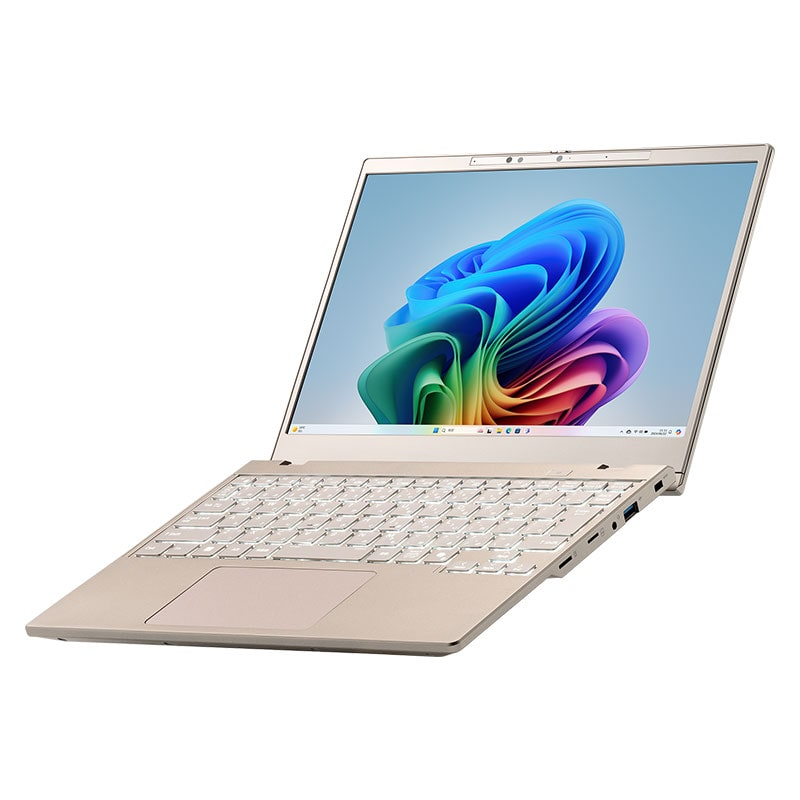
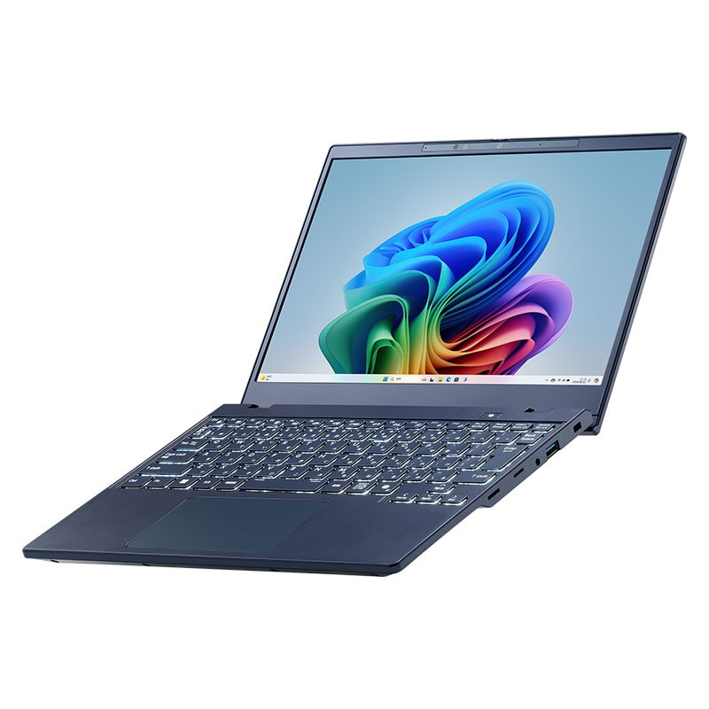
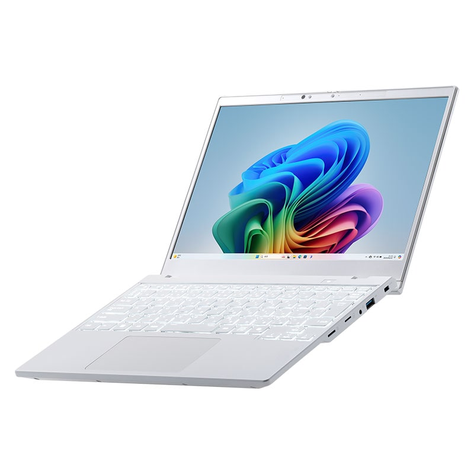

El fabricante japonés Mouse Computer ha anunciado la serie **mouse X2**, un portátil de 12,2 pulgadas y 981 gramos de peso que combina un cuerpo muy compacto con procesadores AMD de la familia Ryzen AI. La compañía presentó el equipo el 15 de septiembre y prevé iniciar las ventas de forma escalonada a partir de octubre, únicamente en Japón y a través de su propia tienda en línea.

El anuncio llega en un momento en el que los portátiles ligeros de menos de un kilogramo vuelven a estar en el centro de la conversación, con propuestas recientes de fabricantes como NEC o Acer. La particularidad del mouse X2 está en su tamaño: se trata de un formato de 12,2 pulgadas, más pequeño que la mayoría de los ultraligeros del mercado, que suelen moverse entre las 13 y las 14 pulgadas.

## Tres variantes de AMD, con NPU en las dos superiores

El equipo se ofrece con tres procesadores distintos, pensados para presupuestos y usos diferentes:

- **Ryzen 5 216**: configuración de seis núcleos y doce hilos, sin unidad de procesamiento neuronal (NPU). Mouse la orienta al uso ofimático y a quien prioriza el precio.
- **Ryzen AI 5 340**: seis núcleos y doce hilos sobre la arquitectura Zen 5, con NPU integrada, lo que la convierte en una máquina compatible con Copilot+ PC.
- **Ryzen AI 7 350**: ocho núcleos y dieciséis hilos, con gráficos Radeon 860M integrados. Es la opción más potente de la serie y también cumple con los requisitos de Copilot+ PC.

La pantalla es un panel de 12,2 pulgadas con resolución WUXGA (1920 × 1200), formato 16:10, acabado mate y 60 Hz, que según el fabricante cubre el 100 % del espacio de color sRGB. El chasis mide 277,1 mm de ancho, 210,2 mm de fondo y 19 mm de alto, e incorpora una bisagra que permite abrir la tapa 180 grados. Mouse destaca además la robustez del conjunto: asegura que la tapa soporta cargas de 100 kgf y que el portátil supera las pruebas de la norma militar MIL-STD-810H frente a golpes, vibraciones y cambios de temperatura.

## Conectividad completa y memoria ampliable

Una de las señas de identidad del mouse X2 es que renuncia a los adaptadores. El equipo incluye puertos USB Type-C y Type-A, salida HDMI, lector de tarjetas microSD y un puerto de red gigabit con conector retráctil, además de Wi-Fi 7 y Bluetooth 5. La webcam es de 2 megapíxeles, incorpora obturador de privacidad y habilita el inicio de sesión con Windows Hello; el fabricante menciona también la detección de presencia para bloquear el equipo al alejarse.

En el apartado de memoria, la configuración base parte de 16 GB de DDR5-5600 en un único módulo y 500 GB de SSD NVMe Gen4. Mouse deja libre una ranura SODIMM, de modo que el usuario puede ampliar la memoria hasta 32 GB sin cambiar de equipo. La batería es de 60 Wh y, según las mediciones bajo el estándar JEITA 3.0, ofrece unas 12,5 horas de reproducción de vídeo y cerca de 25 horas en reposo. El cargador incluido es de 65 W mediante USB PD, y existe una opción de 100 W que reduce a 30 minutos la carga hasta el 50 %. Está previsto además un módulo LTE como opción de configuración posterior.

## Precio, disponibilidad y por qué no llegará a España

La serie mouse X2 se comercializará en tres colores —blanco perla, azul cosmos y oro escarchado— y con precios que varían según el procesador. La versión con Ryzen AI 5 340, 16 GB de RAM y 500 GB de almacenamiento cuesta 239.800 yenes (alrededor de 1.545 dólares), mientras que la configuración con Ryzen AI 7 350 asciende a 259.800 yenes (unos 1.670 dólares). Mouse no ha detallado el precio de la variante con Ryzen 5 216.

El dato clave para el lector fuera de Japón es que **la compañía no venderá el equipo fuera del país**. Mouse Computer es un fabricante de alcance local y sus productos suelen distribuirse a través de su web y de sus tiendas propias. Quien quiera hacerse con una unidad desde España tendría que recurrir a servicios de importación, con el sobrecoste y las complicaciones de garantía que eso implica. Para el público hispanohablante, por tanto, el mouse X2 es más una referencia de hacia dónde va el formato ultraligero que una compra posible: un ejemplo de que un chasis de 12,2 pulgadas puede alojar procesadores con NPU, memoria ampliable y batería de 60 Wh sin renunciar a los puertos físicos.
