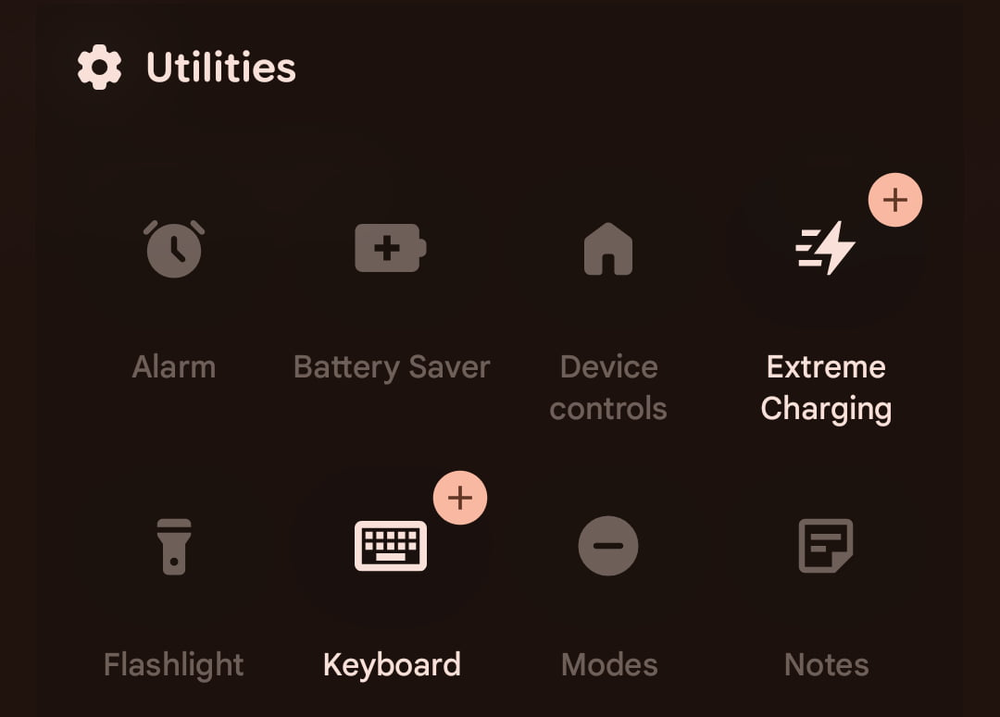
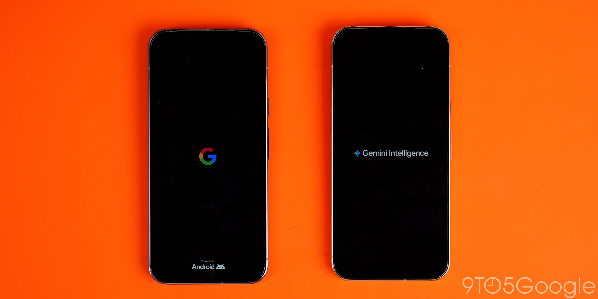

Google ya ha empezado a distribuir **Android 17 QPR3 Beta 1**, la primera entrega de un nuevo ciclo de pruebas que llega con rapidez después de la fase anterior y que apunta a una versión estable prevista para **marzo de 2027**. No hay cambios de calado: se trata de una beta de mantenimiento, centrada en ajustes de interfaz y en corregir errores arrastrados, no en redefinir el sistema. Aun así, hay novedades que conviene conocer antes de decidir si merece la pena instalarla.

## Qué llega nuevo en Android 17 QPR3 Beta 1

El cambio más visible para quien tenga un Pixel de la serie 11 es un **nuevo tile de Notas en los Ajustes rápidos**. Google ya había habilitado en el ciclo QPR2 el acceso rápido a Notas desde la pantalla de bloqueo y su atajo en el escritorio, y esa base se mantiene. Esta beta añade el acceso directo desde el panel de Ajustes rápidos, aunque la función sigue sin aparecer en un Pixel 10.

La **barra de estado** también recibe retoques. Los cambios introducidos en la versión estable de Android 17 QPR1 eran intencionados, así que QPR3 Beta 1 los consolida: el icono de VPN gana presencia, el de silencio se alinea con el menú de volumen y algunos indicadores, como Bluetooth y Modo avión, se muestran algo más grandes.

En la serie Pixel 10 aparece además la **animación de arranque de Gemini Intelligence** que hasta ahora era exclusiva de los Pixel 11. En los Ajustes del sistema se suma **Proactive Assistance**, situada por encima de Magic Cue, que se mantiene disponible. Es un movimiento que ya se vio en la beta de QPR2 y que después se retiró, así que su continuidad no está garantizada. Por ahora no tiene reflejo en los ajustes de la aplicación de Gemini.

## Los Pixel compatibles y cuándo llegará la versión estable

La beta está disponible para un catálogo amplio de teléfonos y tablets de Google: desde el **Pixel 6a** y los **Pixel 7, 7 Pro y 7a**, pasando por la **Pixel Tablet** y el **Pixel Fold**, hasta los **Pixel 8, 8 Pro, 8a, 9, 9 Pro, 9 Pro XL, 9 Pro Fold, 9a, 10, 10 Pro, 10 Pro XL, 10 Pro Fold, 10a** y toda la familia **Pixel 11** (11, 11 Pro, 11 Pro XL y 11 Pro Fold).

Instalarla es un proceso manual, no una actualización que llegue por sí sola. Quien siga el programa beta recibirá estas compilaciones antes que nadie, pero asume el riesgo habitual: funciones que se caen, consumo impredecible y cambios que pueden desaparecer en la siguiente entrega. La versión estable no se espera hasta **marzo de 2027**, así que quedan meses de idas y vueltas.

## Correcciones: la parte menos vistosa y la más útil

El grueso de la publicación es la lista de errores corregidos, y ahí hay problemas que llevaban tiempo molestando. Esta beta arregla fallos como el bloqueo del dispositivo al desbloquear con huella, cierres en la app de Ajustes al abrir la batería, el consumo excesivo en reposo con Flip to Shh activado, problemas de reconexión de Wi-Fi en segundo plano, la pérdida del perfil eSIM, cortes de audio en dispositivos Bluetooth LHDC v5 y varios bloqueos y errores ANR en aplicaciones.

Para quien viene sufriendo alguno de estos fallos, QPR3 Beta 1 es la primera entrega que los aborda de forma directa. Para el resto, el interés es menor: es una beta de transición, no la versión que conviene esperar para dar el salto.

A este precio no hay compra que hacer: si tu Pixel funciona bien con la versión estable, **no instales una beta de mantenimiento a medio ciclo**. El paso lógico es esperar a la versión estable, prevista para marzo de 2027, o como mucho seguir la evolución de QPR2 si ya estás dentro del programa. Para el usuario que depende del móvil a diario, el riesgo no compensa el tile de Notas ni unos iconos algo más grandes.

Como referencia de lo reciente que está este ciclo, la anterior entrega de la rama corrigió fallos similares y retiró funciones de forma temporal, tal como recogimos en [Android 17 QPR2 Beta 6](https://www.techspain24.com/noticias/android-17-qpr2-beta-6/).
