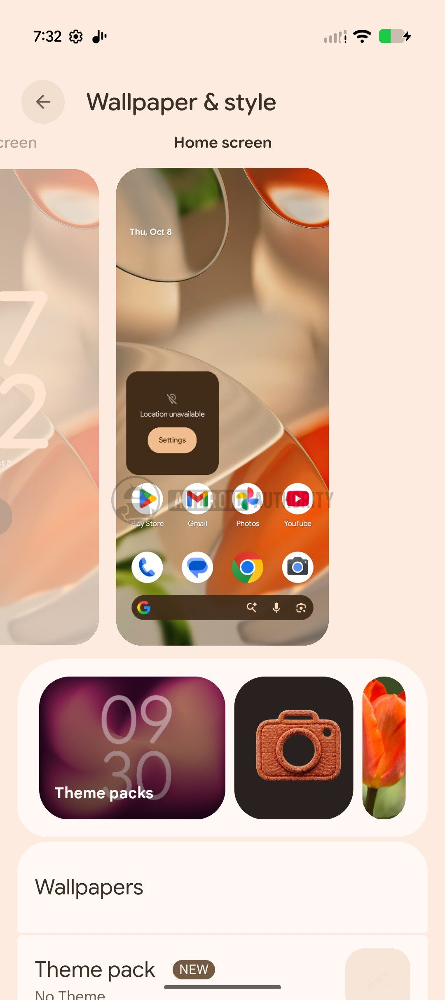
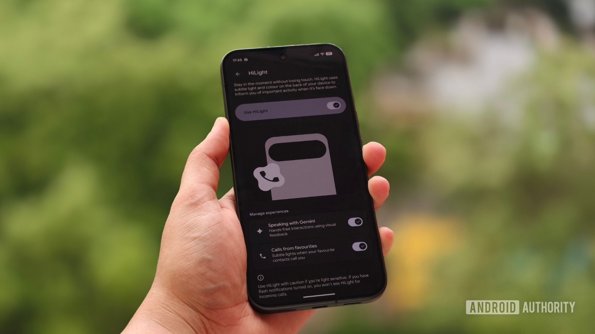

Google ha publicado **Android Canary 2610**, la nueva entrega de su canal experimental para móviles Pixel. La compilación, con número ZP11.260918.007, está dirigida a desarrolladores y entusiastas que quieren probar antes que nadie hacia dónde apunta el sistema. Conviene recordarlo desde la primera línea: Canary es software en pruebas, no una actualización para el teléfono de uso diario.

El análisis, firmado por Adamya Sharma con la colaboración de AssembleDebug para Android Authority, señala dos focos de interés: un rediseño de la personalización de Pixel y nuevos indicios de soporte de WhatsApp en el LED HiLight del [Pixel 11 Pro XL](/noticias/google-pixel-11-pro-xl-review/).

## Personalización de Pixel en Android Canary 2610

La sección *Wallpaper & style* (fondo de pantalla y estilo) estrena un **carrusel** con opciones para personalizar los iconos y aplicar paquetes de tema. En el mismo movimiento, Google retira de ese carrusel *AI wallpaper* (fondo con IA) y *Emoji Workshop* (taller de emoji), que ya no aparecen entre las opciones disponibles.

La antigua entrada *Live Effects* (efectos en vivo) se divide ahora en tres apartados independientes: *Shape effects* (efectos de forma), *Animate* (animar) y *Weather effects* (efectos meteorológicos). En la parte superior del carrusel aparece además un botón *Featured* (destacados) que vuelve a desplegarlo al pulsarlo.

## HiLight apunta a WhatsApp

La segunda novedad toca al LED **HiLight** del Pixel 11 Pro. Android 17 QPR2 Beta 6.1 ya introdujo las notificaciones luminosas de HiLight para mensajes, pero WhatsApp quedó fuera de las apps compatibles. Unas cadenas encontradas ahora en una compilación de Pixel 9 indican que Google prepara su incorporación.

Los textos de la interfaz mencionan `Google Messages, WhatsApp` y describen «luces sutiles cuando tus contactos favoritos te escriben con Google Messages o WhatsApp». Con esas cadenas sobre la mesa, HiLight debería admitir mensajes de WhatsApp en el Pixel 11 Pro con esta build Canary, aunque el medio no ha podido verificar la función todavía: la intención está en el código, pero no hay confirmación de que funcione en la práctica.

*Crédito de la imagen: Shimul Sood / Android Authority.*

## Disponibilidad y advertencias antes de instalarla

Android Canary 2610 se distribuye como imagen de sistema para una lista amplia de dispositivos: desde el Pixel 6a y la serie Pixel 7 hasta la serie Pixel 11 —incluidos los modelos Pro, Pro XL y Pro Fold—, pasando por las series Pixel 8, Pixel 9 y Pixel 10, los modelos Pixel a, el Pixel Fold, el Pixel Tablet y la imagen GSI. Una vez instalada, el equipo recibe actualizaciones OTA de Canary aproximadamente una vez al mes, igual que ocurre con el resto del [canal de betas de Android 17](/noticias/moviles/android-17-qpr3-beta-1/).

El dato que más importa si tu Pixel es tu teléfono de cada día: para salir del canal Canary hay que flashear una compilación que no sea Canary, y ese proceso borra todos los datos del equipo. Entrar es sencillo; volver atrás cuesta un formateo.

## Veredicto

Canary sigue siendo el banco de pruebas de Google y esta 2610 lo deja claro en ambas direcciones: hay funciones que se rediseñan y otras que se retiran de una build a otra. No conviene confundir lo que aparece aquí con lo que acabará en la versión estable, y menos con los análisis de código, que solo anticipan funciones que pueden no llegar nunca al público.

Si tienes un Pixel secundario o desarrollas para Android, la build deja ver hacia dónde apunta la personalización y el LED HiLight. Si es tu único móvil, a ese precio —quedarte sin teléfono un rato y perder los datos al volver— no merece la pena: toca esperar a que estas funciones aterricen en la versión estable.
