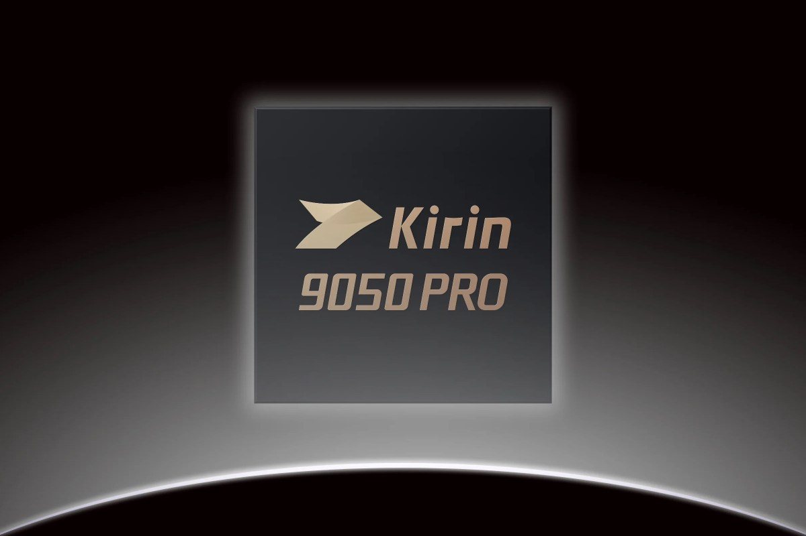
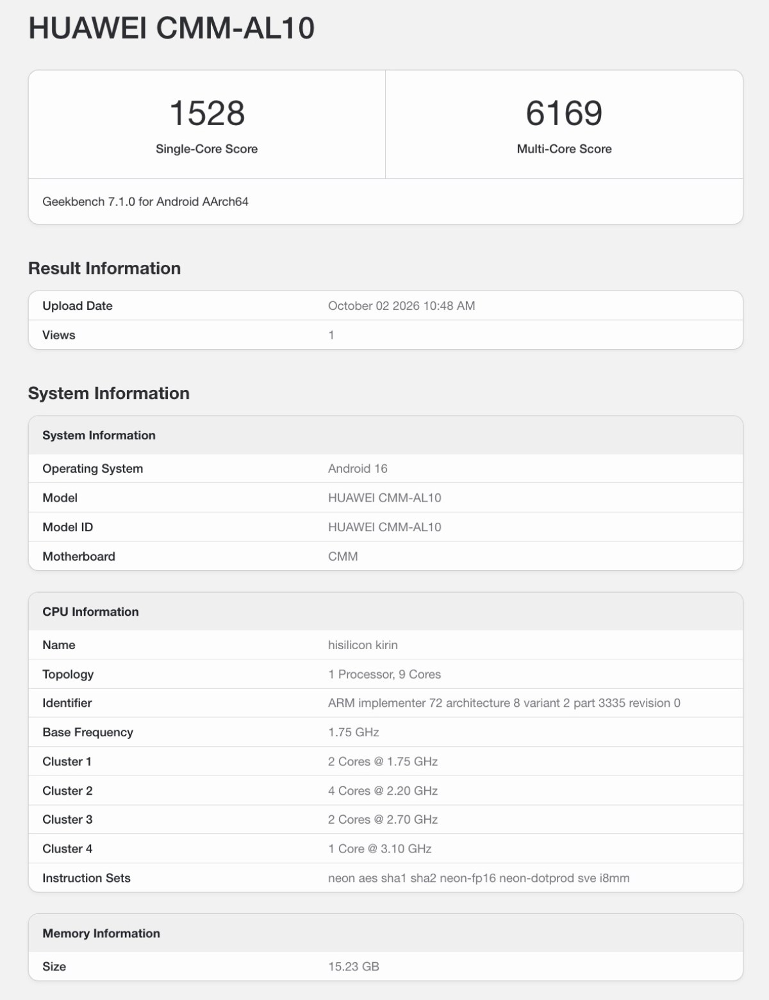

El Huawei Mate 90 Pro Max ha aparecido en la base de datos de Geekbench con su nuevo procesador Kirin 9050 Pro, el chip que la compañía reserva para las variantes más capaces de la serie Mate 90 que acaba de presentar en China. La prueba, subida desde un equipo con el identificador CMM-AL10, arroja una media de 1.317 puntos en un solo núcleo y 5.381 en varios, con un máximo registrado de 1.528 y 6.169 puntos.

Son cifras que sitúan al Kirin 9050 Pro en la zona del Snapdragon 8 Gen 1 y su sucesor, el Snapdragon 8 Gen 2: topes de gama de 2021 y 2022. La distancia con los chips actuales no es pequeña, y conviene tomarla con cautela, porque se trata de un resultado filtrado que Huawei no ha confirmado.

## Qué revela Geekbench del Kirin 9050 Pro

Geekbench detalla una CPU de nueve núcleos con una distribución poco habitual. El núcleo principal, al que el registro llama «ultra», trabaja a 3,1 GHz; le acompañan seis núcleos de rendimiento repartidos en dos bloques (dos a 2,7 GHz y cuatro a 2,2 GHz) y dos núcleos de eficiencia a 1,75 GHz. En gráficos, el listado apunta a una GPU Maleoon 955 de seis núcleos a 1,05 GHz.

El sistema reportado es Android 16 y la memoria detectable ronda los 15,2 GB. Los registros se reparten entre el 1 y el 2 de octubre, lo que encaja con el lanzamiento de la serie en China.

## La horquilla de resultados invita a la prudencia

No todas las mediciones del CMM-AL10 son iguales. Además del mejor resultado de 1.528 y 6.169 puntos, la lista incluye registros que bajan hasta 1.117 en un núcleo y 4.884 en varios. Esa dispersión es habitual en pruebas recién publicadas y en equipos de preproducción con software sin pulir, así que el dato más útil es la media, no el pico.

Dicho esto, incluso con el mejor registro el chip se queda por debajo de lo que ofrecen los procesadores de gama alta actuales. Para Huawei, la pregunta relevante no es si alcanza a Qualcomm en una tabla sintética, sino si su rendimiento sostenido y su eficiencia energética aguantan el tipo en el uso diario.

## Lo que sigue sin confirmarse

La información sobre cómo se fabrica el Kirin 9050 Pro no sale de Geekbench, sino de un informe de Bernstein Research recogido por SCMP. Según ese análisis, el chip usaría un nodo de clase 7 nm con la tecnología N+2 o N+3 de SMIC, la fundición china. Huawei no ha confirmado ese extremo, y es el punto que más condiciona el relato: un proceso de 7 nm limitaría tanto la densidad como el consumo frente a los nodos más avanzados.

Tampoco hay precio ni disponibilidad confirmados para España, y la serie Mate 90 se ha presentado, de momento, en el mercado chino. Quien siga de cerca este modelo tiene ya un precedente en [el teleobjetivo externo que se filtró para este mismo terminal](/noticias/huawei-mate-90-pro-max-teleconverter-leak/): conviene separar lo confirmado por el fabricante de lo que solo aparece en una base de datos o en un informe de terceros.
