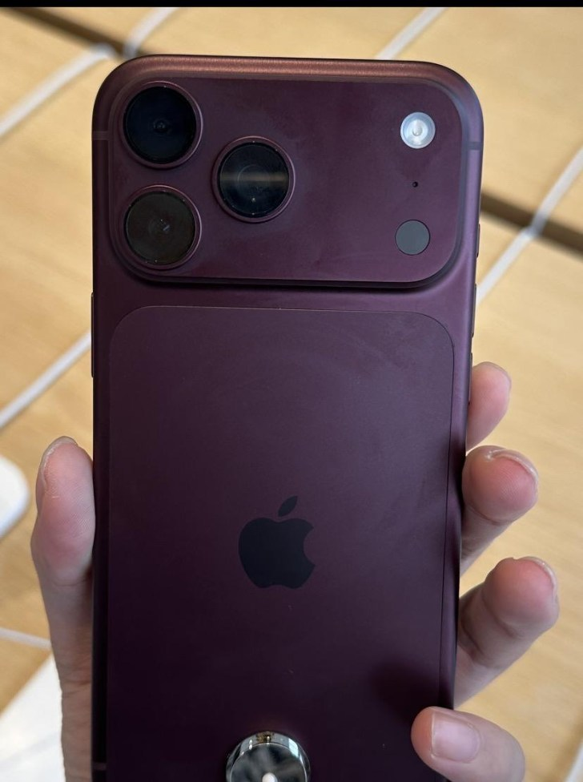
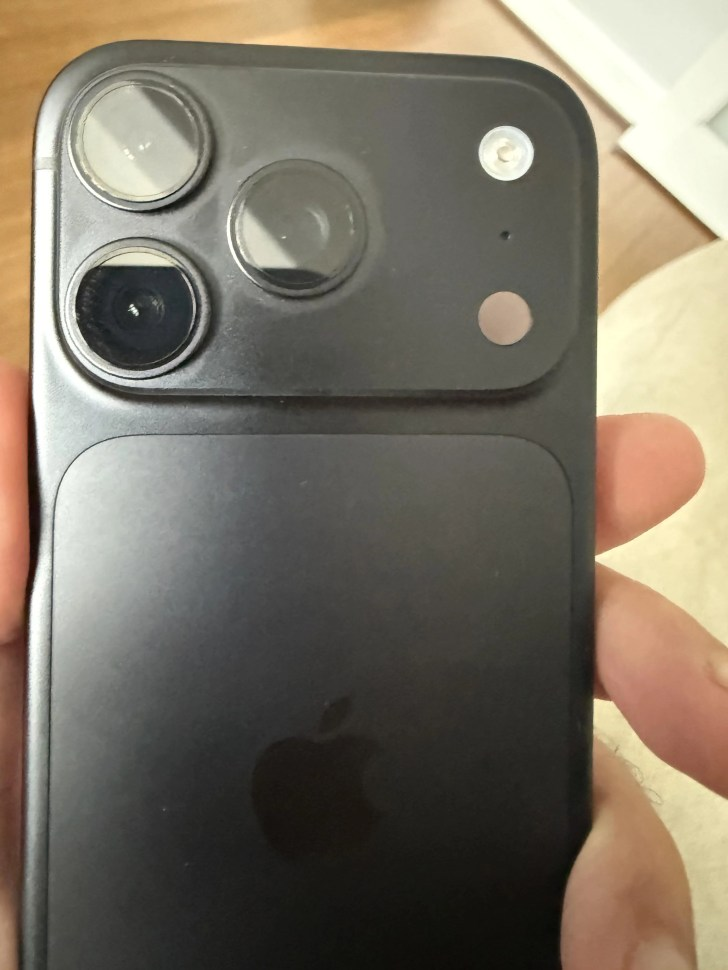

El iPhone 18 Pro y el iPhone 18 Pro Max, la gama premium que Apple puso a la venta hace unas semanas, empiezan a acumular reportes de decoloración. Varios usuarios han publicado fotografías en las que el acabado burdeos —el color estrella de esta generación— pierde tono y se vuelve más rosado alrededor de los módulos de cámara. GSMArena recoge los casos y subraya que, por ahora, Apple no ha confirmado ningún defecto.

## Una decoloración que empieza en las cámaras

Los reportes se concentran en Reddit, en hilos dedicados al iPhone 18 Pro. En las imágenes compartidas, la pérdida de color arranca en la zona que rodea los tres objetivos y, según los propios afectados, se extiende después al chasis de aluminio. Aunque el burdeos es el caso mayoritario, también se han visto unidades en negro con el mismo patrón.

Conviene ser prudente con el alcance: no hay confirmación oficial ni una cifra de unidades afectadas. Algunos propietarios aseguran que el cambio persiste incluso después de limpiar el teléfono; otros atribuyen las manchas a la grasa y a las huellas que deja ver este acabado y sostienen que desaparecen al pasar un paño de microfibra.

## El precedente del iPhone 17 Pro

Es un guion que ya se vio el año pasado. A las pocas semanas del lanzamiento del iPhone 17 Pro y del 17 Pro Max, sus dueños empezaron a reportar una decoloración similar, centrada entonces en el Naranja Cósmico y, en menor medida, en el Azul Profundo. En aquella ocasión Apple acabó sustituyendo las unidades defectuosas, recuerda GSMArena, que espera un movimiento parecido esta vez.

Sobre la causa solo hay hipótesis. La más repetida señala a la luz ultravioleta: muchos de los casos habrían aparecido después de usar el teléfono en exteriores, igual que ocurrió con la generación anterior. El medio chino MyDrivers (快科技) añade una explicación técnica: el chasis de aluminio se colorea por anodizado y, si el sellado de la capa porosa no queda completo, la grasa y el sudor de la piel penetran en el óxido y alteran el tinte. Es plausible, pero no es un diagnóstico oficial.

## Qué puede hacer el usuario (y qué no cambia)

Por ahora, el consejo más repetido entre los propios afectados es el de siempre: usar funda, sobre todo si el teléfono pasa tiempo en la calle, y esperar a que Apple se pronuncie. En ese sentido, conviene recordar que [el iPhone 18 Pro mantiene el diseño exterior del 17 Pro](/noticias/iphone-17-18-same-design-cases/), así que las fundas de la generación anterior sirven igual.

Si el acabado es lo que más pesa en tu decisión, la noticia no cambia el panorama: [lo que ya estaba sobre la mesa entre el 17 Pro y el 18 Pro](/noticias/iphone-17-vs-18-pro/) sigue igual, y un color que se aclara con el uso no ayuda a justificar el desembolso. A este precio, mi veredicto es esperar: hasta que Apple aclare si sustituye unidades —como hizo el año pasado—, el burdeos no es una compra segura para quien vaya a notar cualquier cambio en el acabado. Si ya lo tienes y detectas la decoloración, documenta el caso con fotos y contacta con Apple; el año pasado la compañía terminó reemplazando las unidades afectadas.
