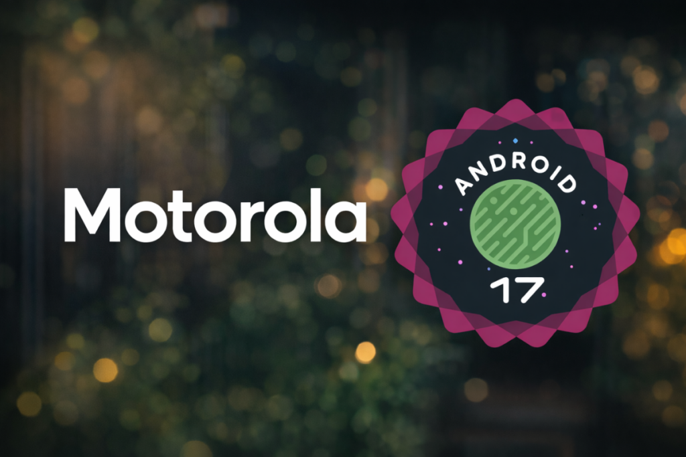

La política de actualizaciones es el punto que más pesa cuando alguien se plantea comprar un Motorola, así que cada avance de su despliegue merece atención. La compañía ha llevado Android 17 a cuatro dispositivos en Estados Unidos en apenas un par de días, con el Razr Ultra (2026) como nombre más destacado de la tanda. El dato que importa para el comprador llega al final: sigue sin publicarse un calendario, de modo que no hay forma de predecir cuándo le tocará el turno a cada modelo.

## Qué móviles reciben Android 17

El Razr Ultra (2026) encabeza esta primera hornada. La actualización llega por OTA con un paquete de 4,17 GB, así que conviene descargarla con una red Wi-Fi rápida antes de confirmar. Una vez instalada, el dispositivo pasa a la versión de firmware A171WLH.38–19–5, y el nivel del parche de seguridad se queda en septiembre de 2026.

El Motorola Signature original también figura entre los primeros receptores en Estados Unidos, y además está recibiendo la actualización en India. La otra sorpresa está en la gama media: los Edge 60 Pro y Edge 60 Fusion se han actualizado junto a los modelos más caros, e incluso empezaron a recibir el paquete unos días antes.

## Por qué importa: gama media y política de soporte

Que un par de móviles de gama media se actualicen a la vez —o antes— que el plegable más caro de la casa es el detalle relevante de esta tanda. El despliegue no se está limitando a los modelos premium, algo que no siempre ocurre entre fabricantes, y los Edge 60 Pro y Fusion demuestran que Motorola ha incluido parte de su catálogo asequible en el arranque.

El otro punto que conviene vigilar es el soporte. El registro de cambios que acompaña a estos dispositivos es muy escueto, y la compañía mantiene una página oficial donde detalla qué incluye Android 17. Para quien siga el ciclo desde España, el contraste queda claro: [Samsung ya desplegó Android 17 en Europa con One UI 9](/noticias/one-ui-9-disponible/), mientras que el avance de Motorola del que hay constancia es el de Estados Unidos y, en el caso del Signature, también el de India. En paralelo, la rama de pruebas sigue su curso con las [betas de Android 17 QPR3](/noticias/moviles/android-17-qpr3-beta-1/) en los Pixel compatibles.

## Qué cambia para el lector

Si tienes uno de estos modelos, la actualización irá llegando por lotes, así que puede tardar un tiempo en aparecer. Para comprobarlo a mano, entra en Ajustes y toca Actualización del sistema. Si tu dispositivo no está en la lista, la propia Motorola mantiene una relación oficial de equipos elegibles para Android 17 que conviene revisar antes de dar por hecho que se quedará fuera.

La letra pequeña sigue siendo la del calendario: al no haber fechas publicadas, no se puede prometer cuándo alcanzará el despliegue a cada mercado ni confirmar plazos para España. Quien compre un Motorola pensando en años de soporte debería consultar esa lista de dispositivos elegibles antes de decidir; el despliegue avanza, sí, pero sin calendario no hay garantía de cuándo le tocará a cada teléfono.
