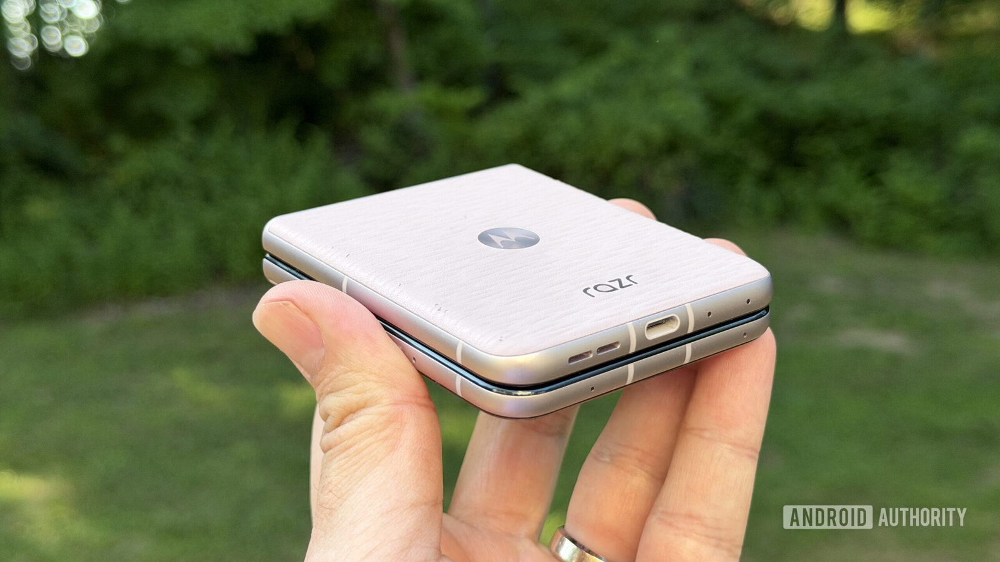
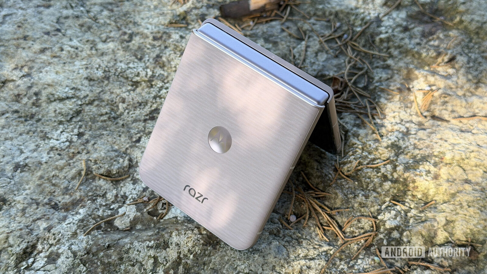
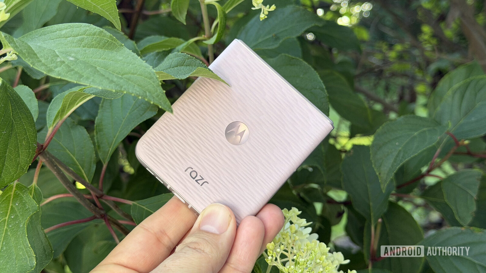
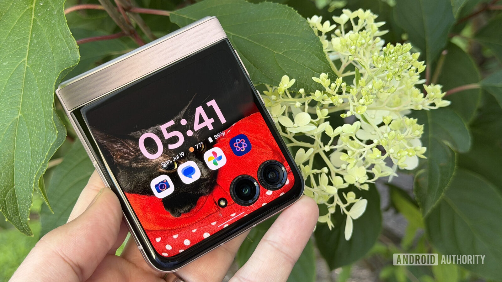
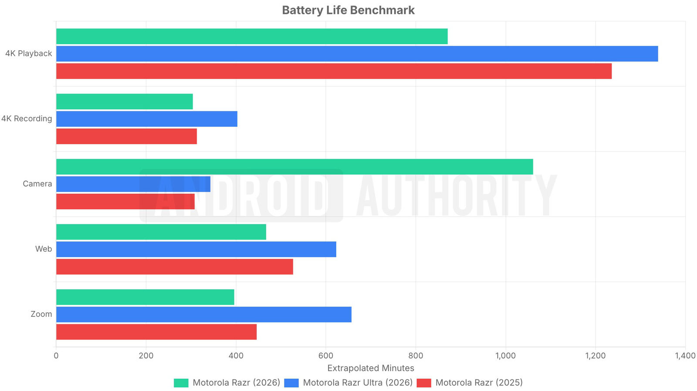
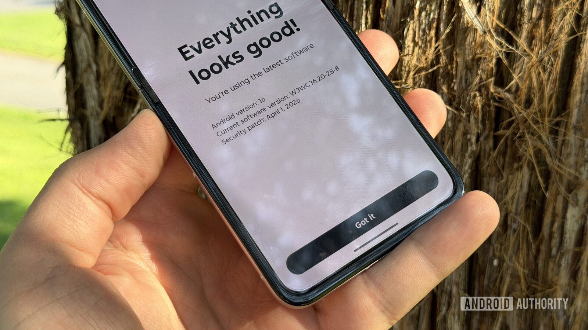
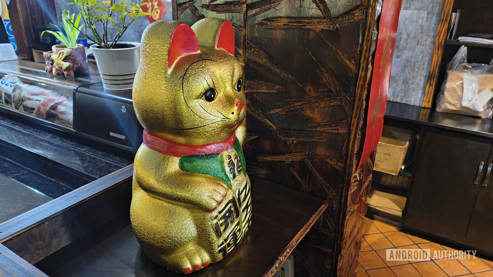

El Motorola Razr 2026 ya tiene veredicto: 8 sobre 10 en el análisis de Android Authority. El
plegable de concha sube este año a 799,99 dólares en su versión base —más caro que su
predecesor y sin cambios de fondo en la ficha técnica—, pero la review lo sigue señalando como
el plegable que debería acabar en más bolsillos. La mejora está en la batería y las cámaras; la
asignatura pendiente, en el soporte de software.

## Diseño y pantallas: una fórmula que Motorola no toca

El Razr 2026 no es una revolución frente a la generación anterior. Mantiene la pantalla exterior
de 3,6 pulgadas, el marco de aluminio a juego con el color y la trasera texturizada; los nuevos
tonos son casi lo único que permite distinguirlo a simple vista. La bisagra, eso sí, es la mejor
que la review ha probado en un Razr, y el conjunto presume de resistencia al polvo y al agua
IP48, un alivio razonable para un formato que todavía exige cierto cuidado.

La pantalla exterior es uno de los argumentos del teléfono: funciona desde el primer arranque,
permite editar los accesos directos sin instalar software extra y ofrece juegos sencillos para
matar el rato. Solo tropieza con alguna aplicación cuyo formato no encaja bien en esas 3,6
pulgadas. El modelo superior, el Razr Ultra, lleva una pantalla externa de 4 pulgadas, pero aquí
el recorte de tamaño no molesta.

Al desplegarlo aparece el panel principal: un AMOLED de 6,9 pulgadas a 120 Hz, resolución 1080p
y compatibilidad con HDR10+. La review lo describe como un panel brillante y suficiente para
interiores y exteriores, y señala que la resolución Full HD no se ha convertido en un problema
en el uso diario.

## Rendimiento y batería: gama media con autonomía de dos días

El Razr 2026 confía en un MediaTek Dimensity 7450X acompañado de 8 GB de RAM. El análisis es
claro: se trata de un rendimiento de gama media que resuelve bien las tareas cotidianas, pero que
se queda corto si se le exige de más, por ejemplo al subir un juego exigente al máximo. Para el
uso habitual, en cualquier caso, no supone un problema.

Donde el teléfono sorprende es en la autonomía. Su batería de silicio-carbono de 4.800 mAh
aguanta dos días de uso moderado con una sola carga, un resultado que la review considera más
propio de un gama alta. La carga rápida, en cambio, se queda en 30 W por cable y 15 W
inalámbricos, por debajo del Razr Ultra.

El punto débil es el software. Motorola promete tres años de actualizaciones de Android y cinco
años de parches de seguridad, la mitad de lo que ofrecen Google y Samsung en móviles que cuestan
menos. Android 16 funciona bien en el dispositivo, pero la review duda de que Android 17 llegue
pronto, y recuerda que los parches pueden retrasarse. La capa Hello UI, limpia, y los gestos de
Moto se mantienen como siempre.

## Las cámaras del Motorola Razr 2026: dos sensores de 50 MP y fotos listas para redes

Motorola vende las cámaras del Razr 2026 como «impulsadas por IA», aunque la review admite que
no sabría decir en qué se traduce eso después de la captura. El resultado, con todo, le convence:
dos sensores de 50 megapíxeles (principal y ultra gran angular) que evitan el bajón de calidad
típico al pasar al ultra gran angular. La review habría preferido un teleobjetivo, pero valora
que ambos compartan resolución.

Con buena luz, las imágenes son detalladas, con contraste profundo y colores saturados; la review
las considera más listas para redes sociales que las de un Pixel, aunque en nocturnidad se quedan
algo blandas y un Pixel 11 seguiría siendo mejor para fotografía nocturna. La cámara frontal es
de 32 MP y cumple, sobre todo en modo retrato, mientras que el modo Flex View permite grabar vídeo
como si fuera una videocámara clásica.

## Qué cambia para el comprador

El Razr 2026 base cuesta 799,99 dólares, por debajo del Galaxy Z Flip 8 (1.199,99 dólares), del
Razr Plus (1.099,99 dólares) y del Razr Ultra (1.499,99 dólares). Frente al [análisis del Galaxy
Z Flip 8 que publicamos el mes pasado](/noticias/samsung-galaxy-z-flip8-review/), la review
reconoce que el teléfono de Samsung es más sólido en software y en frecuencia de actualizaciones,
pero le reprocha haber perdido el gancho de estilo que sí conserva el Razr.

La advertencia de esta generación es que Motorola ha subido el precio sin mejorar apenas la ficha
técnica. El teléfono sigue siendo la compra sensata para quien quiera un plegable de concha
resultón, pero si el soporte a largo plazo es prioritario, la alternativa de Samsung —o esperar a
la próxima hornada de Android— pesa más. Es un contexto que conviene leer junto a la política de
actualizaciones del fabricante, como ya contamos al cubrir la llegada de [Android 17 a varios
Motorola en Estados Unidos](/noticias/moviles/motorola-android-17/).

A este precio, sí: el Razr 2026 compensa por diseño, pantalla exterior y una autonomía de dos
días difíciles de encontrar en un plegable. A este precio, no: quien quiera cinco o más años de
Android actualizado debería mirar a otra parte o esperar a la siguiente generación.
