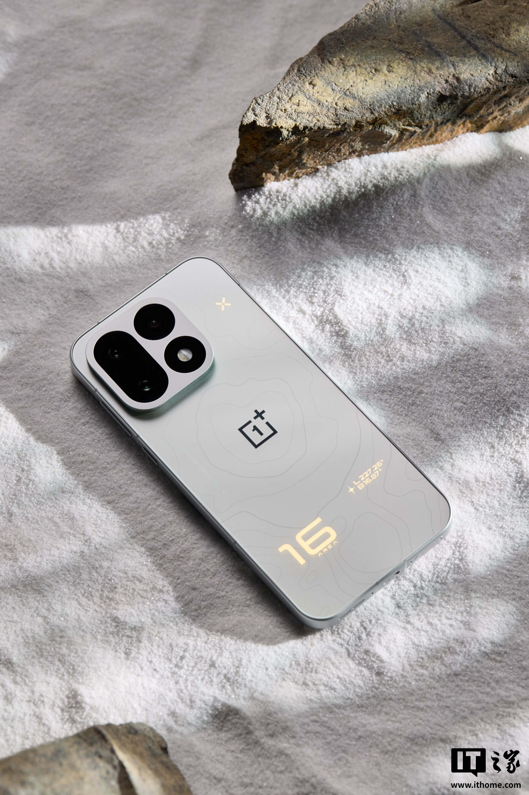

OnePlus ya tiene fecha para su primera batería externa con pantalla: llegará el 12 de octubre. La compañía la ha presentado como su primer modelo que cumple el nuevo estándar nacional de su país, aunque por ahora solo ha mostrado el cartel de promoción y no ha detallado ni el precio ni los mercados donde se venderá.

Según el nombre que aparece en la imagen oficial, el producto es la «OnePlus SUPERVOOC 67W 口袋充 超级闪充屏显移动电源 10000». Traducido, una batería externa de bolsillo con pantalla, carga rápida y una capacidad que la propia denominación sitúa en 10.000 mAh.

## Qué sabemos de la batería externa de OnePlus

El anuncio, publicado este 8 de octubre, se limita a dos certezas: el producto existe y su presentación será el próximo 12 de octubre. De la información de la compañía se desprenden tres características:

- **Capacidad estimada de 10.000 mAh**, según el número que cierra el nombre del modelo.
- **Pantalla inteligente** integrada en el cuerpo del dispositivo para mostrar el estado de la carga.
- **Protocolo SUPERVOOC de 67 W**, la tecnología de carga rápida propietaria de OnePlus (y de OPPO), que en teoría permite recargar un móvil compatible a buena velocidad.

Lo demás, incluida la presencia de puertos USB-C, la compatibilidad con el estándar USB Power Delivery de terceros o el número de celdas, no aparece en la comunicación y habrá que esperar al lanzamiento.

## El «nuevo estándar nacional», en contexto

OnePlus insiste en presentarla como su primera batería externa bajo el nuevo estándar nacional chino. Es una etiqueta regulatoria del mercado chino, no una promesa de rendimiento: sirve para situar el producto dentro de una normativa más reciente sobre seguridad y calidad de acumuladores, un terreno que en los últimos años ha ido endureciéndose en el país.

Conviene leerlo con cautela. Que un fabricante anuncie el cumplimiento de una norma no dice nada sobre cuánta energía entrega realmente el puerto, cuánto dura la célula o cuántos ciclos soporta antes de degradarse. Son las cifras que de verdad importan en una batería externa y todavía no están sobre la mesa.

## Un lanzamiento a la sombra del OnePlus 16

La fecha no es casual: el 12 de octubre es la misma en la que OnePlus tiene prevista la [presentación del OnePlus 16](/noticias/oneplus-16-lanzamiento-12-octubre/), su próximo móvil de juego. La compañía anunció ese terminal a finales de septiembre, dentro de su congreso de gaming, con una experiencia de 185 FPS y un Snapdragon 8 de sexta generación como motor.

Que la batería externa comparta fecha apunta a una estrategia de accesorios de ecosistema: un complemento de carga rápida pensado para quien ya tiene un móvil compatible con SUPERVOOC y quiere aprovechar la máxima velocidad posible. Para el resto de usuarios, un modelo así solo tiene sentido si admite también carga estándar por USB-C a una potencia razonable.

## Qué cambia para el comprador

De momento, poco. No hay precio, no hay confirmación de venta fuera de China y no sabemos si la capacidad de 10.000 mAh es real o una estimación de marketing. La política habitual de OnePlus con sus accesorios es un lanzamiento primero en China y una llegada a Europa que depende del producto.

A falta de esos datos, la respuesta honesta es la de siempre: esperar. Si OnePlus mantiene su táctica de precios ajustados y la batería llega a España con compatibilidad PD, será una opción a mirar; si se queda como accesorio exclusivo del OnePlus 16 en China, no habrá nada que comprar aquí. La fecha del 12 de octubre servirá para saber en cuál de los dos escenarios estamos.
