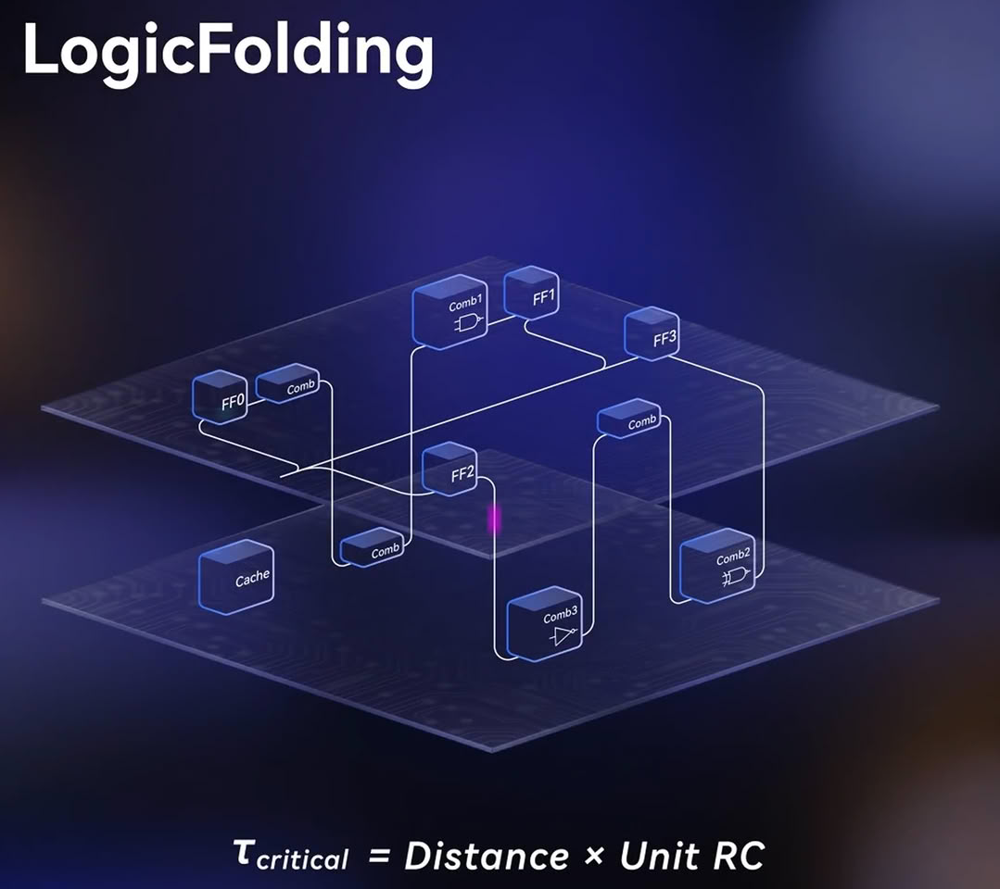

Qualcomm y Huawei han anunciado un acuerdo de licencia cruzada de patentes de varios años que cubre 5G, inteligencia artificial, computación y red. Lo llamativo no es el pacto, sino su dirección: según la información publicada por Tom's Hardware, por primera vez en 25 años será Qualcomm la que pague a Huawei por usar su tecnología, justo al contrario de lo que ocurría desde 2001. La compañía estadounidense también comprará en firme algunas patentes estadounidenses de Huawei, una operación que queda pendiente de aprobación regulatoria.

## Un giro de 25 años en el pulso de las patentes

El vínculo entre ambas compañías viene de lejos. En 2001, cuando Huawei era todavía un proveedor chino de infraestructura de telecomunicaciones, firmó una licencia con regalías para fabricar equipos de red CDMA con patentes de Qualcomm. La relación se torció después: Huawei dejó de pagar regalías en 2018, en 2020 se resolvió una disputa por pagos retroactivos y en 2024 Estados Unidos revocó la licencia que permitía a Qualcomm vender cierto hardware a Huawei. Desde principios de 2025, Qualcomm dejó de contabilizar los ingresos por regalías procedentes del fabricante chino. Ahora el flujo se invierte: el gigante chino pasa de pagar por tecnología ajena a cobrar por la suya, un cambio de posición que en su día habría sido difícil de imaginar.

## Qué incluye el acuerdo entre Qualcomm y Huawei

El pacto se describe como un «amplio acuerdo de licencia de patentes» que admite licencias cruzadas y se remite a los principios FRAND (justos, razonables y no discriminatorios). Según Huawei, no incluye ninguna otra forma de cooperación empresarial, lo que en la práctica descarta la venta de chips. La compra de patentes por parte de Qualcomm abarca computación, IA, red y «otras tecnologías», aunque no se han divulgado ni el número de patentes ni su valor.

Huawei cifra en más de 6.900 millones de dólares el valor total de sus contratos de licencia desde que ingresó sus primeros royalties por Motorola en 2011, y asegura que desde 2021 su negocio de licencias le reporta más de lo que paga por patentes ajenas. En 2025 declaraba 165.000 patentes concedidas activas en todo el mundo, y en agosto firmó un acuerdo cruzado de patentes de Wi-Fi con HP.

## La versión de Qualcomm: «no somos pagadores netos»

Qualcomm no tardó en matizar el relato. En un comunicado difundido después del anuncio, la compañía calificó de incorrectas las informaciones que la describen como «pagador neto» del acuerdo y negó que este tenga relación con LogicFolding, la técnica de apilado vertical de silicio que, según Bloomberg, habría entrado en el pacto. Qualcomm sí confirma que comprará ciertas patentes estadounidenses no celulares de Huawei en varias áreas tecnológicas. Con los términos del contrato bajo confidencialidad, la versión pública del fabricante chino y la del estadounidense no coinciden del todo en un punto básico: quién paga a quién.

La disputa no es menor, porque toca el núcleo del negocio de licencias. Huawei lleva años defendiendo su cartera en los tribunales —en 2024 demandó a MediaTek por supuesta infracción de patentes— y su consejero general llegó a testificar contra Qualcomm en el juicio antimonopolio que la FTC abrió en 2019. Ahora, con más de 165.000 patentes activas, se sienta en la otra mitad de la mesa.

## Qué cambia para el usuario

Poco a la vista, y conviene no confundirlo con una noticia de producto. El acuerdo no implica venta de chips ni cambios inmediatos en los móviles que se venden en España: es una operación de propiedad intelectual entre fabricantes, con términos confidenciales y sin cifras cerradas. Lo relevante está en el reparto de poder dentro de las patentes de 5G y de IA, un terreno donde Huawei ha pasado de pagar por tecnología ajena a cobrar por la suya.

Qualcomm [renovó además su licencia con Apple](/noticias/qualcomm-apple-licencia-patentes-2027/) el mes pasado, efectiva desde el 1 de abril de 2027. El cierre de la compra de patentes no tiene calendario público y no aparecerá en el informe del cuarto trimestre de Qualcomm, cuyo año fiscal terminó antes del anuncio, de modo que las cifras del acuerdo tardarán en verse.

El movimiento deja una foto útil para entender el mercado: en la próxima década, quien controle las patentes de 5G y de IA tendrá tanta influencia sobre lo que compras como quien fabrique el chip. A este ritmo, el pulso por licenciar ya no lo gana solo quien vende más móviles.
