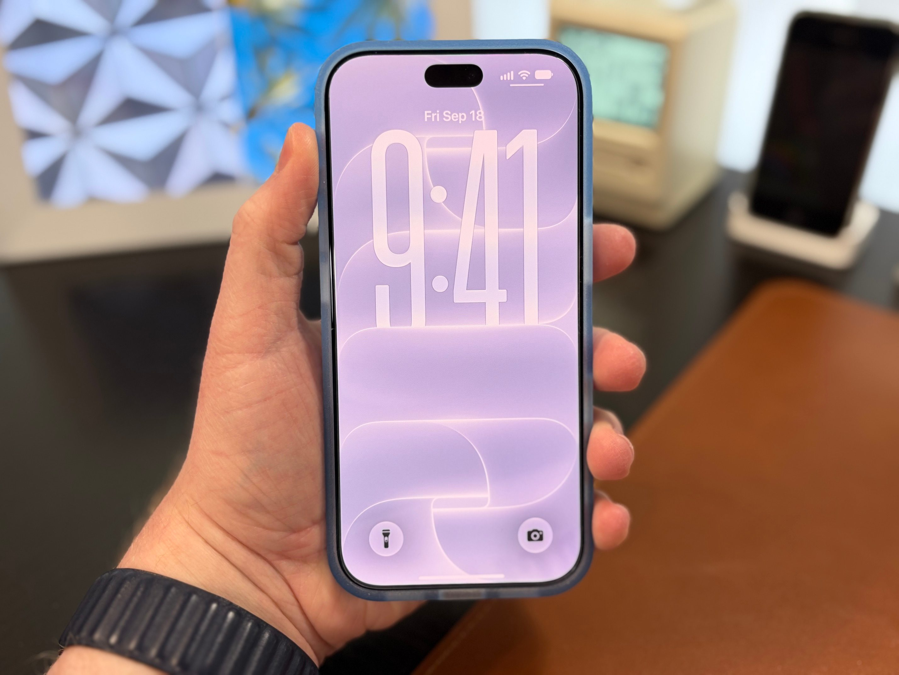
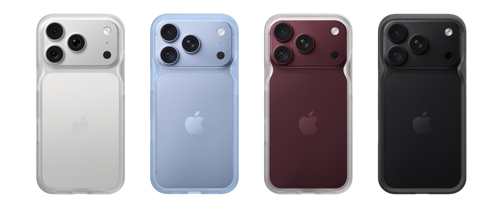
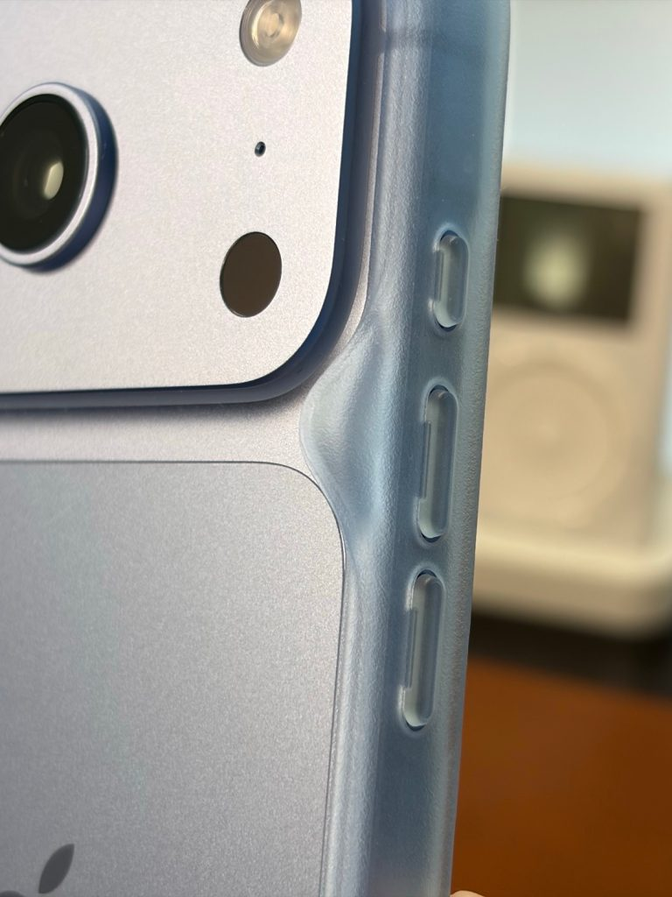
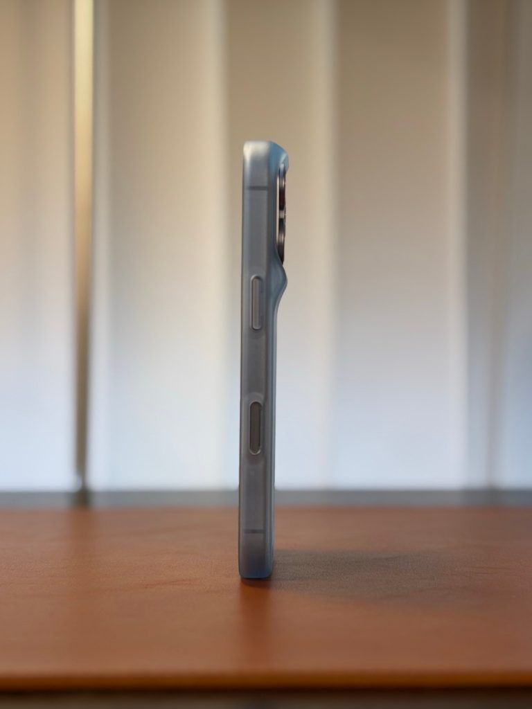
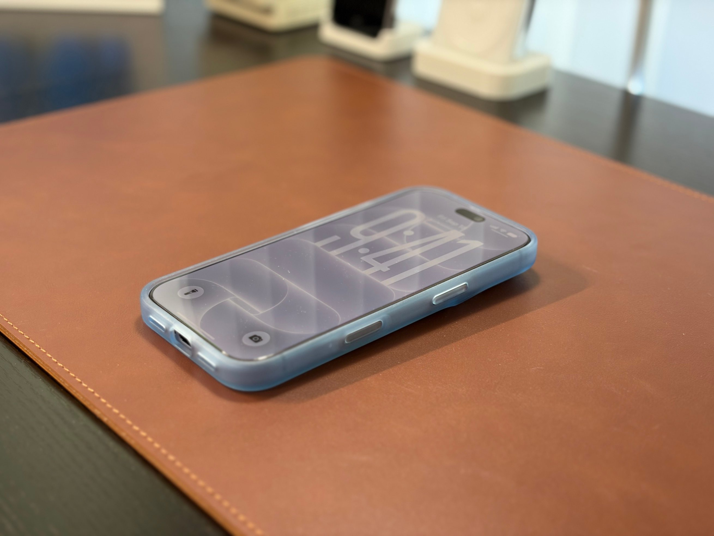

Los bumper —carcasas que se limitan a ceñir el canto del teléfono, sin cubrir la trasera— son un formato minoritario, y el iPhone 18 Pro no ha escapado a esa escasez. Frente a propuestas que suman funciones, como [la funda con pantalla E Ink de Ugreen](/noticias/ugreen-e-ink-iphone-case/), Rhinoshield mantiene la apuesta contraria con su **Minimalist Impact Bumper**, que cuesta alrededor de 30 dólares y se despacha principalmente desde la web de la firma, con apariciones puntuales en Amazon.

El análisis que firma Dylan McDonald en 9to5Mac llega con un matiz: no es el bumper que esperaba de Apple para este modelo, pero cumple. Y lo hace con un argumento poco habitual en este formato: la protección real del módulo de cámara.

## Un bumper que mantiene la cámara a salvo

El Minimalist Impact Bumper replica el ajuste clásico de este tipo de fundas: un labio discreto en la pantalla y otro algo más generoso en la parte trasera. Lo que lo distingue son unos soportes que mantienen el módulo de cámara y las lentes separados de la superficie donde se apoya el teléfono. En un iPhone 18 Pro de aluminio, eso evita arañazos y el incómodo balanceo al escribir sobre una mesa.

9to5Mac señala que, gracias a ese detalle, el conjunto protege más que un bumper corriente. La carcasa es de plástico duro y de un único material, lo que la convierte en 100 % reciclable según el fabricante, y se ofrece en tres colores alineados con los del iPhone 18 Pro: blanco, azul y negro.

La firma no ofrece la variante burdeos, precisamente el color que ha dado que hablar por los [reportes de decoloración alrededor de las cámaras](/noticias/moviles/iphone-18-pro-decoloracion/). El azul del bumper, según la review, se acerca al tono Glacier del teléfono, aunque no lo clava del todo.

## Ajuste flojo y botones que cuestan pulsar

El lado menos brillante está en el tacto. El ajuste resulta algo holgado: los bordes se doblan hacia fuera con facilidad y el crítico sospecha que con el tiempo podrían estirarse. Aun así, tras una caída accidental, el teléfono no se salió de la funda, así que no lo considera un riesgo serio.

Los botones también reciben críticas: están casi a ras y se sienten blandos, lo que complica pulsarlos con firmeza. A ello se suma un material que, comparado con el bumper del iPhone Air de Apple, transmite una sensación más barata —aunque el autor lo prefiere al plástico blando de las fundas transparentes típicas— y que atrapa polvo del bolsillo. Tampoco hay puntos de anclaje para las correas Wrist Strap o Crossbody Strap de Apple.

## Qué cambia para el comprador

Pese a los peros, el crítico ha decidido quedarse con la funda por una razón concreta: permite llevar el iPhone casi sin carcasa sin exponer el aluminio a golpes y marcas. Quien busque esa sensación de ir «desnudo» pero protegido tiene aquí una opción; quien priorice botones firmes y un ajuste rígido, no.

En precio, los 30 dólares del bumper de Rhinoshield quedan en línea con los 39 dólares del modelo de Apple una vez sumado el envío, y la disponibilidad se concentra en la web del fabricante, con listados esporádicos en Amazon. Para el lector en España conviene comprobar el coste de envío y las posibles aduanas antes de dar el paso: la diferencia frente a la alternativa de Apple no es decisiva. A este precio, sí para quien quiera la experiencia casi sin funda; no para quien no tolere un pulsado blando.
