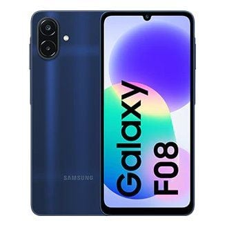

Samsung ha añadido dos móviles de gama media a su catálogo de India: los Galaxy M08 y Galaxy F08 ya figuran como «próximamente» en la lista de productos de la compañía. Lo que de verdad los separa del resto del segmento no es la cámara ni la pantalla, sino la política de actualizaciones: seis generaciones del sistema operativo y seis años de parches de seguridad, una ventana que la firma extiende hasta 2032. Lo que todavía no hay es precio, colores ni fecha de venta.

## Qué traen los Galaxy M08 y F08

Ambos modelos comparten la misma ficha técnica, centrada en la autonomía y en un soporte poco habitual en su rango de precio:

- **Pantalla:** PLS LCD de 6,7 pulgadas en HD+ (720 × 1.600 píxeles) y 16 millones de colores.
- **Cuerpo:** 167,4 × 77,4 × 8,0 mm, 197 gramos, protección IP64 frente al polvo y salpicaduras, y lector de huellas en el lateral.
- **Rendimiento:** MediaTek Helio G99+ de ocho núcleos a hasta 2,2 GHz, con 4 GB de RAM y 64 GB de almacenamiento ampliables por microSD hasta 2 TB.
- **Cámaras:** 50 MP principales más un sensor secundario de 2 MP en la trasera, y 8 MP en la frontal. La principal tiene autofoco, zoom digital de hasta 10 aumentos y graba vídeo en Full HD a 30 fps.
- **Batería:** 6.000 mAh con carga rápida de 25 W, aunque el cargador se vende por separado.
- **Conectividad:** 4G LTE, doble SIM, Wi-Fi 5, Bluetooth 5.3, GPS, USB Type-C y conector de auriculares de 3,5 mm.

En software llegan con Android 17 y funciones como Circle to Search, Quick Share, Knox Vault y compatibilidad con SmartThings.

## El soporte, el argumento que decide

En la gama de entrada, el hardware se parece demasiado entre fabricantes como para ser el criterio de compra. Aquí el detalle relevante es otro: **seis generaciones de Android y seis años de actualizaciones de seguridad**, un compromiso que en la práctica deja el teléfono cubierto hasta 2032. La mayoría de rivales directos en este precio se quedan en dos o tres años de parches, así que quien priorice longevidad sobre potencia encontrará en el M08 y el F08 un argumento difícil de igualar.

No es un soporte aislado: [Android 17 ya está llegando a los Galaxy en Europa con One UI 9](/noticias/one-ui-9-disponible/), y esta es la misma política aplicada a un escalón de precio inferior.

## Precio y disponibilidad: la incógnita

Los dos teléfonos aparecen listados en la configuración de 4 GB + 64 GB, pero Samsung **no ha desvelado todavía ni el precio, ni los colores, ni la fecha de venta** en India. De momento es un lanzamiento para ese mercado; no hay confirmación de que vayan a llegar a España ni con qué nombre.

Ahí está el problema del veredicto: sin precio no se puede decir si conviene. La receta del M08 y el F08 es clara y sensata —batería grande, equipo probado y muchos años de soporte—, pero todo depende de por cuánto salen. Si Samsung mantiene la política agresiva que suele aplicar a la gama M en India, serán una compra fácil de recomendar; si el precio se estira, el mismo hardware con seis años de actualizaciones pierde parte de su encanto. Habrá que esperar a las cifras.
